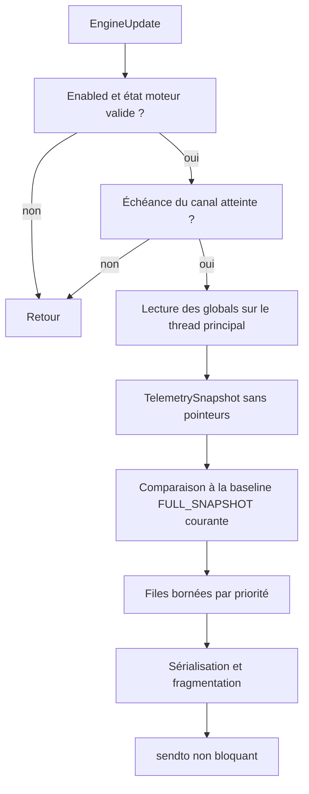
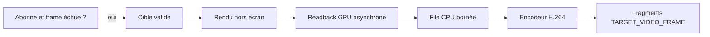
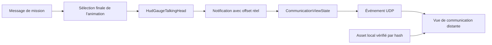

# Architecture du module de télémétrie

## 1. Contraintes

- impact minimal sur le code upstream ;
- regroupement dans `code/telemetry` ;
- fonctionnement en solo et multijoueur ;
- aucune modification de `object`, `ship`, `physics_info` ou `ai_info` ;
- aucun accès concurrent direct aux structures du moteur ;
- transport exclusivement UDP ;
- client distant capable de rejoindre une session en cours et de converger vers l'état complet ;
- vue de communication rejouée depuis des assets locaux, sans flux d'images continu ;
- vue 3D de cible produite par un rendu hors écran haute résolution et un flux H.264 optionnel ;
- protocole indépendant de la version et de l'ABI C++ de FS2Open.

Ce document fixe les choix d'architecture et les invariants attendus, mais ne constitue pas à lui seul le schéma filaire normatif. La phase 0 doit livrer un schéma v1 exhaustif : valeurs numériques des messages, records, enums et flags, ordre et bornes de chaque champ, valeurs par défaut, règles d'évolution, ainsi que des vecteurs binaires et tests de compatibilité. Une revue courte de cohérence du schéma et de ses vecteurs protège l'interopérabilité ; elle ne bloque pas les travaux exploratoires décidés par le propriétaire du projet.

## 2. Surface de patch upstream

Le socle de télémétrie ne modifie que deux fichiers existants. La réplication exacte de la vue de communication ajoute un point d'intégration dans son gauge HUD. La vue de cible haute résolution ajoute une extraction limitée dans le target box et une abstraction de readback graphique asynchrone. Aucune structure de simulation n'est modifiée.

### 2.1 `freespace2/freespace.cpp`

Ajouter l'include :

```cpp
#include "telemetry/telemetry.h"
```

Puis une initialisation à la fin de `game_init()` :

```cpp
telemetry::initialize();
```

`initialize()` enregistre les callbacks puis retourne immédiatement. Lorsque la télémétrie est désactivée, le coût récurrent doit se limiter à un test rapide.

### 2.2 `code/source_groups.cmake`

Ajouter le groupe des fichiers du nouveau module au build. Le socle, la télémétrie d'état et la vue de communication n'ajoutent aucune dépendance externe.

Le flux cible H.264 nécessite un backend d'encodage optionnel isolé derrière `TargetVideoEncoder`. La première implémentation utilise `FfmpegTargetVideoEncoder` avec une allowlist d'encodeurs autorisés par le build et sa politique de licence ; `NullTargetVideoEncoder` reste toujours disponible. Lorsque aucun encodeur compatible n'est compilé ou détecté, seule la capability `TARGET_VIDEO_REMOTE_RENDER` est désactivée.

### 2.3 `code/hud/hudmessage.cpp`

Trois notifications légères sont nécessaires dans `HudGaugeTalkingHead::render()` :

- après sélection de `head_anim` et application de l'offset de départ aléatoire : `telemetry::communication_view_started(...)` ;
- après l'avancement effectif de l'animation, ou dès qu'une pause, une reprise, une inversion ou la compression temporelle modifie sa loi de lecture : `telemetry::communication_view_sampled(...)`, avec seulement l'identifiant, le nouvel offset et le taux de lecture signé ;
- lorsque `msg_id` et `head_anim` sont remis à zéro : `telemetry::communication_view_stopped(...)`.

Le gauge possède à cet instant les seules valeurs réellement autoritaires pour la vue : identifiant de lecture, nom d'asset résolu, position dans l'animation, mode de boucle et choix pleine couleur/teinte HUD. Les notifications copient ces valeurs dans une structure sans pointeur et retournent immédiatement. Elles ne chargent aucun fichier, ne sérialisent rien et n'effectuent aucun appel réseau.

Ce hook est préférable à une nouvelle implémentation de la logique de persona côté télémétrie : le choix des suffixes est réalisé dans [`message_play_anim()`](../../code/mission/missionmessage.cpp#L1409-L1562) et le gauge peut encore choisir une image initiale dans [`HudGaugeTalkingHead::render()`](../../code/hud/hudmessage.cpp#L1299-L1314).

### 2.4 `code/hud/hudtargetbox.cpp` et `code/hud/hudtargetbox.h`

La partie modèle de `HudGaugeTargetBox::renderTargetShip()` est extraite dans une fonction sans réseau qui rend vers le contexte graphique courant :

```cpp
bool render_target_model_to_current_context(
    object* target,
    const TargetRenderOptions& options);
```

Le gauge historique et `code/telemetry` réutilisent cette fonction. Elle conserve la caméra, l'orientation, les textures de remplacement, les couleurs d'équipe, les sous-modèles et les flags de rendu sans recopier cette logique dans le module.

La première extraction couvre les vaisseaux. Les chemins armes, astéroïdes, débris et jump nodes sont migrés progressivement vers la même interface. Aucun appel UDP, encodeur ou état de session n'entre dans `code/hud`.

### 2.5 Abstraction graphique de readback asynchrone

La capture régulière d'une texture 1024 ne doit pas utiliser un `glReadPixels()` bloquant. Une interface graphique générique et étroite est ajoutée dans la couche `graphics`, avec une implémentation OpenGL par buffers de lecture et fences ainsi que des stubs explicites pour les backends non pris en charge.

Cette abstraction :

- démarre une copie sans attendre ;
- permet de tester ultérieurement si elle est terminée ;
- copie les pixels dans un buffer CPU fourni et borné ;
- annule et libère proprement les requêtes en attente ;
- ne connaît ni la télémétrie, ni H.264, ni UDP.

Si cette abstraction n'est pas disponible pour le renderer actif, le producteur n'annonce pas la capability vidéo.

## 3. Réutilisation du bus d'événements

Le moteur expose déjà les événements suivants dans [`code/events/events.h`](../../code/events/events.h#L5-L16) :

- `EngineUpdate` ;
- `EngineShutdown` ;
- `GameLeaveState` ;
- `GameEnterState` ;
- `GameMissionLoad`.

Le module s'y abonne :

```cpp
void telemetry::initialize()
{
    events::EngineUpdate.add(on_engine_update);
    events::EngineShutdown.add(on_engine_shutdown);
    events::GameMissionLoad.add(on_mission_load);
    events::GameEnterState.add(on_game_enter_state);
    events::GameLeaveState.add(on_game_leave_state);
}
```

`EngineUpdate` est déjà exécuté dans la boucle principale, dans [`freespace2/freespace.cpp`](../../freespace2/freespace.cpp#L6957-L6964). La collecte lit ainsi un état terminé de la simulation précédente avec au plus une frame de retard, ce qui est acceptable pour la télémétrie et évite un nouveau hook dans la boucle de simulation.

Si des mesures ultérieures montrent que ce placement n'est pas suffisant, un unique appel `telemetry::capture_frame()` juste après `game_simulation_frame()` constituera le fallback. Il ne doit pas être ajouté avant d'avoir démontré le besoin.

## 4. Organisation proposée

```text
code/telemetry/
├── telemetry.h                    interface publique minimale
├── telemetry.cpp                  cycle de vie et callbacks
├── telemetry_config.h/.cpp        configuration
├── telemetry_ids.h/.cpp           IDs stables et registre d'entités
├── telemetry_snapshot.h           DTO sans pointeurs
├── telemetry_collector.h/.cpp     lecture du moteur
├── telemetry_diff.h/.cpp          comparaison et événements
├── telemetry_communication.h/.cpp état et événements du Talking Head
├── telemetry_assets.h/.cpp        IDs, hashes et manifeste d'assets
├── telemetry_target_capture.h/.cpp rendu hors écran et readback
├── telemetry_video_encoder.h/.cpp abstraction H.264
├── telemetry_video_stream.h/.cpp  abonnements, cadence et frames
├── telemetry_video_queue.h/.cpp   files CPU/frames strictement bornées
├── telemetry_protocol.h/.cpp      PacketReader/Writer et messages
├── telemetry_fragmenter.h/.cpp    fragmentation applicative
├── telemetry_session.h/.cpp       clients, ACK et resynchronisation
└── telemetry_transport_udp.h/.cpp socket UDP non bloquant
```

L'interface visible depuis le moteur reste :

```cpp
namespace telemetry {
void initialize();
void communication_view_started(const CommunicationViewSample& sample);
void communication_view_sampled(int engine_message_id, uint64_t animation_time_us, float playback_rate);
void communication_view_stopped(int engine_message_id, CommunicationStopReason reason);
}
```

Les trois notifications de communication font partie du seam d'intégration moteur ; leurs types publics ne contiennent que des scalaires, enums et chaînes copiées. `communication_view_sampled()` ne copie aucune chaîne et ne fait que remplacer l'offset courant et son `playback_rate`. Celui-ci vaut `0` pendant une pause, est négatif en lecture inverse et inclut la compression temporelle effective. Tout le reste demeure privé à `code/telemetry`.

Le target box n'appelle aucune fonction de télémétrie. Lorsqu'un abonnement vidéo est actif et que sa cadence arrive à échéance, `telemetry_target_capture` appelle la fonction de rendu extraite sur le thread principal.

## 5. Pipeline de collecte



La collecte doit :

1. vérifier `Player`, `Player_obj`, `Player_ship` et les bornes des index ;
2. copier uniquement des valeurs ;
3. traduire les références locales en IDs de télémétrie ;
4. convertir les timestamps en temps restants ;
5. normaliser les unités ;
6. ne jamais conserver un pointeur moteur entre deux frames.

Le flux vidéo suit un pipeline distinct du snapshot :



Les pixels ne sont jamais ajoutés à `TelemetrySnapshot`. Seuls la configuration et l'état du flux sont exposés au reste du modèle.

## 6. Snapshot, delta et événement

### Snapshot

État autonome permettant de reconstruire la réplique sans historique :

- session et mission ;
- entités vivantes ;
- état complet du vaisseau et de ses systèmes ;
- armes, sous-systèmes, locks et docking ;
- contacts selon le mode de visibilité ;
- références vers les catalogues.

Cette liste décrit la cible complète atteinte par phases. Le premier flux n'usurpe pas cette complétude : il négocie FSTL 1.1 et annonce seulement `StateDomainCoverage.PLAYER_KINEMATICS`. Son snapshot contient `SESSION_STATE` et `MISSION_STATE`, puis, si `observed_player_entity_id` est présent, un `ENTITY_LIFECYCLE` de type `SHIP` et le `FLIGHT_STATE` correspondant. `required_manifest_id`, capabilities et couvertures événementielles valent zéro ; aucun `SHIP_IDENTITY`, catalogue, dommage, bouclier, sous-système, énergie ou propulsion n'est collecté en Phase 1.

Le layout de `FLIGHT_STATE` reste celui de FSTL 1.0 : son masque de présence vaut zéro dans ce profil, tandis que les champs de base portent position, quaternion, vitesse, rotation, rayon et flags physiques. Un changement de mission ou de joueur observé déclenche une nouvelle keyframe. La Phase 2 installe les manifestes et promeut la couverture en `PLAYER_KINEMATICS | CORE_SHIP` seulement lorsque tous les records exigés par `CORE_SHIP` sont disponibles.

### Delta

État cumulatif par rapport à un `baseline_snapshot_id` connu :

- uniquement les entités ou blocs dont la valeur courante diffère de cette baseline, plus les suppressions survenues depuis celle-ci ;
- produit à partir d'un dirty-set maintenu depuis la baseline, et non par comparaison avec le snapshot de la frame précédente ;
- chaque bloc inclus transporte sa valeur courante complète selon la granularité de remplacement définie par le schéma ;
- remplaçable intégralement par un delta plus récent portant le même `baseline_snapshot_id`, même si des deltas intermédiaires ont été perdus ;
- ignoré si le client ne possède pas la baseline ;
- jamais utilisé comme seule source d'une donnée indispensable.

Si une valeur modifiée revient exactement à sa valeur de baseline, elle est retirée du dirty-set ; une suppression reste présente jusqu'au changement de baseline. Une keyframe est un nouveau `FULL_SNAPSHOT` fiable et une baseline candidate. Dès sa capture, le producteur accumule aussi les différences survenues après elle, tout en continuant à servir l'ancienne baseline. Après validation et application atomique, le client envoie `ACK APPLIED` : le `snapshot_id` candidat devient alors la nouvelle baseline commune et son dirty-set est initialisé avec l'état courant comparé au snapshot capturé. Les créations, suppressions ou modifications survenues pendant l'aller-retour de l'ACK ne sont donc jamais effacées. Un delta calculé depuis la baseline précédente n'est jamais appliqué à la nouvelle.

Le client conserve la baseline immuable et reconstruit chaque état candidat depuis celle-ci avant d'y superposer le dernier delta cumulatif. Ainsi, l'absence dans un delta récent d'un bloc revenu à sa valeur de baseline restaure bien cette valeur au lieu de conserver celle d'un delta antérieur.

### Événement

Information ponctuelle utile à l'interface ou au replay :

- tir, impact, changement de cible ;
- apparition/disparition ;
- destruction ou perturbation ;
- cargo révélé ;
- docking/undocking ;
- début/fin warp, mission ou session.

Les premiers événements peuvent être obtenus en comparant deux snapshots. Un événement dont le cycle complet peut se produire entre deux collectes devra ultérieurement recevoir un hook explicite, limité à une ligne dans son point autoritaire.

### Cas particulier : vue de communication

Une communication peut commencer et être remplacée entre deux collectes. Elle possède aussi un offset initial que le gauge peut choisir aléatoirement. Elle utilise donc le hook explicite décrit en section 2.3.

Le module maintient simultanément :

- un état courant `CommunicationViewState`, inclus dans les snapshots complets et les keyframes ;
- un record `COMM_VIEW_EVENT` de variante `START` ou `STOP`, émis immédiatement ;
- une correction immédiate lors de tout changement discontinu de position ou de `playback_rate`, puis un état courant périodique plafonné à 10 Hz pendant la lecture ;
- un manifeste `COMM_ASSET_MANIFEST`, envoyé de manière fiable à la connexion ou lorsqu'il change.



Les pixels de l'animation ne traversent pas le réseau. Le client fait progresser son asset local à partir de `animation_time_us`, `producer_sample_time_us`, du `playback_rate` signé et du mode de boucle. L'horloge monotone du producteur est estimée par les échanges NTP-style `HELLO`/`WELCOME` puis `HEARTBEAT`. Les corrections périodiques, plafonnées à 10 Hz, et les keyframes bornent la dérive et permettent de rejoindre une animation déjà en cours.

## 7. Modèle d'autorité

### Solo

Le processus local est la source de vérité.

### Multijoueur client

Le producteur exporte ce que le client connaît :

- état local/predit du vaisseau joueur ;
- corrections reçues du serveur ;
- contacts et informations autorisés par ses capteurs.

### Multijoueur serveur/master

Le serveur est la source de vérité pour :

- coque, boucliers et dommages ;
- sous-systèmes ;
- énergie et munitions ;
- cycle de vie des entités ;
- cargo, docking et état global.

Cette autorité serveur n'est pas exportée comme une vue omnisciente. La
télémétrie reste la projection capteurs du cockpit observé.

Les deux vues de présentation constituent des capabilities du processus
joueur observé. La vue Talking Head dépend du gauge HUD actif et de sa
résolution finale de l'asset ; la vue vidéo de cible dépend de `Player_obj`,
de la cible du HUD et d'un renderer graphique. Elles sont produites par le
processus joueur en solo ou par le client multijoueur observé. Un serveur
dédié/headless n'annonce pas ces capabilities.

## 8. Threading et impact sur la frame

Les globals de FS2Open sont lus uniquement sur le thread principal.

Première implémentation : collecte, sérialisation bornée et `sendto()` non bloquant sur le thread principal. Si le socket retourne `WOULD_BLOCK`, le datagramme d'un delta ancien est abandonné ; le delta cumulatif suivant, calculé depuis la même baseline, le remplace sans créer de trou sémantique. La frame ne doit jamais attendre.

Évolution possible :

```text
Thread principal : collecte -> copie immuable -> file SPSC
Thread encodeur  : frame CPU prête -> conversion -> H.264
Thread réseau    : sérialise -> fragmente -> envoie -> reçoit HELLO/HEARTBEAT/ACK/NACK
```

Même dans ce modèle, aucun pointeur du moteur ne traverse la file. Les files sont bornées :

- état rapide : ne conserver que le delta cumulatif le plus récent pour chaque baseline et chaque client ;
- événements fiables : conserver jusqu'à ACK ou expiration ;
- manifestes : conserver jusqu'à ACK ;
- snapshots et autres messages fiables fragmentés : conserver au plus 1 Mio par message et quatre réassemblages/messages en vol par client ;
- vidéo : conserver au plus trois frames et 6 Mio de données en réassemblage par client ; une IDR envoyée reste disponible 500 ms pour une retransmission sélective de fragments ;
- aucune croissance mémoire non bornée.

Les notifications de communication suivent la même règle. La copie du nom logique et des quelques métadonnées s'effectue une fois au démarrage de la lecture ; les échantillons suivants ne copient que des scalaires. La résolution du manifeste, le hashing et toute conversion d'asset sont réalisés hors de la frame, idéalement par un outil de préparation distinct.

Pour la vue de cible :

- le rendu et le lancement du readback restent sur le thread principal/render ;
- aucune attente de fence GPU n'est autorisée ;
- deux ou trois lectures peuvent être en vol ;
- une frame non prête ou une file pleine est abandonnée ;
- conversion colorimétrique et encodage s'exécutent hors du thread principal ;
- le réseau abandonne les anciennes frames avant les nouvelles ;
- aucun second rendu n'est effectué sans abonné compatible.

Le scheduler réseau traite toujours les messages de session, synchronisation d'horloge, ACK/NACK, événements et états avant la vidéo. `TARGET_VIDEO_FRAME` utilise la priorité la plus basse et un budget par token bucket. Si le socket retourne `WOULD_BLOCK` ou si le budget est épuisé, les fragments vidéo sont abandonnés avant tout message de télémétrie. Les interframes ne sont jamais retransmises. Seuls les fragments manquants d'une IDR encore dans sa fenêtre de rétention de 500 ms peuvent être renvoyés après un `NACK`, si la deadline du client n'est pas dépassée ; ces renvois restent moins prioritaires que l'état.

## 9. Socket UDP dédié

Le module doit posséder son propre socket. Il ne faut pas utiliser directement `psnet_send()` ni `multi_io_send()` :

- `psnet_send()` ajoute un octet de type interne et partage le socket du jeu ;
- les types de paquets PSNET sont codés en dur ;
- les réponses du client de télémétrie pourraient interférer avec le multijoueur ;
- `multi_io_send()` dépend de l'état et des joueurs multijoueur.

Le module peut néanmoins réutiliser les helpers de résolution :

- [`psnet_get_addr()`](../../code/network/psnet2.h#L173-L180) ;
- `psnet_get_sockaddr_len()` ;
- les types portables de socket déjà configurés par le projet.

[`code/network/chat_api.cpp`](../../code/network/chat_api.cpp#L139-L167) fournit un exemple de socket autonome, dual-stack, bindé sur le port `0` et placé en non-bloquant.

## 10. Configuration

Pour éviter de modifier le parseur de ligne de commande, le module lit un fichier optionnel, par exemple :

```text
data/config/telemetry.json
```

Exemple :

```json
{
	"schemaVersion": 4,
  "enabled": true,
	"visibilityMode": "Cockpit",
	"bindAddresses": ["127.0.0.1", "::1"],
  "bindPort": 42042,
	"allowedClients": ["127.0.0.1/32", "::1/128"],
  "communicationView": {
    "enabled": true,
    "bundleManifest": "data/telemetry-assets/manifest.json",
    "missingAsset": "communication-placeholder"
  },
  "targetVideo": {
    "enabled": true,
    "codec": "h264",
    "encoderBackend": "ffmpeg",
    "allowedEncoders": ["h264_nvenc", "h264_amf", "h264_videotoolbox", "libx264", "libopenh264"],
    "codecProfile": "main",
    "codecLevel": "4.1",
    "maxWidth": 1024,
    "maxHeight": 1024,
    "defaultFps": 15,
    "maxFps": 20,
    "bitrateKbps": 4000,
    "gopMilliseconds": 1000,
    "renderProfile": "MfdHigh",
    "overlayMode": "Client",
    "readbackSlots": 3,
    "cpuQueueFrames": 2,
    "maxEncodedFrameBytes": 2097152,
    "maxFragments": 2048,
    "maxReassemblyFrames": 3,
    "recoveryMode": "IdrSelectiveRetransmit",
    "idrRecoveryWindowMs": 500
  },
  "protocol": {
    "maxReliableMessageBytes": 1048576,
    "maxReliableFragments": 1024,
    "maxReliableReassembliesPerClient": 4
  },
  "rates": {
    "flightHz": 60,
    "systemsHz": 10,
    "contactsHz": 20,
    "keyframeSeconds": 2
  }
}
```

Jansson est déjà lié à la cible `code`, donc cette configuration n'ajoute aucune dépendance.

## 11. Choix de sérialisation

Protobuf ou FlatBuffers imposeraient une nouvelle dépendance et des changements CMake plus larges. Pour garder le patch isolé, la première version utilise :

- un en-tête fixe ;
- des records versionnés et bornés ;
- une longueur pour ignorer les records inconnus ;
- des tableaux d'éléments versionnés ;
- un `PacketWriter`/`PacketReader` explicite ;
- aucun `reinterpret_cast` d'une structure C++ vers le réseau.

Le format pourra être remplacé ultérieurement sans modifier le collecteur, grâce à la séparation entre `TelemetrySnapshot` et `telemetry_protocol`.

FSTL 1.1 ne remplace pas ce format : il garde l'en-tête de 68 octets, les 20 messages, les 28 records, les CRC et la fragmentation FSTL 1.0. Il attribue uniquement le bit de couverture 10. Le producteur Phase 1 annonce `min_minor = max_minor = 1` et rejette `UnsupportedVersion` face à un client limité à 1.0, plutôt que de prétendre fournir le profil `CORE_SHIP` requis par 1.0.

## 12. Stratégie Git

Conserver des commits séparés :

1. schéma v1 exhaustif, vecteurs binaires et tests de compatibilité de la phase 0 ;
2. seam d'intégration (`freespace.cpp`, `source_groups.cmake`) ;
3. squelette du module ;
4. protocole, fragmentation et tests de transport ;
5. collecteurs par domaine ;
6. client distant.

Mise à jour upstream :

```powershell
git fetch upstream
git rebase upstream/master
```

Il est préférable de rebaser ces commits que de réappliquer manuellement un patch monolithique. `git rerere` peut mémoriser une éventuelle résolution récurrente :

```powershell
git config rerere.enabled true
```
