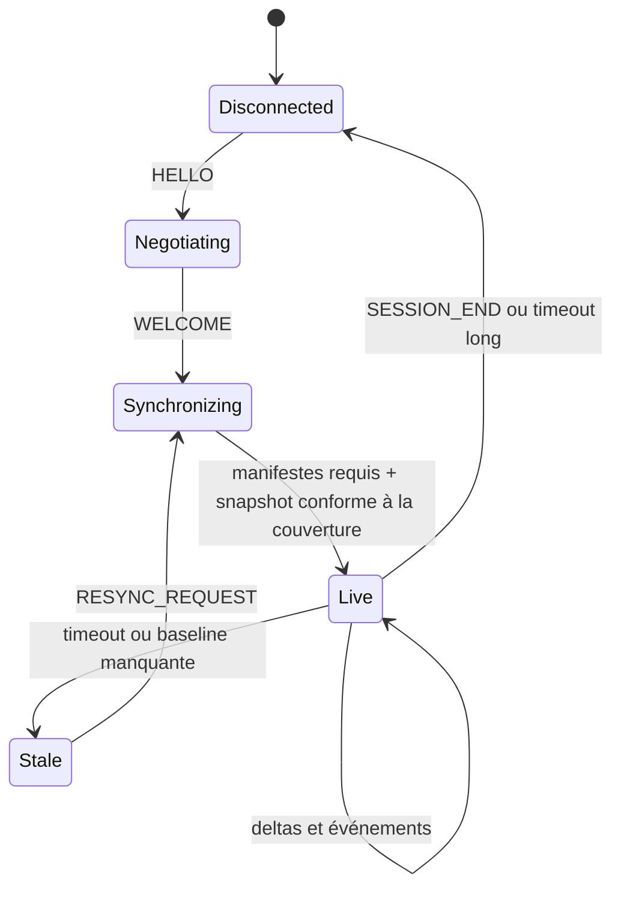

# Proposition de protocole UDP

## 1. Principes

- UDP est l'unique transport.
- Le protocole est bidirectionnel, même si la simulation reste en lecture seule.
- Les paquets sont versionnés, bornés et validés avant allocation.
- Les données rapides tolèrent la perte et le désordre.
- Les données indispensables utilisent ACK, retransmission et snapshots périodiques au-dessus d'UDP.
- Un client peut rejoindre une session en cours sans historique préalable.
- La perte d'un paquet ne doit jamais bloquer le producteur.

### 1.1 Portée de cette proposition

Ce document fixe les invariants et les structures nécessaires pour évaluer le protocole. Le contrat exhaustif et normatif est [`specs/0-Contrat-de-protocole`](specs/0-Contrat-de-protocole/README.md) : FSTL 1.0 y reste gelé et FSTL 1.1 y est défini comme amendement additif du premier flux Phase 1. Le schéma doit attribuer les valeurs numériques de tous les messages, records, enums et flags, décrire chaque champ dans son ordre filaire avec ses bornes et valeurs par défaut, formaliser les règles d'évolution, et fournir des vecteurs binaires ainsi que des tests de compatibilité croisée.

### 1.2 Conventions filaires communes

- Tous les entiers, longueurs, enums et flottants multi-octets sont encodés en little-endian. Une enum utilise le type non signé indiqué par son schéma ; une valeur inconnue est rejetée si le message ne la déclare pas extensible.
- Un `float32` est un IEEE-754 binary32. Les valeurs non finies sont rejetées, sauf autorisation explicite d'un champ dans le schéma v1.
- Une chaîne est encodée par `byte_length: u16`, suivi d'exactement `byte_length` octets UTF-8, sans NUL terminal. Sa borne métier, toujours inférieure ou égale à 65 535 octets, est définie champ par champ. L'UTF-8 invalide est rejeté.
- Les temps réseau sont des microsecondes entières. `sent_time_us` et `producer_sample_time_us` utilisent l'horloge monotone du processus concerné ; `mission_time_us` appartient au temps de simulation et peut évoluer différemment.
- Les positions et distances utilisent la world-unit FSO, les vitesses la world-unit FSO par seconde, les angles le radian et les vitesses angulaires le radian par seconde, sauf indication contraire explicite.
- Le repère télémétrique est direct : `+X` vers la droite, `+Y` vers le haut et `+Z` vers l'avant. Un quaternion est un `float32[4]` ordonné `(w, x, y, z)`, normalisé avant émission. Comme `q` et `-q` codent la même rotation, le signe canonique impose `w >= 0` puis, si `w == 0`, la première composante non nulle parmi `x`, `y`, `z` positive. Le schéma v1 doit documenter toute conversion nécessaire depuis le repère interne du moteur.
- L'ID stable d'une entité est un `u64`. La valeur `0` est toujours la sentinelle « aucune entité » et n'est jamais attribuée par le registre.

## 2. Taille maximale

FS2Open retient déjà 1232 octets comme charge UDP maximale sûre avec le MTU IPv6 minimal :

```text
1280 octets MTU IPv6 minimal
- 40 octets d'en-tête IPv6
-  8 octets d'en-tête UDP
= 1232 octets de payload UDP
```

Référence : [`code/network/psnet2.h`](../../code/network/psnet2.h#L34-L44).

La télémétrie utilisera une limite plus conservatrice :

```cpp
constexpr size_t TELEMETRY_MAX_DATAGRAM_SIZE = 1200;
```

Cette taille inclut l'en-tête de télémétrie. Aucun datagramme ne doit dépendre de la fragmentation IP.

Avec l'en-tête v1 de 68 octets, la charge utile maximale d'un fragment est donc :

```cpp
constexpr size_t TELEMETRY_HEADER_SIZE_V1 = 68;
constexpr size_t TELEMETRY_MAX_FRAGMENT_PAYLOAD = 1132;
```

## 3. En-tête de datagramme proposé

Le format v1 est little-endian, cohérent avec les packers actuels de FS2Open et simple pour les cibles x86/ESP32. Les flottants sont IEEE-754 `float32` ; les temps sont des entiers en microsecondes.

| Champ | Type | Description |
|---|---:|---|
| `magic` | `u32` | constante `FSTL` |
| `version_major` | `u8` | rupture de compatibilité |
| `version_minor` | `u8` | extension compatible |
| `message_type` | `u8` | famille du message |
| `flags` | `u8` | keyframe `FULL_SNAPSHOT`, fragment, ACK requis, `IDR` vidéo, etc. |
| `header_size` | `u16` | taille de l'en-tête |
| `payload_size` | `u16` | taille utile dans ce datagramme |
| `session_id` | `u64` | nouvelle valeur à chaque session |
| `packet_sequence` | `u32` | détection perte/désordre |
| `frame_id` | `u32` | groupe logique d'état |
| `mission_time_us` | `i64` | temps de mission |
| `sent_time_us` | `u64` | temps monotone local de l'émetteur |
| `message_id` | `u32` | message avant fragmentation |
| `fragment_index` | `u16` | index du fragment |
| `fragment_count` | `u16` | nombre total de fragments |
| `message_size` | `u32` | taille totale du payload logique avant fragmentation |
| `fragment_offset` | `u32` | offset du fragment dans le payload logique |
| `message_crc32` | `u32` | CRC du payload logique complet, identique dans tous ses fragments |
| `crc32` | `u32` | CRC du datagramme, en-tête et payload du fragment |

La taille de cet en-tête v1 est exactement 68 octets, laissant au plus 1132 octets de payload dans un datagramme de 1200 octets. Pour un message non fragmenté, `fragment_index = 0`, `fragment_count = 1`, `fragment_offset = 0` et `payload_size = message_size`. `message_id` est unique par direction dans une session tant qu'un message portant cet ID peut encore être en vol ; le producteur ouvre une nouvelle session avant toute réutilisation ambiguë après wrap.

FSTL 1.1 conserve exactement cet en-tête, les IDs, layouts, CRC, limites et règles de fragmentation FSTL 1.0. Sa seule nouveauté filaire est la valeur négociée `version_minor = 1`; sa seule nouveauté métier est le bit 10 `StateDomainCoverage.PLAYER_KINEMATICS = 0x0000000000000400`. `DISCOVERY`, `HELLO` et un `WELCOME` de rejet gardent l'en-tête 1.0 afin de transporter les intervalles de mineures et de permettre un rejet explicite ; un `WELCOME Accepted` porte déjà la mineure sélectionnée.

Les deux contrôles utilisent CRC-32/ISO-HDLC : polynôme normal `0x04C11DB7` (réfléchi `0xEDB88320`), `init = 0xFFFFFFFF`, `refin = true`, `refout = true`, `xorout = 0xFFFFFFFF`, valeur de contrôle `0xCBF43926` pour les octets ASCII `123456789`. `message_crc32` est calculé sur les `message_size` octets du payload logique sérialisé. `crc32` est calculé sur les 68 octets de l'en-tête, champ `crc32` mis à zéro, suivis des `payload_size` octets du fragment. Les CRC protègent contre la corruption accidentelle, pas contre un client malveillant.

## 4. Records de payload

Les messages d'état (`FULL_SNAPSHOT`, `DELTA`, `EVENT_BATCH` et manifestes) contiennent un ou plusieurs records. Les messages de contrôle et de vidéo dont une section définit un payload fixe n'utilisent pas cette enveloppe :

| Champ | Type | Description |
|---|---:|---|
| `record_type` | `u16` | type de bloc |
| `record_version` | `u8` | version du bloc |
| `record_flags` | `u8` | création, suppression, partiel, etc. |
| `record_length` | `u16` | longueur permettant d'ignorer un type inconnu |
| `record_payload` | bytes | contenu borné |

Chaque version de record possède un ordre de champs fixe. Les nouveaux champs compatibles sont ajoutés en fin de record. Les listes utilisent :

```text
count: u16
item_version: u8
item_size: u16
items: bytes[]
```

Ce modèle est moins coûteux qu'un TLV par champ, tout en permettant à un ancien client d'ignorer les records et extensions qu'il ne comprend pas.

## 5. Familles de messages

| Message | Direction | Livraison |
|---|---|---|
| `DISCOVERY` | producteur → réseau local optionnel | périodique |
| `HELLO` | client → producteur | répété jusqu'à réponse |
| `WELCOME` | producteur → client | acquitté |
| `SESSION_BEGIN` | producteur → client | acquitté |
| `MANIFEST` | producteur → client | fragmenté, acquitté |
| `FULL_SNAPSHOT` | producteur → client | fragmenté, acquitté |
| `DELTA` | producteur → client | non acquitté |
| `EVENT_BATCH` | producteur → client | répété ou acquitté selon classe |
| `TARGET_VIDEO_SUBSCRIBE` | client → producteur | fiable au niveau applicatif |
| `TARGET_VIDEO_CONFIG` | producteur → client | acquitté |
| `TARGET_VIDEO_FRAME` | producteur → client | interframe non acquittée ; IDR avec NACK sélectif pendant 500 ms |
| `TARGET_VIDEO_KEYFRAME_REQUEST` | client → producteur | fiable, répété avec backoff et limité en fréquence |
| `TARGET_VIDEO_STOP` | producteur → client | acquitté |
| `TARGET_VIDEO_STATS` | client → producteur | optionnel, périodique |
| `HEARTBEAT` | bidirectionnel | périodique |
| `ACK` / `NACK` | bidirectionnel | immédiat |
| `RESYNC_REQUEST` | client → producteur | répété jusqu'à réponse |
| `SESSION_END` | producteur → client | répété et inclus dans l'état suivant |

Cela reste un seul protocole UDP. La fiabilité nécessaire est une propriété de certains messages, pas un second transport.

### 5.1 Négociation et synchronisation des horloges

L'en-tête porte l'heure monotone locale de son émetteur dans `sent_time_us`. La synchronisation suit l'échange à quatre instants de NTP sans prétendre fournir une heure civile :

```text
t0 : envoi de la requête par l'initiateur
t1 : réception de la requête par le répondant
t2 : envoi de la réponse par le répondant
t3 : réception de la réponse par l'initiateur
```

Le préfixe fixe de `HELLO` contient au minimum `client_nonce: u64` et `client_send_t0_us: u64`, puis les versions, capabilities et hashes négociés décrits par le schéma v1. Le `HELLO` initial utilise `session_id = 0`. `WELCOME` reprend `client_nonce`, `client_send_t0_us`, puis ajoute `producer_receive_t1_us: u64`, `producer_send_t2_us: u64`, les paramètres négociés et l'intervalle de heartbeat ; son en-tête porte le nouveau `session_id`. Le client relève `client_receive_t3_us` à la réception, avant tout traitement coûteux.

Le producteur Phase 1 annonce `min_minor = max_minor = 1`. Il sélectionne 1.1 face à un client compatible et répond `UnsupportedVersion` à un client limité à 1.0, sans créer de session. Une implémentation ne peut annoncer `0..1` que si elle sait aussi produire le snapshot `CORE_SHIP` complet exigé par FSTL 1.0 ; aucune rétrogradation silencieuse n'est autorisée.

Après connexion, un `HEARTBEAT` utilise le préfixe suivant :

| Champ | Type | Description |
|---|---:|---|
| `probe_id` | `u32` | compteur propre à l'initiateur |
| `kind` | `u8` | `REQUEST` ou `RESPONSE` |
| `reserved` | `bytes[3]` | zéro en v1 |
| `origin_t0_us` | `u64` | instant d'envoi de la requête chez l'initiateur |
| `receive_t1_us` | `u64` | zéro dans `REQUEST`, réception chez le répondant dans `RESPONSE` |
| `transmit_t2_us` | `u64` | zéro dans `REQUEST`, envoi de la réponse chez le répondant dans `RESPONSE` |

Le répondant copie `probe_id` et `origin_t0_us`. L'initiateur relève localement `t3`. Pour une requête client vers producteur, l'offset « producteur moins client » et le RTT estimés sont :

```text
clock_offset_us = ((t1 - t0) + (t2 - t3)) / 2
round_trip_us   = (t3 - t0) - (t2 - t1)
estimated_producer_time_us = client_monotonic_time_us + clock_offset_us
```

Le client conserve plusieurs échantillons bornés, privilégie les RTT les plus faibles et lisse les variations ; il invalide l'estimation après un changement de session ou plusieurs heartbeats manqués. Les différences sont calculées dans un entier signé suffisamment large, avec contrôle d'overflow. `mission_time_us` n'est jamais utilisé pour cette synchronisation.

### 5.2 Structure et sémantique des ACK/NACK

Un `ACK` n'est émis qu'après réassemblage complet, validation de `message_crc32` et acceptation du message logique. Son payload fixe est :

| Champ | Type | Description |
|---|---:|---|
| `target_message_id` | `u32` | message logique acquitté |
| `target_message_type` | `u8` | type attendu du message acquitté |
| `ack_flags` | `u8` | `APPLIED`, ou `VALIDATED` si l'application atomique est différée |
| `target_fragment_count` | `u16` | doit correspondre à l'en-tête du message |
| `target_message_crc32` | `u32` | désambiguïsation et validation de l'ACK |

Un `NACK` demande sélectivement les fragments manquants ou signale l'impossibilité de valider un message :

| Champ | Type | Description |
|---|---:|---|
| `target_message_id` | `u32` | message logique concerné |
| `target_message_type` | `u8` | type attendu |
| `reason` | `u8` | `MISSING_FRAGMENTS`, `BAD_MESSAGE_CRC`, `STALE_BASELINE` ou autre valeur du schéma v1 |
| `target_fragment_count` | `u16` | nombre annoncé par le message cible |
| `target_message_crc32` | `u32` | désambiguïsation du message cible |
| `needed_before_producer_time_us` | `u64` | deadline estimée dans l'horloge du producteur, `0` si non applicable |
| `bitmap_bytes` | `u16` | longueur du bitmap, au plus 256 octets |
| `reserved` | `u16` | zéro en v1 |
| `missing_bitmap` | `bytes[bitmap_bytes]` | bit `i` à 1 si le fragment `i` manque, bit de poids faible en premier |

`bitmap_bytes` vaut exactement `ceil(target_fragment_count / 8)` pour `MISSING_FRAGMENTS` et zéro pour les raisons sans liste. Les bits hors `target_fragment_count` doivent être nuls. Un ACK ou NACK inconnu, tardif, provenant d'un autre endpoint ou dont le type, le nombre de fragments et le CRC ne correspondent pas au message conservé est ignoré. ACK et NACK ne sont jamais eux-mêmes acquittés ; leur duplication est idempotente. `VALIDATED` signale seulement que le message est structurellement et sémantiquement acceptable : il ne change pas une baseline et ne permet pas de libérer un snapshot qui doit encore être appliqué. Le client renvoie le même ACK avec `APPLIED` après publication atomique ; seul ce dernier fait avancer la baseline commune. Pour un message fiable, l'absence de l'ACK requis par sa classe déclenche un backoff borné ; un NACK valide permet de ne retransmettre que les fragments indiqués. Une expiration provoque une nouvelle keyframe d'état ou une resynchronisation plutôt qu'une rétention illimitée.

## 6. Catégories de records

- `SESSION_STATE`
- `MISSION_STATE`
- `CLASS_MANIFEST`
- `WEAPON_MANIFEST`
- `ENTITY_LIFECYCLE`
- `SHIP_IDENTITY`
- `FLIGHT_STATE`
- `CONTROL_STATE`
- `DAMAGE_STATE`
- `SHIELD_STATE`
- `SUBSYSTEM_STATE`
- `ENERGY_STATE`
- `PROPULSION_STATE`
- `WEAPON_STATE`
- `LOCK_STATE`
- `TARGET_STATE`
- `RADAR_STATE`
- `RADAR_CONTACTS`
- `THREAT_STATE`
- `CARGO_SCAN_STATE`
- `DOCKING_STATE`
- `SUPPORT_STATE`
- `NAVIGATION_STATE`
- `EFFECT_STATE`
- `COMM_ASSET_MANIFEST`
- `COMM_VIEW_STATE`
- `COMM_VIEW_EVENT`
- `EVENTS`

Chaque record commence par l'ID stable de l'entité à laquelle il s'applique, sauf les records globaux.

### 6.1 Vue de communication

La vue de communication utilise des assets préinstallés. Le réseau transmet leur identité et l'état de lecture, jamais les pixels de chaque frame.

`COMM_ASSET_MANIFEST` est un record global fiable. Une entrée contient au minimum :

| Champ | Type | Description |
|---|---:|---|
| `asset_id` | `u64` | ID stable et content-addressed du fichier livré |
| `content_hash` | `bytes[32]` | SHA-256 du fichier livré au client |
| `source_format` | `u8` | format de l'asset moteur d'origine : ANI, EFF, APNG ou image fixe |
| `delivered_format` | `u8` | format réellement présent dans le bundle client : APNG, atlas, image ou autre valeur négociée |
| `width`, `height` | `u16` | dimensions logiques |
| `frame_count` | `u32` | nombre d'images |
| `duration_us` | `u64` | durée totale |
| `logical_name` | chaîne bornée | nom de diagnostic, sans chemin absolu |

`asset_id` est constitué des huit premiers octets du SHA-256 des octets livrés, interprétés comme un entier non signé big-endian ; ce `u64` est ensuite sérialisé little-endian sur le fil. Le hash complet reste autoritaire ; un bundle contenant deux contenus différents avec le même `asset_id` est invalide. Le `bundle_hash` est le SHA-256 du manifeste JSON canonique UTF-8 défini dans [06 — Vue de communication](06-communication-view.md#43-manifeste) : clés triées, aucune espace non significative, entiers en base 10 et tableau `assets` trié par `(asset_id, logical_name UTF-8 bytewise)`. Les chemins qu'il contient sont relatifs au bundle ; aucun chemin absolu ni métadonnée du système de fichiers n'entre dans le hash.

Le manifeste décrit les fichiers mais ne les transporte pas. Le client annonce dans `HELLO` la capability `COMM_VIEW_LOCAL_ASSETS`, son `bundle_hash` et la liste `supported_delivered_formats`. Le producteur indique dans `WELCOME` si la vue peut être activée. Un bundle absent, différent ou dont le format livré n'est pas décodable n'empêche jamais la réplication des autres domaines.

`COMM_VIEW_STATE` décrit l'unique lecture actuellement visible :

| Champ | Type | Description |
|---|---:|---|
| `active` | `u8` | aucune vue ou vue active |
| `playback_id` | `u64` | ID monotone de lecture dans la session |
| `engine_message_id` | `u32` | corrélation avec le message de mission, distinct du `message_id` de l'en-tête |
| `sender_entity_id` | `u64` | ID stable de l'émetteur répliqué ; `0` signifie explicitement « aucun » |
| `head_asset_id` | `u64` | animation effectivement résolue |
| `producer_sample_time_us` | `u64` | instant monotone de l'échantillon |
| `animation_time_us` | `u64` | offset autoritaire dans l'animation |
| `duration_us` | `u64` | durée attendue de l'asset |
| `playback_rate` | `float32` | taux signé : `0` en pause, négatif en lecture inverse, compression temporelle incluse |
| `playback_flags` | `u16` | boucle, teinte HUD et pleine couleur ; le sens et la pause viennent de `playback_rate` |
| `stop_reason` | `u8` | valeur significative lorsque `active == 0` |

Cet état figure dans `FULL_SNAPSHOT` et les keyframes. Un client arrivé en retard calcule précisément :

```text
elapsed_us = max(0, client_estimated_producer_time_us - producer_sample_time_us)
display_time_us = animation_time_us + playback_rate * elapsed_us
```

Le calcul intermédiaire est signé. Le client applique ensuite la boucle dans `[0, duration_us)` ou borne la valeur à `[0, duration_us]`. `playback_rate == 0` conserve exactement `animation_time_us`. Une correction plus récente du même `playback_id` remplace toujours l'offset et le taux précédents.

`COMM_VIEW_EVENT` transporte `START` ou `STOP` avec le même `playback_id`. `START` reprend les champs de lecture nécessaires pour commencer immédiatement sans attendre la keyframe suivante. `STOP` ne s'applique que si son `playback_id` correspond à la lecture visible, ce qui empêche un paquet retardé d'arrêter une communication plus récente.

`START`, `STOP`, un saut d'offset et tout changement de `playback_rate` sont envoyés immédiatement. Tant qu'une vue est active, `COMM_VIEW_STATE` est aussi émis périodiquement à une cadence plafonnée à 10 Hz et inclus dans chaque keyframe d'état ; ces corrections bornent la dérive et permettent de rejoindre une lecture en cours.

La restitution de la piste voix n'appartient pas à la première version de la vue de communication. Aucun paquet audio n'est défini ici.

### 6.2 Vue 3D de cible haute résolution

Le flux `RemoteRenderedFrame` transporte des access units H.264 produites par un second rendu FS2Open. Il ne fait pas partie des snapshots : seules sa configuration et son association à la cible courante sont de l'état répliqué.

Le producteur annonce `TARGET_VIDEO_REMOTE_RENDER` dans `WELCOME` uniquement si le renderer, le readback asynchrone et un encodeur sont disponibles. Le client annonce `TARGET_VIDEO_H264` s'il peut décoder ce codec et présenter la texture obtenue.

`TARGET_VIDEO_SUBSCRIBE` négocie H.264 avec les champs suivants :

| Champ | Type | Description |
|---|---:|---|
| `request_id` | `u32` | déduplication de la demande fiable |
| `max_width`, `max_height` | `u16` | dimensions maximales décodables |
| `preferred_width`, `preferred_height` | `u16` | dimensions souhaitées, bornées par les maxima |
| `max_fps` | `u16` | cadence entière maximale décodable |
| `preferred_fps` | `u16` | cadence entière souhaitée, bornée par le maximum |
| `max_bitrate_kbps` | `u32` | débit maximal accepté |
| `preferred_bitrate_kbps` | `u32` | débit souhaité par le client |
| `supported_h264_profiles` | `u32` | bitmap versionné des profils acceptés |
| `supported_h264_levels` | `u32` | bitmap versionné des niveaux acceptés |
| `overlay_capabilities` | `u32` | bitmap versionné des overlays que le client sait redessiner localement |

Une préférence supérieure à son maximum ou l'absence de profil/niveau commun est rejetée. Le schéma v1 attribue les bits des trois bitmaps ; un bit inconnu est ignoré.

Le producteur borne ces valeurs par sa configuration et répond avec `TARGET_VIDEO_CONFIG` :

| Champ | Type | Description |
|---|---:|---|
| `stream_id` | `u32` | identifie le flux jusqu'à son arrêt |
| `config_generation` | `u32` | change avec résolution, codec, profil ou cible |
| `codec` | `u8` | H.264 dans la première version |
| `codec_profile` | `u8` | profil négocié |
| `codec_level` | `u8` | niveau négocié |
| `pixel_format` | `u8` | format décodé attendu, initialement 4:2:0 8 bits |
| `width`, `height` | `u16` | résolution encodée |
| `fps_num`, `fps_den` | `u16` | cadence rationnelle |
| `bitrate_kbps` | `u32` | objectif, non garantie stricte |
| `gop_duration_ms` | `u16` | intervalle IDR maximal |
| `render_profile` | `u8` | `MfdHigh` ou `HudExact` |
| `overlay_mode` | `u8` | `Client` dans la première version |
| `recovery_mode` | `u8` | `IdrSelectiveRetransmit` dans la première version |
| `idr_recovery_window_ms` | `u16` | fenêtre de rétention et retransmission IDR, au plus 500 ms en v1 |

Une access unit H.264 forme un unique message logique `TARGET_VIDEO_FRAME`. Son payload logique commence une seule fois par les métadonnées suivantes, puis contient exactement `encoded_frame_size` octets encodés :

| Champ | Type | Description |
|---|---:|---|
| `stream_id` | `u32` | flux destinataire |
| `config_generation` | `u32` | rejette une ancienne configuration |
| `video_frame_id` | `u32` | ordre des frames du flux |
| `target_entity_id` | `u64` | empêche d'afficher l'ancienne cible |
| `presentation_time_us` | `u64` | temps monotone de présentation |
| `encoded_frame_size` | `u32` | allocation totale bornée |
| `video_flags` | `u16` | `IDR`, discontinuité, cible changée |

Le fragmenter découpe ensuite cette suite d'octets selon `fragment_offset` ; il ne répète aucun préfixe vidéo dans les fragments suivants. Ainsi `message_size` vaut la taille des métadonnées plus `encoded_frame_size`, et les champs génériques `message_id`, `fragment_index`, `fragment_count`, `fragment_offset` et `message_crc32` suffisent au réassemblage. `message_id` identifie le message logique de transport et reste distinct de la séquence métier `video_frame_id`, qui n'est lue qu'après réassemblage et validation.

`TARGET_VIDEO_KEYFRAME_REQUEST` demande une IDR après perte ou erreur de décodage. C'est un message fiable au niveau applicatif, dédupliqué par son `request_id`, retransmis avec backoff jusqu'à ACK et limité en fréquence par client et par flux. Le producteur peut agréger plusieurs requêtes en une seule IDR. `TARGET_VIDEO_STOP` termine explicitement un `stream_id` lors d'une disparition de cible, d'un désabonnement, d'un changement de mission ou d'une incapacité du renderer/encodeur.

Les fragments `TARGET_VIDEO_FRAME` ont la priorité réseau la plus faible. Un budget vidéo par client limite leur débit ; les contrôles de session, synchronisations d'horloge, ACK/NACK, événements, snapshots et deltas passent toujours avant eux. Une saturation du socket supprime des fragments vidéo, jamais un état essentiel au profit de la vidéo. Les interframes ne sont jamais retransmises. Le producteur conserve les fragments de la dernière IDR pendant au plus 500 ms après son premier envoi et ne retransmet que ceux indiqués par un `NACK MISSING_FRAGMENTS`, à condition que `needed_before_producer_time_us` ne soit pas dépassé. Ces retransmissions restent moins prioritaires que tout état de télémétrie ; passé ce délai, le client abandonne la frame et peut envoyer une demande d'IDR fiable.

La configuration détaillée et le pipeline sont décrits dans [07 — Vue de cible 3D haute résolution](07-high-resolution-target-view.md).

## 7. Fragmentation applicative

Les catalogues, manifestes d'assets, snapshots complets et listes de contacts dépasseront 1200 octets. Le module les découpe avant `sendto()`.

Le message est d'abord sérialisé une seule fois en un payload logique de `message_size` octets ; les records ou métadonnées qui le préfixent ne sont jamais répétés. En v1, le fragment canonique `i` transporte la tranche commençant à `fragment_offset = i * 1132`. Tous les fragments sauf le dernier ont `payload_size = 1132`, et `fragment_count = ceil(message_size / 1132)` ; un message vide non fragmenté est le seul cas particulier. Chaque fragment possède l'en-tête complet et répète les mêmes `session_id`, `message_type`, `message_id`, `message_size`, `message_crc32`, `frame_id` et `fragment_count`.

Le récepteur suit cet ordre avant toute allocation proportionnelle à l'entrée :

1. valider la taille réelle du datagramme, l'en-tête v1 et son `crc32` ;
2. valider la classe du message, `message_size`, `fragment_count`, `fragment_index`, l'offset canonique et `fragment_offset + payload_size <= message_size` ;
3. vérifier ou réserver une entrée de réassemblage dans les quotas du client ;
4. accepter un fragment dupliqué seulement si ses octets sont identiques, et rejeter tout chevauchement contradictoire ;
5. après réception de toutes les tranches, vérifier `message_crc32`, puis parser et appliquer atomiquement le message logique.

Aucun snapshot, manifeste, record ou access unit partiel n'est appliqué. Les limites du protocole sont :

| Classe | Taille logique maximale | Fragments maximum | Réassemblages simultanés par client | Octets réservés par client |
|---|---:|---:|---:|---:|
| messages fiables et état | 1 Mio (`1 048 576`) | 1024 | 4 | 4 Mio |
| `TARGET_VIDEO_FRAME` | 2 Mio (`2 097 152`) | 2048 | 3 | 6 Mio |

Ces limites sont des maxima v1 et peuvent être abaissées par configuration ou négociation, jamais relevées sans nouvelle version compatible. Les quotas globaux valent au plus le nombre maximal de clients configurés multiplié par ces quotas par client. Une nouvelle réservation qui dépasserait un quota est rejetée sans évincer un message fiable plus ancien au profit de la vidéo.

Pour un message fiable, le récepteur envoie un `NACK` sélectif après détection d'un trou ; l'absence d'ACK provoque un backoff borné et peut entraîner une retransmission complète. Le timeout de réassemblage fiable est configurable et borné, initialement 2 secondes. À expiration, les buffers sont libérés et une resynchronisation ou une nouvelle keyframe d'état remplace l'historique perdu.

Pour la vidéo :

- une interframe n'est jamais retransmise et son réassemblage expire après 100 à 200 ms ;
- une IDR incomplète peut faire l'objet d'un `NACK` sélectif tant que la copie du producteur, conservée au plus 500 ms, existe et que la deadline transmise n'est pas dépassée ;
- une frame encore incomplète à sa deadline est abandonnée entièrement ;
- la prochaine IDR corrige la chaîne de décodage, éventuellement après `TARGET_VIDEO_KEYFRAME_REQUEST`.

Le client libère immédiatement tout réassemblage expiré, appartenant à une session remplacée, à une ancienne `config_generation` ou à un flux arrêté.

## 8. Snapshots et deltas

Un `FULL_SNAPSHOT` reçoit un `snapshot_id` strictement croissant dans la session et décrit un état autonome. Une keyframe d'état est un nouveau `FULL_SNAPSHOT` fiable ; elle ne devient la baseline commune qu'après réassemblage, validation, application atomique et émission de son `ACK APPLIED`. Si cet ACK est perdu, une retransmission du même snapshot déjà appliqué est acquittée de nouveau sans republier ni faire régresser l'état ; un snapshot plus ancien que la baseline courante est ignoré. Le producteur n'active que sa candidate courante et ne revient jamais à un `snapshot_id` antérieur.

Dans le profil FSTL 1.1 Phase 1, la complétude signifie `PLAYER_KINEMATICS` et non `CORE_SHIP`. `required_manifest_id`, capabilities et couvertures événementielles valent zéro. Le snapshot contient `SESSION_STATE`, `MISSION_STATE` et, lorsqu'un joueur est observé, son `ENTITY_LIFECYCLE` de type `SHIP` et son `FLIGHT_STATE` à masque de présence nul. Un changement de mission ou de joueur observé impose une nouvelle keyframe. La Phase 2 positionne `PLAYER_KINEMATICS | CORE_SHIP` seulement après installation des manifestes et présence de toute la matrice système.

Un `DELTA` contient :

- `baseline_snapshot_id` ;
- `delta_sequence`, strictement croissant au sein de cette baseline ;
- toutes les valeurs courantes qui diffèrent du `FULL_SNAPSHOT` de baseline, selon la granularité de remplacement des records ;
- toutes les suppressions explicites survenues depuis cette baseline.

Un delta est donc cumulatif depuis la baseline, pas différentiel par rapport au delta ou à la frame précédente. Le producteur maintient un dirty-set par baseline et compare la valeur courante à la baseline ; la perte de n'importe quel nombre de deltas intermédiaires ne rend pas le suivant incomplet. Un delta plus récent portant le même `baseline_snapshot_id` remplace intégralement les précédents.

À la capture d'une nouvelle keyframe, le producteur crée au plus une baseline candidate par client et commence à suivre les différences par rapport à ce snapshot sans cesser d'émettre les deltas de la baseline active. Une candidate encore dans sa fenêtre fiable est retransmise plutôt que remplacée périodiquement ; après expiration ou resynchronisation, une candidate plus récente peut la remplacer avec une rétention toujours bornée. À réception de `ACK APPLIED`, le producteur active la candidate et initialise son dirty-set par comparaison entre l'état courant et le snapshot capturé, ou avec un journal équivalent maintenu depuis sa capture. Il ne remet jamais aveuglément ce dirty-set à vide : toute modification, création ou suppression survenue pendant l'aller-retour de l'ACK doit apparaître dans le premier delta de la nouvelle baseline.

Le client :

1. refuse un delta dont la baseline est inconnue ;
2. conserve une copie immuable du `FULL_SNAPSHOT` de baseline ;
3. reconstruit l'état candidat depuis cette baseline, puis y superpose le delta cumulatif et ses suppressions ; un champ absent reprend donc sa valeur de baseline ;
4. accepte les records dans un ordre quelconque au sein du message logique complet, puis publie le nouvel état atomiquement ;
5. ignore tout `delta_sequence` inférieur ou égal au dernier appliqué pour cette baseline, mais n'exige aucune continuité de séquence ;
6. ignore un delta de l'ancienne baseline dès que la nouvelle keyframe a été appliquée ;
7. demande `RESYNC_REQUEST` si la baseline requise n'arrive pas ou si l'état ne peut plus être validé.

Le producteur ne rebascule son dirty-set qu'au changement de baseline, selon la règle sans perte ci-dessus. Un delta de la nouvelle baseline reçu avant son `FULL_SNAPSHOT` peut au plus remplacer un unique delta en attente borné ; il n'est jamais appliqué sur l'ancienne baseline. Après `ACK APPLIED` de la nouvelle keyframe, le producteur peut libérer les données fiables liées à l'ancienne baseline.

Le principe « dernier état reçu gagnant » s'applique aux mouvements et jauges. Les suppressions d'entité et changements de session doivent aussi apparaître dans les snapshots afin de corriger la perte d'un événement.

## 9. Fiabilité au-dessus d'UDP

### Non fiable et remplaçable

- pose et cinématique ;
- commandes ;
- valeurs de jauges ;
- contacts radar fréquents ;
- progression de lock ;
- fragments des interframes `TARGET_VIDEO_FRAME`.

L'état courant périodique d'une vue de communication, plafonné à 10 Hz ou reçu dans une keyframe, est également remplaçable par un état plus récent du même `playback_id`.

Une valeur plus récente remplace l'ancienne ; aucune retransmission.

Cas vidéo borné : les interframes restent strictement non fiables. Les fragments d'une IDR peuvent seuls être retransmis sélectivement sur NACK, pendant la rétention maximale de 500 ms et avant la deadline client. Cette exception ne transforme pas le flux vidéo en canal fiable et ne retarde jamais les messages d'état.

### Fiable au niveau applicatif

- `WELCOME` et début de session ;
- catalogues ;
- snapshot initial ;
- apparition/disparition ;
- configuration d'une entité ;
- cargo révélé ;
- événements non reconstructibles ;
- manifeste d'assets de communication ;
- début, remplacement et fin d'une vue de communication ;
- configuration et arrêt du flux vidéo cible ;
- abonnement et `TARGET_VIDEO_KEYFRAME_REQUEST` demandant une IDR ;
- fin de session.

Le producteur conserve ces messages dans une fenêtre bornée, les retransmet avec backoff et les supprime à l'ACK. Après expiration, il envoie une nouvelle keyframe d'état plutôt que de conserver indéfiniment un historique. Les structures exactes d'ACK/NACK, leurs validations et leur déduplication sont définies en section 5.2.

## 10. Machine d'état du client



Le client n'expose l'état comme « complet » qu'après réception :

- des versions et capacités ;
- des manifestes nécessaires, s'il en existe pour la couverture annoncée ;
- d'un snapshot intégral validé relativement à `state_domain_coverage`.

La capability de vue de communication est indépendante de cet état global : un client peut être `Live` avec un bundle visuel absent ou incompatible. Il expose alors `communication_view_available = false` et un état de vue indisponible. Le placeholder d'asset est réservé à un fichier ponctuellement absent ou corrompu dans un bundle annoncé compatible.

Le flux vidéo possède un sous-état indépendant :

```text
Unsupported -> Stopped -> Starting -> Live -> Stale
                 ^           |          |       |
                 |           +----------+-------+
                 +---------- TARGET_VIDEO_STOP
```

Le client peut rester `Live` pour la télémétrie lorsque la vidéo est `Unsupported`, `Stopped` ou `Stale`. Une frame n'est présentée que si `stream_id`, `config_generation` et `target_entity_id` correspondent encore à l'état courant.

## 11. Cadences proposées

| Canal | Fréquence initiale |
|---|---:|
| Pose et cinématique | 30 à 60 Hz |
| Commandes, cible et locks | 15 à 30 Hz |
| Radar et missiles entrants | 10 à 20 Hz |
| Coque, boucliers, énergie, ETS et munitions | 5 à 10 Hz |
| Navigation, scan, docking et support | 5 à 10 Hz ou changement |
| Vue de communication | début/fin et changements discontinus immédiats, état actif périodique plafonné à 10 Hz et inclus dans les keyframes |
| Vue 3D cible H.264 | 10 à 15 FPS initialement, jusqu'à 20 FPS configurables |
| Événements | immédiat, regroupement court |
| Heartbeat et synchronisation d'horloge | 1 Hz hors mission, 2 à 5 Hz en mission |
| Keyframe complète | toutes les 1 à 5 secondes |

Le producteur doit pouvoir ajuster ces cadences selon la bande passante et la charge mesurées.

## 12. Socket et API interne

API indicative :

```cpp
enum class IoResult {
    Sent,
    WouldBlock,
    Error
};

class UdpTransport {
public:
    bool open(uint16_t bind_port);
    void close();
    bool resolve(const char* host, uint16_t port, Endpoint& endpoint);
    IoResult send(const Endpoint&, const uint8_t*, size_t);
    ReceiveResult receive(uint8_t*, size_t, Endpoint&);
};
```

Le `SOCKET`, les `SOCKADDR_*` et les détails IPv4/IPv6 restent privés au `.cpp` du transport.

## 13. Validation des entrées

Avant toute allocation ou traitement :

- vérifier magic, version et `header_size == 68` pour la v1 ;
- vérifier `payload_size <= 1132`, l'égalité `header_size + payload_size` avec la taille réelle du datagramme, puis son `crc32` avant de conserver le fragment ;
- borner tous les comptes, tailles et index ;
- vérifier `message_size`, `fragment_count`, `fragment_index`, l'offset canonique, la tranche déclarée et la cohérence de tous les fragments avec les plafonds 1 Mio/1024 ou 2 Mio/2048 ;
- réserver dans les quotas de réassemblage avant allocation, puis vérifier `message_crc32` avant parsing ;
- borner `encoded_frame_size`, vérifier qu'il correspond aux octets restant après les métadonnées, et borner les frames vidéo en vol ainsi que leur timeout ;
- valider les longueurs UTF-8, enums et `float32`, et rejeter les valeurs non finies non autorisées ;
- rejeter codec, `codec_profile`, `codec_level`, résolution, génération ou `stream_id` non négociés ;
- vérifier endpoint, type, nombre de fragments, bitmap, CRC cible et deadline de chaque ACK/NACK avant de modifier une fenêtre de retransmission ;
- rejeter une session inconnue hors `HELLO`/`WELCOME` ;
- filtrer l'adresse source selon la configuration ;
- limiter le débit des requêtes de resynchronisation ;
- limiter les abonnements vidéo, changements de configuration et demandes d'IDR ;
- ignorer les types inconnus sans planter.

Le client distant ne peut envoyer aucune commande de simulation dans la première version.

## 14. Sécurité

La première cible est un LAN de confiance :

- destination et clients autorisés configurés explicitement ;
- pas de broadcast par défaut ;
- validation stricte des tailles ;
- session ID imprévisible ;
- protection contre le flood et limites de mémoire ;
- journalisation des clients acceptés/refusés.

UDP ne chiffre ni n'authentifie. Une exposition Internet demanderait une authentification et idéalement une protection cryptographique ; elle est hors du premier périmètre.

## 15. Pourquoi ne pas réutiliser les paquets multijoueur

Le protocole multijoueur :

- dépend de l'autorité et de l'état d'une partie FS2Open ;
- quantifie et compresse les valeurs ;
- omet plusieurs données nécessaires aux instruments ;
- utilise des indices et hypothèses partagés par les participants ;
- peut changer avec le moteur ;
- mélange logique de jeu et transport.

Il démontre que la réplication est faisable et fournit des exemples de découpage sous la limite de paquet, mais ne constitue pas une API publique stable.
