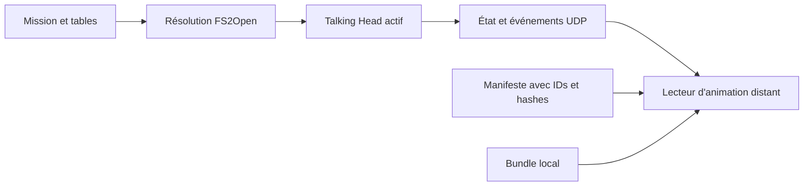

# Réplication de la vue de communication

> **Document prospectif, non normatif.** Les exemples de ce document ne sont pas des configurations produit et ne doivent pas être chargés par le runtime actif.

## 1. Périmètre

Ce document décrit uniquement la fenêtre animée affichée par le gauge `Talking Head` pendant une communication.

La première version couvre :

- l'animation du portrait ;
- son démarrage, son remplacement et son arrêt ;
- la reprise en cours de lecture après connexion ou resynchronisation ;
- le mode boucle ou lecture unique ;
- le sens de lecture ;
- le choix entre teinte HUD et pleine couleur ;
- le cadre du gauge, si le client souhaite reproduire l'apparence FS2Open ;
- la sélection et la validation des assets locaux.

Elle ne couvre pas :

- la restitution de la piste voix ;
- le transport d'audio ;
- le streaming des pixels de l'animation ;
- la distribution automatique du bundle pendant une mission ;
- les autres vues ou rendus du HUD.

La vue de cible 3D, volontairement séparée de ce mécanisme à assets locaux, est décrite dans [07 — Vue de cible 3D haute résolution](07-high-resolution-target-view.md).

## 2. Fonctionnement actuel dans FS2Open

### 2.1 Données de mission

`MissionMessage` référence séparément une animation et une voix dans [`code/mission/missionmessage.h`](../../code/mission/missionmessage.h#L199-L221). Le parser accepte :

- `+AVI Name` pour l'animation, malgré le nom historique ;
- `+Wave Name` pour la voix facultative.

Référence : [`code/mission/missionmessage.cpp`](../../code/mission/missionmessage.cpp#L480-L560).

La voix est jouée séparément par [`message_play_wave()`](../../code/mission/missionmessage.cpp#L1315-L1356). Elle peut influencer le choix de l'offset initial ou la durée d'affichage, mais elle n'est pas nécessaire pour afficher la première version distante.

### 2.2 Résolution de l'animation

[`message_play_anim()`](../../code/mission/missionmessage.cpp#L1409-L1562) :

1. récupère le nom déclaré par la mission ;
2. retire son extension ;
3. applique les règles de persona et de message intégré ;
4. ajoute éventuellement un suffixe comme `a`, `b`, `-reg` ou `-death` ;
5. charge l'animation réellement trouvée ;
6. calcule un premier offset en fonction de sa durée et de celle de la voix ;
7. configure la boucle et la coloration HUD.

Le nom déclaré dans la mission n'est donc pas une identité suffisante pour le protocole public. La télémétrie doit observer le nom final contenu dans `generic_anim::filename`.

Avec le nouveau système de suffixes, le gauge peut encore choisir une image de départ aléatoire dans [`HudGaugeTalkingHead::render()`](../../code/hud/hudmessage.cpp#L1299-L1314). L'offset final ne devient autoritaire qu'après cette étape.

### 2.3 Rendu

[`HudGaugeTalkingHead::render()`](../../code/hud/hudmessage.cpp#L1175-L1317) :

- retrouve le `pmessage` actif dans `Playing_messages` ;
- vérifie si l'animation doit continuer ;
- dessine le cadre du gauge ;
- avance `generic_anim` avec `frametime` ;
- dessine l'image courante en teinte HUD ou en pleine couleur ;
- arrête ou remplace la lecture lorsque le message disparaît.

Les formats génériques pris en charge sont ANI, EFF et APNG : [`code/bmpman/bmpman.cpp`](../../code/bmpman/bmpman.cpp#L64-L72) et [`code/graphics/generic.cpp`](../../code/graphics/generic.cpp#L157-L305).

## 3. Décision d'architecture

Le client distant ne reçoit pas une vidéo. Il possède une copie préparée de l'animation et reçoit uniquement un état de lecture synchronisé.



Avantages :

- aucune bande passante proportionnelle au nombre d'images ;
- aucune capture GPU ;
- aucun encodage vidéo dans la frame du jeu ;
- qualité identique à l'asset source ou à sa conversion ;
- reprise possible à n'importe quel offset ;
- coût nul pour un client ou ESP32 qui n'annonce pas cette capability.

La contrepartie est que le producteur et le client doivent utiliser un bundle compatible. Le hash du bundle est négocié pendant `HELLO`/`WELCOME`. Une incompatibilité désactive cette capability ; une corruption ou l'absence ponctuelle d'un asset dans un bundle annoncé compatible produit un placeholder et un diagnostic, jamais une erreur de session.

## 4. Bundle d'assets

### 4.1 Contenu

Organisation indicative :

```text
telemetry-assets/
├── manifest.json
├── communication/
│   ├── animations/
│   ├── frames/
│   └── placeholder/
└── bundle-info.json
```

Le cadre `head1` ou son remplacement défini dans `hud_gauges.tbl` peut être ajouté dans `frames/` si le client souhaite un habillage de style FS2Open. La version 1 ne promet pas de reproduire la disposition HUD personnalisée du producteur : le cadre, ses offsets et la couleur de teinte appartiennent au thème local du client. Un client possédant sa propre interface peut ne livrer que les animations.

### 4.2 Formats livrés

Deux stratégies sont compatibles avec le protocole :

1. conserver ANI, EFF et APNG si le lecteur client les prend en charge ;
2. convertir hors ligne vers un format standard comme APNG, WebM sans audio ou atlas d'images avec métadonnées temporelles.

La conversion doit préserver :

- l'ordre des images ;
- la cadence ou la durée individuelle des images ;
- le canal alpha ;
- les dimensions logiques ;
- la durée totale ;
- la possibilité de seek à un offset arbitraire.

Le moteur ne réalise aucune conversion au lancement d'une communication.

### 4.3 Manifeste

Exemple prospectif explicitement non chargeable :

```text
NON_CHARGEABLE_COMMUNICATION_EXAMPLE
{
  "bundleVersion": 1,
  "sourceRevision": "2e57072b57f305716ba1f437b80008974d04849b",
  "modSignature": "example-mod-stack",
  "assets": [
    {
      "id": "0x8bb398755a88c5c1",
      "logicalName": "head-cm4b",
      "sourceFormat": "ani",
      "deliveredFormat": "apng",
      "file": "communication/animations/head-cm4b.png",
      "sha256": "...",
      "width": 160,
      "height": 120,
      "frames": 42,
      "durationUs": 2800000
    }
  ]
}
```

`logicalName` sert au diagnostic. La correspondance réseau utilise `asset_id` et le hash ; elle ne dépend ni d'un chemin absolu ni de la casse du système de fichiers.

Le packager calcule `asset_id` à partir des huit premiers octets du SHA-256 du fichier livré, interprétés comme un entier non signé big-endian puis sérialisés selon l'ordre little-endian du protocole. Il échoue si deux contenus différents produisent le même ID dans un bundle. Le `bundle_hash` est le SHA-256 du manifeste canonique UTF-8 : clés d'objet triées lexicographiquement, aucune espace non significative, entiers en base 10 et tableau `assets` trié par `(asset_id, logicalName UTF-8 bytewise)`. Les chemins sont relatifs au bundle et normalisés avec `/` ; les chemins absolus, dates, permissions et autres métadonnées du système de fichiers sont exclus. Ainsi, deux packagers conformes produisent les mêmes identifiants et le même hash.

### 4.4 Extraction

[`cfileextractor`](../../code/cfileextractor/cfileextractor.cpp#L405-L421) permet d'extraire une archive VP pour un prototype. Il n'est pas suffisant pour le packager final : une pile de mods peut contenir plusieurs fichiers de même nom et FS2Open applique ses règles de priorité CFile.

Le packager final doit :

1. démarrer avec la même pile de mods que le producteur ;
2. résoudre l'asset effectif avec `CF_TYPE_ANY` et les mêmes règles de priorité que CFile ;
3. inclure toutes les variantes de persona susceptibles d'être sélectionnées ;
4. convertir les formats si nécessaire ;
5. calculer les hashes ;
6. produire le manifeste et le hash global du bundle.

Le bundle est installé avant la session. Son transfert automatique par UDP pourra être étudié séparément, mais ne fait pas partie du flux temps réel.

## 5. Modèle répliqué

### 5.1 État courant

```text
CommunicationViewState
  active: bool
  playback_id: u64
  engine_message_id: u32
  sender_entity_id: u64, 0 si absent
  head_asset_id: u64
  producer_sample_time_us: u64
  animation_time_us: u64
  duration_us: u64
  loop: bool
  playback_rate: f32
  use_hud_color: bool
  stop_reason: enum
```

`playback_id` est attribué par `code/telemetry` et augmente pendant toute la session. Il distingue deux lectures successives du même message ou du même asset.

`engine_message_id` conserve une corrélation avec le système de messages FS2Open, mais il n'est pas utilisé pour retrouver un fichier sur le client. Ce nom évite de le confondre avec le `message_id` de fragmentation de l'en-tête UDP.

`producer_sample_time_us`, `animation_time_us` et `playback_rate` forment ensemble un échantillon autoritaire. `playback_rate` vaut normalement `1`, intègre la compression temporelle, vaut `0` pendant une pause et devient négatif en lecture inverse. Le client ne doit reproduire ni le choix aléatoire de FS2Open ni ses propres règles de vitesse.

`use_hud_color` demande une teinte avec la couleur du thème local du client ; la couleur HUD personnalisée du producteur n'est pas répliquée dans la version 1.

Au démarrage seulement, `CommunicationViewSample` copie le nom final et le `generic_anim::type`. Cette paire est nécessaire parce que le chemin EFF peut conserver un nom sans extension après chargement ; `code/telemetry` la résout dans le manifeste puis ne conserve sur le réseau que `head_asset_id`.

### 5.2 Événements

- `COMM_VIEW_EVENT START` : nouvelle lecture visible ;
- `COMM_VIEW_EVENT STOP` : lecture terminée ou interrompue ;
- un remplacement est représenté par un `STOP` suivi d'un `START`, sans variante supplémentaire.

Raisons de fin proposées :

- `Completed` ;
- `Interrupted` ;
- `Replaced` ;
- `HudDisabled` ;
- `MissionEnded` ;
- `SessionEnded`.

Le `STOP` ne s'applique que si son `playback_id` correspond encore à la lecture active. Cette règle rend inoffensif un événement ancien reçu après le `START` suivant.

## 6. Synchronisation du client

À réception de `COMM_VIEW_EVENT START` ou d'un état actif dans un snapshot :

1. vérifier que l'événement n'est pas plus ancien que le `playback_id` courant ;
2. rechercher `head_asset_id` dans le manifeste validé ;
3. estimer le temps monotone courant du producteur avec l'horloge de session ;
4. calculer l'offset corrigé ;
5. appliquer la boucle ou borner l'offset ;
6. effectuer un seek puis démarrer la lecture ;
7. afficher un placeholder si l'asset est introuvable.

Calcul de base :

```text
elapsed_us = max(0, estimated_producer_now_us - producer_sample_time_us)
display_time_us = animation_time_us + elapsed_us * playback_rate

if duration_us == 0:
    afficher le placeholder et signaler un manifeste invalide
else if loop:
    display_time_us = euclidean_mod(display_time_us, duration_us)
else:
    display_time_us = clamp(display_time_us, 0, duration_us)
```

`euclidean_mod` retourne toujours une valeur dans `[0, duration_us)`, y compris pour une lecture inverse. L'alignement de l'horloge producteur est défini par les échanges horodatés `HELLO`/`WELCOME` puis entretenu par `HEARTBEAT` dans le protocole UDP.

Le producteur émet immédiatement un `COMM_VIEW_STATE` remplaçable lorsque `playback_rate`, la boucle ou l'asset change, et au plus à 10 Hz pendant une lecture active. Les keyframes restent la correction de dernier recours après perte.

## 7. Livraison UDP

Les trois records sont décrits dans [03 — Protocole UDP](03-udp-protocol.md#61-vue-de-communication) :

- `COMM_ASSET_MANIFEST` : fiable, fragmenté et acquitté ;
- `COMM_VIEW_STATE` : remplaçable, envoyé sur changement et au plus à 10 Hz, également inclus dans `FULL_SNAPSHOT` et les keyframes ;
- `COMM_VIEW_EVENT` : `START` ou `STOP`, envoyé immédiatement et acquitté.

Le client annonce :

```text
COMM_VIEW_LOCAL_ASSETS
bundle_version
bundle_hash
supported_delivered_formats
```

Le producteur répond avec la compatibilité du bundle. Une incompatibilité désactive seulement cette vue ; le radar, les jauges et les autres données restent disponibles.

## 8. Point d'intégration minimal

Trois appels dans le même fichier existant sont proposés :

```cpp
// Après sélection de head_anim et application de l'offset aléatoire.
telemetry::communication_view_started(sample);

// Après generic_anim_bitmap_set(), avec uniquement des scalaires.
telemetry::communication_view_sampled(engine_message_id, animation_time_us, playback_rate);

// Juste avant ou pendant la remise à zéro de msg_id/head_anim.
telemetry::communication_view_stopped(engine_message_id, reason);
```

Emplacements conceptuels : [`code/hud/hudmessage.cpp`](../../code/hud/hudmessage.cpp#L1284-L1314).

Contraintes du hook :

- aucun `sendto()` ;
- aucun chargement de fichier ;
- aucun hash ;
- aucune allocation non bornée ;
- aucune conservation de `generic_anim*` ou `pmessage*` ;
- copie des chaînes uniquement au démarrage ;
- mise à jour scalaire de l'offset et de la vitesse signée pendant les frames suivantes.

`code/telemetry` transforme ensuite la notification en état canonique et en événement réseau. Lorsque la télémétrie ou la capability est désactivée, l'appel retourne immédiatement. Un serveur dédié ou un processus sans gauge `Talking Head` actif n'annonce pas cette capability : il ne possède pas d'offset de lecture autoritaire.

## 9. Cas d'erreur

| Situation | Comportement attendu |
|---|---|
| Bundle absent | capability refusée, autres flux inchangés |
| Hash du bundle différent | capability refusée, autres flux inchangés |
| Asset absent ou hash local invalide malgré un bundle annoncé compatible | placeholder et compteur de diagnostic |
| `START` dupliqué | ignoré si le `playback_id` est déjà actif |
| `STOP` ancien | ignoré si le `playback_id` ne correspond pas |
| `START` perdu | restauré par retransmission ou keyframe |
| `STOP` perdu | état inactif restauré par retransmission ou keyframe |
| Connexion en cours de lecture | seek depuis `COMM_VIEW_STATE` |
| Changement de mission | arrêt local et invalidation de l'ancien état |

## 10. Critères produit de livraison

La fonctionnalité est considérée valide lorsque :

- le même asset final est affiché sur le producteur et le client ;
- l'écart d'offset reste visuellement négligeable sur un LAN ;
- une communication en cours apparaît après une connexion tardive ;
- un remplacement rapide n'est pas annulé par un ancien `STOP` ;
- la pause, la compression temporelle et la lecture inverse restent alignées grâce à `playback_rate` ;
- une perte simulée de `START` ou `STOP` converge grâce à la fiabilité applicative et aux keyframes ;
- un bundle absent ne perturbe jamais les autres données ;
- aucune lecture de fichier, conversion ou opération réseau bloquante n'est effectuée dans la frame du jeu ;
- la fonctionnalité désactivée n'ajoute qu'un test rapide dans le gauge.

La méthode et l'outillage employés pour vérifier ces critères seront choisis lors de la spécification de la phase qui les livre. Aucune lecture prolongée, matrice de bundles ou campagne de perte longue n'est nécessaire à la livraison. Une campagne de durée supérieure à cinq minutes ne peut être lancée que sur demande humaine explicite et ses découvertes alimentent des issues séparées.
