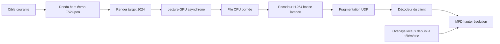

# Vue de cible 3D haute résolution

> **Document prospectif, non normatif.** Les exemples de ce document ne sont pas des configurations produit et ne doivent pas être chargés par le runtime actif.

## 1. Décision et périmètre

La première implémentation de la vue de cible 3D utilise `RemoteRenderedFrame` : FS2Open rend la cible dans une texture hors écran à la résolution demandée par le client, encode cette image en H.264 basse latence et la transporte dans le protocole UDP de télémétrie.

Cette décision répond au besoin d'un MFD pouvant atteindre 1024 pixels sans :

- agrandir le viewport historique de 131 × 112 pixels ;
- réimplémenter le format POF et le moteur de modèles côté client ;
- convertir et distribuer tous les modèles et toutes leurs textures ;
- perdre les effets propres aux mods, les remplacements de textures ou l'état dynamique des sous-modèles.

La première version transporte uniquement la couche 3D sur fond noir. Le client redessine localement, à sa résolution native :

- le nom et la classe de la cible ;
- la distance et la vitesse ;
- l'intégrité de la coque et du sous-système ;
- les brackets et couleurs IFF ;
- les autres textes et jauges du moniteur.

Un futur mode `FullTargetMonitor` pourra encoder tout le gauge, mais il ne fait pas partie du premier lot. Le rendu 3D local depuis glTF et les atlas précalculés restent des optimisations futures, pas le chemin principal.

Ce flux est lié au cockpit observé. Il est produit par une partie solo ou par le client multijoueur qui possède `Player_obj`, sa caméra et sa sélection de cible. Un serveur dédié/headless peut exporter l'état autoritaire de la mission, mais ne possède pas les conditions nécessaires pour produire cette vue.

## 2. Limite de la vue HUD actuelle

Le gauge `HudGaugeTargetBox` choisit la cible courante, dessine le cadre et dispatch le rendu selon le type d'objet dans [`code/hud/hudtargetbox.cpp`](../../code/hud/hudtargetbox.cpp#L383-L483).

Le viewport retail par défaut mesure seulement 131 × 112 pixels : [`code/hud/hudparse.cpp`](../../code/hud/hudparse.cpp#L3392-L3443). Une capture de cette zone agrandie jusqu'à 1024 conserve seulement les informations des pixels d'origine ; elle ne peut pas produire de nouveaux détails.

La géométrie 3D n'est cependant pas limitée à cette résolution. [`renderTargetSetup()`](../../code/hud/hudtargetbox.cpp#L587-L616) configure la caméra et la projection pour le viewport courant. [`renderTargetShip()`](../../code/hud/hudtargetbox.cpp#L618-L790) appelle ensuite le renderer de modèles. En fournissant une render target plus grande, le même modèle peut être rasterisé directement en 1024.

Le flux haute résolution ne doit donc jamais être une capture redimensionnée du HUD. Il doit être un nouveau rendu hors écran.

## 3. Contenu réel du rendu

Pour un vaisseau, le target box :

- construit l'axe de caméra depuis le joueur vers la cible ;
- conserve l'axe vertical de la caméra du joueur ;
- applique `$Closeup_pos_targetbox` et `$Closeup_zoom_targetbox` ;
- utilise les couleurs d'équipe et textures de remplacement ;
- choisit texturé, wireframe ou désaturé ;
- applique un LOD forcé si nécessaire ;
- tient compte des glowmaps désactivées ;
- rend le POF spécial HUD s'il existe, sinon le modèle principal ;
- projette le sous-système sélectionné.

Références : [`code/hud/hudtargetbox.cpp`](../../code/hud/hudtargetbox.cpp#L631-L790), [`code/ship/ship.cpp`](../../code/ship/ship.cpp#L3349-L3373) et [`code/ship/ship.cpp`](../../code/ship/ship.cpp#L4800-L4819).

Le même gauge possède aussi des chemins pour :

- les débris : [`code/hud/hudtargetbox.cpp`](../../code/hud/hudtargetbox.cpp#L808-L916) ;
- les armes et missiles : [`code/hud/hudtargetbox.cpp`](../../code/hud/hudtargetbox.cpp#L921-L1140) ;
- les astéroïdes : [`code/hud/hudtargetbox.cpp`](../../code/hud/hudtargetbox.cpp#L1184-L1285) ;
- les jump nodes : [`code/hud/hudtargetbox.cpp`](../../code/hud/hudtargetbox.cpp#L1317-L1366).

L'ordre d'implémentation proposé est : vaisseaux, armes/missiles, astéroïdes, débris puis jump nodes. Tant qu'un type n'est pas pris en charge, le client conserve ses informations textuelles et affiche un placeholder visuel.

## 4. Profil de rendu haute résolution

Le POF destiné au HUD peut avoir été simplifié pour le petit viewport historique. Le flux 1024 ne doit pas l'utiliser automatiquement.

Deux profils sont prévus :

| Profil | Modèle | LOD | Usage |
|---|---|---|---|
| `MfdHigh` | modèle principal | LOD haute qualité ou automatique | valeur par défaut pour un MFD 1024 |
| `HudExact` | `$POF target file` si présent | `$POF target LOD` | reproduction du choix historique |

Le profil `MfdHigh` conserve l'orientation, la caméra, les textures de remplacement et les états dynamiques du target box, mais peut produire plus de détails que le petit gauge original.

Le producteur impose des limites de résolution et de coût. Le client formule une préférence ; il ne peut pas forcer un profil supérieur aux capacités configurées.

## 5. Architecture générale



Le flux n'existe que si au moins un client compatible y est abonné et qu'une cible rendable est sélectionnée.

Plusieurs clients demandant le même profil partagent le même rendu et le même encodage. Si les résolutions diffèrent, la première version peut produire un flux à la résolution maximale autorisée et laisser les clients réduire l'image localement.

## 6. Rendu hors écran

FS2Open possède déjà des render targets via [`bm_make_render_target()`](../../code/bmpman/bmpman.h#L628-L636) et [`bm_set_render_target()`](../../code/bmpman/bmpman.h#L638-L644).

Le rendu cible suit cette séquence sur le thread principal/render :

1. vérifier qu'un abonnement actif et une cible valide existent ;
2. respecter la cadence vidéo négociée ;
3. sélectionner ou redimensionner une render target persistante ;
4. sauvegarder l'état graphique nécessaire ;
5. activer la render target et effacer en noir ;
6. configurer un viewport couvrant toute la texture ;
7. rendre uniquement le modèle de la cible avec le profil choisi ;
8. lancer une lecture GPU asynchrone ;
9. restaurer l'état et la render target précédente ;
10. retourner sans attendre la fin de la copie GPU.

La render target n'est pas recréée à chaque frame. Un changement de taille est appliqué entre deux images et incrémente la génération de configuration du flux.

Le flux est indépendant de la visibilité du gauge dans le HUD principal. Il peut continuer lorsque l'utilisateur masque ce gauge, tant que la mission, la cible et le renderer graphique restent actifs.

## 7. Lecture GPU et threading

Une lecture synchrone de 1024 × 1024 peut bloquer le pipeline graphique. La fonction OpenGL actuelle [`gr_opengl_get_region()`](../../code/graphics/opengl/gropengl.cpp#L655-L674) utilise directement `glReadPixels()` et ne convient pas telle quelle au flux régulier.

La première implémentation ajoute une abstraction de capture asynchrone et son backend OpenGL concret, fondé sur un anneau de Pixel Buffer Objects et des fences :

```text
Frame N     : rendu et copie GPU vers PBO A
Frame N+1   : rendu et copie GPU vers PBO B
Frame N+2   : si la fence A est prête, copie CPU bornée puis réutilisation de A
```

Règles :

- ne jamais attendre une fence dans la frame du jeu ;
- si aucun buffer n'est prêt, abandonner cette image ;
- utiliser deux ou trois slots au maximum ;
- pousser vers une file CPU bornée ;
- si cette file est pleine, supprimer l'image la plus ancienne ;
- ne transmettre aucun handle graphique au thread d'encodage.

Pipeline des threads :

```text
Thread principal/render : rendu -> readback asynchrone -> copie CPU prête
Thread encodeur         : RGB/NV12 -> H.264 -> access unit encodée
Thread réseau           : fragmentation -> sendto non bloquant
```

Une évolution pourra utiliser un encodeur matériel avec interop GPU et éviter la copie CPU. Elle ne doit pas être nécessaire au premier prototype.

Le renderer sans support de render target ou de readback asynchrone n'annonce pas la capability `TARGET_VIDEO_REMOTE_RENDER`.

## 8. Encodage H.264

Le codec initial est H.264/AVC basse latence, encapsulé sous forme d'access units Annex B.

Profil de départ recommandé :

- format 8 bits 4:2:0 ;
- aucune B-frame ;
- contrôle de débit faible latence ;
- résolution maximale initiale 1024 × 1024 ;
- 10 à 15 FPS ;
- bitrate cible configurable, 4 Mbit/s par défaut ;
- intervalle IDR maximal d'une seconde ;
- SPS/PPS répétés avec chaque IDR ;
- IDR forcée lors d'un changement de cible, de résolution ou de profil.

L'encodeur est caché derrière une interface `TargetVideoEncoder`. Le premier backend concret, `FfmpegTargetVideoEncoder`, utilise `libavcodec` lorsque le build active FFmpeg et sélectionne dans une liste autorisée un encodeur H.264 réellement présent : matériel (`h264_nvenc`, `h264_amf`, `h264_videotoolbox` selon la plateforme) ou logiciel (`libx264`/`libopenh264`) si la politique de licence et le packaging du build l'autorisent. Le nom retenu, sa version et sa licence sont journalisés. Le build et la CI doivent valider au moins un encodeur ; `NullTargetVideoEncoder` reste le fallback qui refuse proprement la capability. L'absence d'encodeur compatible désactive uniquement le flux visuel.

Un mode MJPEG peut servir au diagnostic initial, mais il ne constitue pas le mode de production attendu en 1024 à cause de son débit.

## 9. Transport UDP

Le flux vidéo reste une famille du même protocole UDP ; aucun second socket ni transport n'est requis.

Messages dédiés :

| Message | Direction | Livraison |
|---|---|---|
| `TARGET_VIDEO_SUBSCRIBE` | client → producteur | fiable au niveau applicatif |
| `TARGET_VIDEO_CONFIG` | producteur → client | fiable et acquitté |
| `TARGET_VIDEO_FRAME` inter | producteur → client | fragmenté, non fiable |
| `TARGET_VIDEO_FRAME` IDR | producteur → client | fragmenté, retransmission sélective bornée par une échéance |
| `TARGET_VIDEO_KEYFRAME_REQUEST` | client → producteur | fiable, acquitté et limité en fréquence |
| `TARGET_VIDEO_STOP` | producteur → client | fiable et acquitté |
| `TARGET_VIDEO_STATS` | client → producteur | optionnel, périodique |

Une frame encodée forme un message logique identifié par `stream_id`, `config_generation` et `video_frame_id`. Les champs génériques `message_id`, `message_size`, `fragment_offset`, `fragment_index` et `fragment_count` de l'en-tête UDP assurent le découpage sous 1200 octets et permettent de borner l'allocation avant réassemblage.

Le message logique contient une seule fois un en-tête vidéo borné, suivi de l'access unit Annex B :

- `stream_id` ;
- `config_generation` ;
- `video_frame_id` ;
- `target_entity_id` ;
- `presentation_time_us` ;
- `encoded_frame_size`, qui doit être cohérent avec le `message_size` générique ;
- flags `IDR`, `DISCONTINUITY` et `TARGET_CHANGED`.

Seul l'en-tête UDP générique est répété dans chaque datagramme. Les fragments sont des tranches non chevauchantes du message logique placées à `fragment_offset` ; cette règle évite de mélanger métadonnées répétées et taille de réassemblage.

Règles spécifiques :

- aucune retransmission d'un fragment de frame inter ;
- une frame inter incomplète ou trop ancienne est abandonnée entièrement ;
- le producteur conserve uniquement la dernière IDR pendant `500 ms` ; le client NACKe les plages de fragments IDR manquantes et le producteur les retransmet sélectivement tant que cette échéance n'est pas dépassée ;
- timeout de réassemblage de `200 ms` pour une frame inter et de `500 ms` pour une IDR en récupération ;
- les limites de taille et de fragments sont validées avant allocation ;
- une nouvelle IDR invalide la récupération de la précédente ;
- le client peut demander une IDR après une perte ou une erreur du décodeur ;
- les demandes d'IDR sont limitées en fréquence pour éviter un déni de service ou une explosion du bitrate.

La vidéo est la classe de trafic la moins prioritaire. Un token bucket par profil/client réserve la bande passante de la télémétrie d'état. Les retransmissions d'IDR passent avant les nouvelles frames inter, mais après session, ACK/NACK, événements, snapshots et deltas. Si `sendto()` retourne `WOULD_BLOCK`, le producteur abandonne d'abord la frame inter courante ; il n'attend jamais pour sauver une IDR et ne retarde jamais l'état de télémétrie.

## 10. Négociation

Dans `HELLO`, le client annonce uniquement la capability `TARGET_VIDEO_H264`. Après négociation de session, il envoie les champs suivants dans `TARGET_VIDEO_SUBSCRIBE` :

```text
request_id
max_width
max_height
preferred_width
preferred_height
max_fps
preferred_fps
max_bitrate_kbps
preferred_bitrate_kbps
supported_h264_profiles
supported_h264_levels
overlay_capabilities
```

Le producteur choisit une configuration bornée par ses propres limites et répond avec `TARGET_VIDEO_CONFIG` :

```text
stream_id
config_generation
codec
codec_profile
codec_level
pixel_format
width
height
fps_num / fps_den
bitrate_kbps
gop_duration_ms
render_profile
overlay_mode
recovery_mode
idr_recovery_window_ms
```

La valeur initiale recommandée pour un MFD 1024 est 1024 × 1024 à 15 FPS et 4 Mbit/s. Ce n'est pas une garantie : le producteur peut réduire résolution, cadence ou bitrate selon sa charge.

## 11. Comportement du client

Le client maintient le flux vidéo séparément de `ReplicaStore` :

```text
UDP video fragments
  -> réassemblage borné
  -> access unit H.264
  -> décodeur
  -> dernière texture vidéo valide
  -> composition avec TARGET_STATE et les jauges locales
```

Avant d'afficher une image, il vérifie que son `target_entity_id` correspond encore à la cible de la réplique. Cette règle empêche une image retardée de l'ancienne cible d'être présentée avec les données de la nouvelle.

En cas de perte :

- conserver brièvement la dernière image valide ;
- envoyer un `NACK` borné pour les fragments manquants de l'IDR encore dans sa fenêtre de récupération ;
- demander une nouvelle IDR si l'ancienne a expiré ou si le décodeur ne peut plus progresser ;
- afficher un état `Stale` ou un placeholder après timeout ;
- continuer à afficher les données numériques de la cible ;
- ne jamais bloquer le thread UI en attendant une frame.

Le client dessine les textes, barres et brackets en vectoriel. La vidéo ne contient pas de police ni de coordonnées dépendantes de la résolution du HUD source.

## 12. Point d'intégration minimal

La logique 3D utile est actuellement imbriquée dans `HudGaugeTargetBox::renderTargetShip()`. La recopier dans `code/telemetry` créerait une divergence lors des mises à jour upstream.

La proposition est d'extraire, dans `code/hud/hudtargetbox.cpp` et son header, une fonction étroite et sans réseau :

```cpp
bool render_target_model_to_current_context(
    object* target,
    const TargetRenderOptions& options);
```

Le gauge existant et `telemetry_target_capture` appellent cette fonction. Elle rend uniquement la partie 3D dans le contexte graphique déjà configuré. Le module de télémétrie reste propriétaire :

- de la render target haute résolution ;
- de la cadence ;
- du readback ;
- des files bornées ;
- de l'encodeur ;
- du protocole et du transport UDP.

Cette extraction modifie un fichier d'implémentation HUD et son header, sans ajouter de champ aux structures `object`, `ship` ou `ship_info` et sans faire dépendre le renderer du réseau.

## 13. Configuration prospective non chargeable

```text
NON_CHARGEABLE_TARGET_VIDEO_EXAMPLE
{
  "targetVideo": {
    "enabled": true,
    "codec": "h264",
    "encoderBackend": "ffmpeg",
    "allowedEncoders": ["h264_nvenc", "h264_amf", "h264_videotoolbox", "libx264", "libopenh264"],
    "maxWidth": 1024,
    "maxHeight": 1024,
    "defaultFps": 15,
    "maxFps": 20,
    "bitrateKbps": 4000,
    "gopMilliseconds": 1000,
    "renderProfile": "MfdHigh",
    "overlayMode": "Client",
    "recoveryMode": "IdrSelectiveRetransmit",
    "idrRecoveryWindowMs": 500,
    "readbackSlots": 3,
    "cpuQueueFrames": 2
  }
}
```

Une valeur invalide désactive le flux vidéo et journalise une erreur ; elle ne doit pas empêcher la télémétrie d'état de démarrer.

## 14. Bande passante et coût

Ordres de grandeur pour 1024 × 1024 à 15 FPS :

| Représentation | Ordre de grandeur |
|---|---:|
| RGBA brut | environ 500 Mbit/s |
| MJPEG | souvent 15 à 60 Mbit/s |
| H.264 basse latence | cible initiale 2 à 8 Mbit/s |

Ces valeurs dépendent du modèle, des textures, du mouvement, du profil et de l'encodeur. Le fond noir et la caméra relativement stable rendent cette scène favorable à la compression inter-frame.

À 4 Mbit/s et 15 FPS, une frame moyenne contient environ 33 ko, soit une trentaine de fragments après les en-têtes. Abandonner systématiquement une frame dès qu'un fragment manque ne permet donc pas une reprise fiable sous perte UDP. La retransmission sélective bornée des IDR garantit un point de reprise sans transformer toutes les frames en trafic fiable ; les frames inter restent sacrifiables.

Le produit doit rendre observables les erreurs et dégradations nécessaires à son exploitation, tout en garantissant l'absence de blocage de la frame, le bornage des files et la continuité de la télémétrie numérique. Les métriques et l'outillage employés pour vérifier ces propriétés seront choisis lors de la spécification de cette phase.

## 15. Cas d'erreur

| Situation | Comportement attendu |
|---|---|
| Aucune cible | `TARGET_VIDEO_STOP`, zone visuelle vide |
| Type de cible non pris en charge | placeholder, télémétrie numérique conservée |
| Pas de render target | capability vidéo refusée |
| Readback non prêt | image abandonnée sans attente |
| File encodeur pleine | image la plus ancienne abandonnée |
| Encodeur indisponible | flux visuel désactivé uniquement |
| Fragment inter manquant | frame entière abandonnée |
| Fragment IDR manquant | `NACK` sélectif jusqu'à l'échéance, puis nouvelle demande d'IDR |
| Décodeur désynchronisé | requête d'IDR limitée en fréquence |
| Changement de cible | nouvelle génération, IDR et purge des anciennes frames |
| Client lent | baisse de résolution/FPS ou frames abandonnées |
| Producteur headless | capability vidéo absente |

## 16. Critères produit de livraison

La première version est validée lorsque :

- un vaisseau ciblé est rendu nativement en 1024 sans agrandissement du viewport HUD ;
- l'orientation, les textures de remplacement, les couleurs d'équipe et l'état visible correspondent au producteur ;
- le modèle haute qualité est utilisé avec `MfdHigh` et le modèle HUD avec `HudExact` ;
- le client ne montre jamais une frame appartenant à l'ancienne cible ;
- une perte UDP n'arrête pas la télémétrie et la récupération sélective permet de reconstruire une IDR malgré la perte de fragments ;
- une connexion tardive reçoit la configuration puis une IDR ;
- aucune lecture GPU, opération d'encodage ou opération réseau ne bloque la frame du jeu ;
- les files restent bornées sous surcharge ;
- la vidéo désactivée ou sans abonné n'effectue aucun second rendu ;
- les overlays locaux restent nets et synchronisés avec `TARGET_STATE`.

Comportement attendu sous perte UDP :

- à 1 %, session et télémétrie restent `Live`, aucune file vidéo ne dépasse 500 ms et une demande d'IDR retrouve une frame décodable en 500 ms au plus ;
- à 5 %, session et télémétrie restent `Live`, le trafic d'état n'est jamais privé de bande passante et la vidéo récupère sur une IDR complète en 1 s au plus ;
- à 20 %, session et télémétrie restent `Live`, mémoire et files restent bornées, et le flux retrouve une frame décodable en 2 s au plus ; aucune qualité, cadence ou continuité nominale n'est exigée à ce niveau de perte ;
- dans tous les cas, la vidéo ne retarde ni ACK/NACK, ni événements, ni snapshots, ni deltas.
