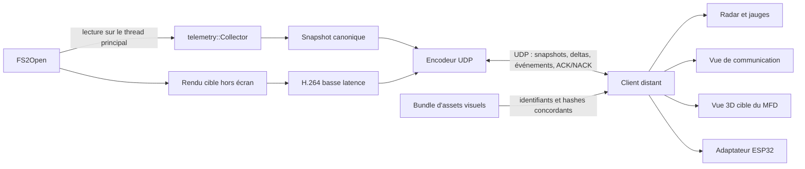

# Télémétrie et réplication distante de FS2Open

## Statut de ce dossier

Ce dossier rassemble l'analyse et la proposition d'architecture pour exporter l'état de FS2Open et le répliquer sur un client distant. Il fixe les décisions communes et les invariants attendus, mais ne remplace pas le schéma binaire exhaustif et les vecteurs de référence qui doivent être produits en phase 0 avant toute implémentation interopérable.

L'analyse a été réalisée sur la révision `2e57072b57f305716ba1f437b80008974d04849b` du dépôt. Les noms et emplacements internes cités peuvent évoluer avec le projet upstream ; le protocole public proposé ne doit donc jamais dépendre directement de la disposition mémoire de ces structures.

## Objectif

Le système doit permettre à un client distant de reconstruire une réplique complète du **modèle de télémétrie exporté** :

- vaisseau du joueur et tous ses systèmes ;
- physique, commandes et modes de vol ;
- coque, boucliers, énergie, armement et sous-systèmes ;
- cible, locks, radar, contacts et menaces ;
- navigation, cargo, docking et support ;
- vue de communication animée (« Talking Head »), rejouée depuis des assets locaux ;
- vue 3D de la cible rendue hors écran à la résolution du MFD et encodée en H.264 ;
- catalogues statiques nécessaires à l'interprétation des données ;
- cycle de vie des entités et événements importants.

Cette réplique vise les tableaux de bord, radars, jauges, clients de visualisation, enregistrements et ESP32. Elle ne constitue pas une seconde simulation déterministe de FS2Open : reproduire exactement la simulation demanderait également les scripts de mission, les collisions, tous les projectiles, les entrées, l'autorité réseau et les états aléatoires.

## Décisions actées

1. La couche de communication reste exclusivement **UDP**.
2. Le protocole UDP est bidirectionnel afin de permettre `HELLO`, acquittements et demandes de resynchronisation.
3. La logique, les sessions, l'encodage et le protocole sont centralisés dans `code/telemetry` ; le moteur n'expose que des seams génériques et minimaux.
4. Le module lit les structures existantes et ne leur ajoute aucun champ.
5. Le module possède son propre socket UDP non bloquant, distinct du socket multijoueur.
6. Les données rapides utilisent des deltas cumulatifs par rapport à la dernière keyframe appliquée puis acquittée par `ACK APPLIED` : un delta plus récent de la même baseline remplace intégralement les précédents. Les manifestes et snapshots indispensables sont acquittés et retransmis au niveau applicatif.
7. Aucun pointeur, handle ou index local de tableau n'est transmis.
8. Le client distant est initialement en lecture seule vis-à-vis de la simulation.
9. La mémoire partagée n'est pas retenue : elle ne répond pas au besoin distant et introduirait un couplage d'ABI.
10. Le format multijoueur existant sert de référence, mais n'est pas exposé comme protocole de télémétrie.
11. La vue de communication est répliquée comme un état de lecture synchronisé, avec une vitesse signée qui couvre pause, compression temporelle et lecture inverse ; ses images ne sont pas streamées à chaque frame.
12. Les assets de communication sont préparés et installés séparément, puis référencés par un identifiant stable et un hash.
13. La vue 3D de la cible utilise d'abord `RemoteRenderedFrame` : un nouveau rendu haute résolution, jamais un agrandissement du petit viewport HUD.
14. Le flux cible est encodé en H.264 basse latence et fragmenté dans le même protocole UDP.
15. Les frames vidéo inter prédites sont remplaçables et non retransmises. La dernière IDR est conservée pendant une fenêtre courte et ses fragments manquants peuvent être retransmis sélectivement avant échéance ; configuration, arrêt et demandes d'IDR utilisent également la fiabilité applicative.
16. La vidéo contient uniquement la couche 3D ; les textes, brackets et jauges sont redessinés localement en haute résolution.
17. Le format filaire définit explicitement ordre des octets, représentation des chaînes, repère, unités, quaternions, horloges, limites, CRC et règles de fragmentation ; aucune convention C++ implicite ne traverse le réseau.

## Documents

- [01 — Inventaire des données](01-telemetry-data-inventory.md)
- [02 — Architecture du module](02-telemetry-architecture.md)
- [03 — Protocole UDP](03-udp-protocol.md)
- [04 — Feuille de route et validation](04-implementation-roadmap.md)
- [05 — Réseau et API existants](05-existing-network-and-api.md)
- [06 — Réplication de la vue de communication](06-communication-view.md)
- [07 — Vue de cible 3D haute résolution](07-high-resolution-target-view.md)

## Architecture résumée

## Sens du mot « tout »

Deux modes pourront être proposés :

- `Cockpit` : état complet du vaisseau du joueur et vue capteur autorisée, sans révéler les objets cachés par le jeu ;
- `TrustedFullState` : toutes les entités connues du processus exporteur, destiné à un client de confiance, au diagnostic ou au replay.

Dans les deux modes, « tout » signifie tous les champs définis par le schéma de télémétrie. Les caches de rendu, pointeurs, handles audio, coordonnées écran et autres détails d'implémentation non nécessaires à la reconstruction ne font pas partie de ce modèle.

Les vues de présentation dépendent en plus des capabilities du processus producteur. Un serveur dédié peut fournir `TrustedFullState` sans renderer, sans `TARGET_VIDEO_REMOTE_RENDER` et sans vue `Talking Head` autoritaire, puisque cette dernière n'existe que lorsqu'un gauge HUD actif fait réellement progresser l'animation. L'absence d'une capability visuelle ne rend donc pas l'état de simulation incomplet.
