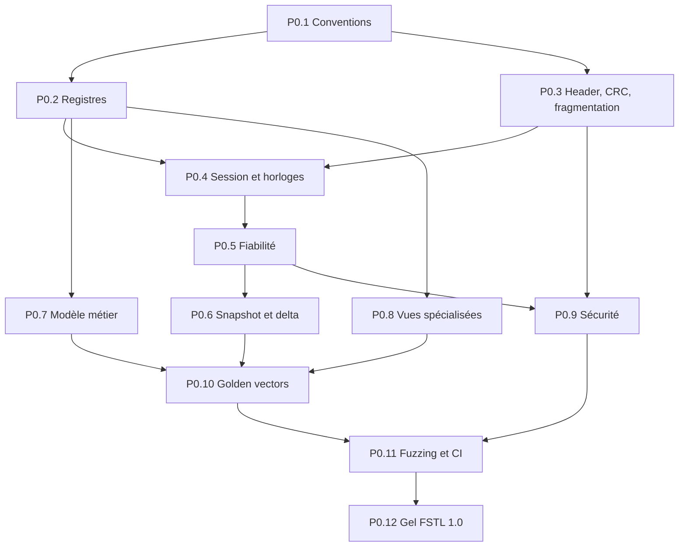

# 07 — Livraison et traçabilité

## 1. Objet

Ce document transforme le contrat FSTL 1.0 en lots de travail, preuves et gates de revue. Il garantit que la Phase 0 reste indépendante du moteur tout en couvrant les besoins de toutes les phases décrites dans la [feuille de route](../../04-implementation-roadmap.md).

La Phase 0 est une phase de **contrat exécutable** : la documentation seule n'est pas une preuve suffisante, et une bibliothèque de sérialisation sans schéma ni golden vectors ne l'est pas davantage.

## 2. Arborescence de livraison attendue

Les emplacements finaux peuvent suivre les conventions du dépôt, mais la livraison DOIT contenir l'équivalent de :

```text
documentation/analysis/specs/0-Contrat-de-protocole/
├── README.md
├── 01-cadre-normatif-et-perimetre.md
├── 02-format-filaire-et-registres.md
├── 03-session-horloges-fiabilite.md
├── 04-modele-de-donnees-v1.md
├── 05-capabilities-et-vues-specialisees.md
├── 06-validation-securite-et-conformite.md
└── 07-livraison-et-tracabilite.md

code/telemetry/protocol/
├── telemetry_protocol_constants.h
├── packet_writer.h/.cpp
├── packet_reader.h/.cpp
├── telemetry_crc32.h/.cpp
├── telemetry_fragmenter.h/.cpp
├── telemetry_reassembler.h/.cpp
├── telemetry_messages.h/.cpp
└── telemetry_records.h/.cpp

tests/telemetry/protocol/
├── schema/fstl-v1.yaml
├── vectors/valid/...
├── vectors/invalid/...
├── expected/...
├── reference_decoder/...
├── test_packet_io.*
├── test_messages.*
├── test_records.*
├── test_fragmentation.*
├── test_session_model.*
└── fuzz/...
```

La présente demande produit le premier bloc documentaire. Les blocs code/tests constituent les artefacts d'exécution obligatoires pour déclarer la Phase 0 terminée.

## 3. Lots de travail

### P0.1 — Gel des conventions communes

**Entrées** : analyse générale, inventaire, proposition UDP.

**Travail** :

- figer magic, version, endianness et absence de padding ;
- figer scalaires, floats, booléens, chaînes et byte strings ;
- figer unités, repère, quaternion et temps ;
- figer règles d'absence et canonicalisation ;
- classer chaque limite comme constante, maximum, défaut ou négociée.

**Sorties** : sections correspondantes de [02](02-format-filaire-et-registres.md) et schéma machine-readable.

**Acceptation** : une structure C++ packée n'est nécessaire à aucun encodeur/décodeur ; chaque scalaire possède un golden vector.

### P0.2 — Registres numériques

**Travail** : attribuer définitivement :

- `MessageType`, `MessageFlags` et `RecordType` ;
- flags de record, ACK et vidéo ;
- capabilities producteur/client et bitmaps extensibles ;
- enums métier, raisons de stop/resync/NACK et résultats de négociation ;
- valeurs réservées et politique d'allocation future.

**Sorties** : registre machine-readable unique, vérifié automatiquement contre les registres transversaux de [02](02-format-filaire-et-registres.md), métier de [04](04-modele-de-donnees-v1.md) et spécialisés de [05](05-capabilities-et-vues-specialisees.md), puis repris dans les constantes générées ou vérifiées.

**Acceptation** : aucune valeur numérique ne vit uniquement dans le code ; doublons et réaffectations sont détectés en CI.

### P0.3 — En-tête, CRC et fragmentation

**Travail** :

- implémenter l'en-tête de 68 octets et les deux CRC ;
- implémenter la fragmentation canonique sous 1200 octets ;
- valider offsets, comptes, tranches et cohérence inter-fragments ;
- implémenter les quotas de réassemblage ;
- couvrir messages vides, non fragmentés et multi-fragments ;
- définir les transactions paginées de manifestes/snapshots dépassant un message logique.

**Sorties** : writer/reader, CRC, fragmenter, réassembleur, vectors.

**Acceptation** : aucune allocation basée sur `message_size` n'a lieu avant validation des maxima et réservation de quota ; un snapshot paginé est appliqué atomiquement ou pas du tout.

### P0.4 — Contrôle de session et horloges

**Travail** :

- implémenter `HELLO`, `WELCOME`, `HEARTBEAT` et `CAPABILITY_UPDATE` ;
- définir identité, nonce, endpoint et preuve de retour ;
- implémenter estimation offset/RTT et invalidation ;
- implémenter machine `Disconnected/Negotiating/Synchronizing/Live/Stale` ;
- définir pause, compression temporelle et temps de mission ;
- tester changement de session et wrap des compteurs.

**Sorties** : payloads, modèle de session pur, harness à deux endpoints.

**Acceptation** : aucune donnée volumineuse n'est envoyée avant ACK du `WELCOME` ; un changement de session purge toutes les anciennes ressources.

### P0.5 — ACK/NACK et fiabilité

**Travail** :

- implémenter `ACK VALIDATED`, `ACK APPLIED` et NACK sélectif ;
- fixer backoff, délais, retry, expiration et priorités ;
- valider endpoint, type, nombre de fragments, CRC et bitmap ;
- rendre duplication et retransmission idempotentes ;
- implémenter `RESYNC_REQUEST` et rate limits ;
- tester ACK perdu, NACK tardif et expiration.

**Sorties** : fenêtre fiable pure, scheduler simulé, fixtures.

**Acceptation** : aucune rétention ne peut croître indéfiniment ; une expiration mène à une keyframe ou resynchronisation, jamais à un blocage.

### P0.6 — Snapshot, manifeste et delta cumulatif

**Travail** :

- définir préfixes et références de générations ;
- définir transaction/pagination bornée ;
- définir snapshot candidat et baseline active ;
- formaliser dirty-set depuis baseline immuable ;
- conserver créations/suppressions pendant l'aller-retour de l'ACK ;
- reconstruire chaque candidat client depuis la baseline ;
- définir la mise en attente bornée d'un delta précoce ;
- tester désordre et changement de baseline.

**Sorties** : modèle d'état pur et scénarios de convergence.

**Acceptation** : la perte de tous les deltas intermédiaires n'empêche pas le delta cumulatif le plus récent de converger ; aucune modification post-capture n'est perdue à la bascule.

### P0.7 — Schéma métier exhaustif

**Travail** :

- couvrir les 28 records ;
- attribuer type, unité, borne, optionalité et nature `A/C/D/E` à chaque champ ;
- définir granularité atomique et clés des listes ;
- séparer les trois familles de banques d'armes ;
- définir visibility filtering, cargo et états capteur ;
- définir catalogues, lifecycle et événements ;
- lister explicitement dérivations et exclusions.

**Sorties** : [04 — Modèle de données v1](04-modele-de-donnees-v1.md), schéma et un vector par record.

**Acceptation** : chaque puce de l'inventaire est mappée vers un champ, une valeur dérivée, une exclusion ou une fonctionnalité hors v1 justifiée.

### P0.8 — Capabilities et vues spécialisées

**Travail** :

- séparer capabilities producteur et consommateur ;
- définir bundle/hash/format et canonicalisation communication ;
- définir état, événements et synchronisation de lecture ;
- définir subscribe/config/frame/keyframe/stop/stats vidéo ;
- définir H.264 Annex B, profils, niveaux, générations et récupération IDR ;
- définir retrait dynamique d'une capability ;
- vérifier que vidéo/communication n'empêchent jamais l'état `Live`.

**Sorties** : [05 — Capabilities et vues spécialisées](05-capabilities-et-vues-specialisees.md), vectors spécialisés.

**Acceptation** : bundle absent, producteur headless ou encodeur indisponible dégrade uniquement la capability concernée.

### P0.9 — Sécurité et robustesse

**Travail** :

- implémenter validation dans l'ordre normatif ;
- configurer bind/allowlist sûrs ;
- appliquer budgets par client et globaux ;
- appliquer rate limits et anti-amplification ;
- tester types inconnus, valeurs non finies et arithmétique overflow ;
- prouver qu'aucune commande de simulation n'est décodable.

**Sorties** : tests négatifs, métriques et revue de modèle de menace.

**Acceptation** : aucune fixture ou entrée fuzzée ne dépasse un budget, ne publie un état partiel ou n'atteint la simulation.

### P0.10 — Golden vectors et décodeur indépendant

**Travail** :

- générer les fixtures selon [06](06-validation-securite-et-conformite.md) ;
- calculer les CRC avec un second outil ;
- produire JSON canonique ;
- écrire un décodeur indépendant ;
- tester cross-endian et cross-implementation ;
- publier la commande reproductible de régénération.

**Acceptation** : les vectors ne sont pas seulement générés par l'implémentation qu'ils testent ; leur diff est revu comme une modification de protocole.

### P0.11 — Fuzzing et CI

**Travail** :

- ajouter les fuzz targets obligatoires ;
- amorcer le corpus avec les vectors ;
- exécuter sanitizers ;
- vérifier registre/schéma/doc ;
- archiver les graines des tests transport ;
- publier couverture des messages et records.

**Acceptation** : CI verte sur toutes les plateformes supportées de la Phase 0 et aucun défaut bloquant ouvert.

### P0.12 — Revue de gel FSTL 1.0

**Travail** :

- comparer documentation, schéma, constantes, vectors et décodeurs ;
- réconcilier toute divergence avec l'analyse ;
- enregistrer les décisions ;
- apposer les approbations métier, transport, sécurité et client ;
- créer le tag/version d'artefact du contrat.

**Acceptation** : checklist finale complète et autorisation explicite de démarrer la Phase 1.

## 4. Ordre et dépendances



Le schéma et les tests peuvent progresser en parallèle après gel des conventions et registres. Aucun collecteur moteur ne dépend de ces branches de travail.

## 5. Gates intermédiaires

| Gate | Condition | Bloque |
|---|---|---|
| `G0-A Conventions` | scalaires, header, versioning et registres revus | tout encodeur métier |
| `G0-B Transport` | CRC, fragmentation, quotas et contrôle de session testés | snapshots/deltas |
| `G0-C Modèle` | 28 records et enums couverts sans champ ni décision implicite | collecteurs des phases 1–4 |
| `G0-D Fiabilité` | baseline/delta/ACK/resync convergent dans le harness | premier flux Phase 1 |
| `G0-E Vues` | capabilities et payloads spécialisés gelés | hooks et encodeur des phases 5/7 |
| `G0-F Interop` | vectors croisés, fuzzing et sécurité acceptés | gel FSTL 1.0 et Phase 1 |

Une gate échouée ne peut être contournée par une valeur hardcodée dans un prototype.

## 6. Critères d'acceptation finaux

| ID | Critère vérifiable |
|---|---|
| `P0-AC-001` | les 20 messages v1 ont ID, direction, QoS, layout, limites et vectors |
| `P0-AC-002` | les 28 records ont ID, version, scope, granularité, layout et vectors |
| `P0-AC-003` | toutes les enums, flags et capabilities possèdent une valeur et une règle d'inconnu |
| `P0-AC-004` | l'en-tête mesure 68 octets et les datagrammes ne dépassent jamais 1200 octets |
| `P0-AC-005` | les CRC correspondent au check ISO-HDLC et aux vectors indépendants |
| `P0-AC-006` | toute allocation proportionnelle est précédée par validation et réservation de quota |
| `P0-AC-007` | `HELLO/WELCOME/HEARTBEAT/ACK/NACK/RESYNC_REQUEST` fonctionnent dans le harness sans moteur |
| `P0-AC-008` | l'anti-amplification interdit tout état volumineux avant preuve de retour |
| `P0-AC-009` | snapshot/manifestes paginés restent bornés et atomiques |
| `P0-AC-010` | seul `ACK APPLIED` de l'ensemble du snapshot fait avancer la baseline |
| `P0-AC-011` | le dernier delta cumulatif suffit après pertes intermédiaires |
| `P0-AC-012` | une mutation pendant l'ACK de keyframe apparaît dans le premier delta de la nouvelle baseline |
| `P0-AC-013` | types inconnus et extensions suivent la matrice de compatibilité sans crash |
| `P0-AC-014` | NaN, infinis, UTF-8 invalide, tailles et offsets incohérents sont rejetés |
| `P0-AC-015` | le mode `Cockpit` ne fuit aucune vérité interdite via un autre record |
| `P0-AC-016` | un bundle communication incompatible n'empêche pas la télémétrie `Live` |
| `P0-AC-017` | une frame vidéo ancienne ou d'une autre cible n'est jamais présentable |
| `P0-AC-018` | la vidéo ne peut évincer ni retarder session, ACK/NACK, événements ou état |
| `P0-AC-019` | chaque fixture valide et invalide donne le même résultat dans deux décodeurs indépendants |
| `P0-AC-020` | le fuzzing ne révèle aucun crash, UB, dépassement ou croissance non bornée |
| `P0-AC-021` | bind non-loopback, discovery et `TrustedFullState` sont opt-in et testés |
| `P0-AC-022` | aucune API/message de commande de simulation n'existe en v1 |
| `P0-AC-023` | le code Phase 0 ne lit aucune structure moteur et ne modifie pas la boucle FS2Open |
| `P0-AC-024` | schéma, docs, constantes et vectors ont une vérification de cohérence automatique |

## 7. Relectures requises

La revue de gel comprend au minimum quatre rôles, même si une personne peut cumuler plusieurs rôles dans un petit projet :

| Revue | Porte sur | Preuve |
|---|---|---|
| modèle FS2Open | sens métier, autorité, dérivé/exclu | couverture de l'inventaire |
| protocole/interop | octets, évolution, IDs, ACK, baseline | vectors et second décodeur |
| sécurité/robustesse | parser, quotas, allowlist, rate limits | tests négatifs, fuzzing, budgets |
| client | optionalité, join, rendu local, fallbacks | scénario de réplique et vues |

Une approbation verbale sans artefact reproductible ne ferme pas la gate.

## 8. Décisions de clarification intégrées

Les analyses contenaient des points à fermer avant gel. FSTL 1.0 retient :

| ID | Point | Décision |
|---|---|---|
| `D0-001` | snapshot autonome mais catalogues séparés | autonomie dynamique ; publication conditionnée par les générations de manifestes requises |
| `D0-002` | « état complet » en `Cockpit` | complet signifie complet dans le périmètre autorisé, jamais vérité cachée |
| `D0-003` | autorité serveur et vues client | sessions producteur séparées ; aucune fusion implicite |
| `D0-004` | événements détectés par diff ou exacts | deux bitmaps de couverture par famille dans `SESSION_STATE`, hors registre `Capability` ; le client connaît la garantie |
| `D0-005` | assets et UDP exclusif | le manifeste est FSTL ; la distribution des fichiers reste hors bande/hors v1 |
| `D0-006` | capability communication ambiguë | capabilities client assets et producteur source autoritaire séparées |
| `D0-007` | capability vidéo trop agrégée | bits séparés pour producteur remote render, client H.264 et options négociées |
| `D0-008` | stats vidéo reçues côté producteur | statistiques reçues viennent uniquement du message client `TARGET_VIDEO_STATS` |
| `D0-009` | contact radar distordu | observation capteur explicitement typée, pas vérité d'entité |
| `D0-010` | snapshot ou manifeste >1 Mio | transaction paginée bornée ; chaque message reste <=1 Mio ; commit atomique |
| `D0-011` | configuration d'analyse présentée comme exemple | chaque valeur est reclassée constante, maximum, défaut, négociée ou test |
| `D0-012` | version protocole et record | matrice d'évolution séparée ; ajout compatible uniquement selon longueur/capability |
| `D0-013` | profil `MfdHigh/HudExact` absent du subscribe | bitmap acceptable et préférence ajoutés au payload de souscription |
| `D0-014` | désabonnement vidéo non défini | `TARGET_VIDEO_STOP` bidirectionnel, fiable et idempotent |
| `D0-015` | retrait dynamique de capability | message fiable `CAPABILITY_UPDATE` ; l'état canonique reste actif |
| `D0-016` | délai vidéo 100–200 ms | timeout interframe v1 fixé à 200 ms ; IDR au plus 500 ms |
| `D0-017` | optionalité et sentinelles | presence bits, cardinalité, ID nul ou enum `NONE` seulement ; jamais NaN/magic implicite |
| `D0-018` | sécurité LAN | loopback/disabled par défaut, allowlist et rate limits ; pas de sécurité Internet native |

Toute modification d'une décision `D0-*` après gel exige au minimum une revue de compatibilité et la mise à jour des vectors.

## 9. Matrice de traçabilité des analyses

### 9.1 Vue globale

| Source | Exigences reprises | Spécifications |
|---|---|---|
| [`analysis/README.md`](../../README.md) | objectifs, UDP, lecture seule, delta cumulatif, modes et vues | 01, 02, 03, 05 |
| [`01-telemetry-data-inventory.md`](../../01-telemetry-data-inventory.md) | taxonomie et tous les domaines métier | 01, 04, 05 |
| [`02-telemetry-architecture.md`](../../02-telemetry-architecture.md) | indépendance ABI, pipelines, autorité, threading, socket, sérialisation | 01, 02, 03, 06 |
| [`03-udp-protocol.md`](../../03-udp-protocol.md) | wire, messages, ACK/NACK, fragmentation, delta, machine d'état, sécurité | 02, 03, 05, 06 |
| [`04-implementation-roadmap.md`](../../04-implementation-roadmap.md) | livrables Phase 0, tests, observabilité, risques et ordre | 06, 07 |
| [`05-existing-network-and-api.md`](../../05-existing-network-and-api.md) | MTU, réseau séparé, float32, limites du multijoueur | 01, 02, 06 |
| [`06-communication-view.md`](../../06-communication-view.md) | bundle, manifeste, lecture signée, lifecycle et fallback | 04, 05, 06 |
| [`07-high-resolution-target-view.md`](../../07-high-resolution-target-view.md) | H.264, négociation, fragmentation, IDR, priorité et tests | 02, 03, 05, 06 |

### 9.2 Couverture détaillée de l'inventaire

| Section de l'inventaire | Record(s)/contrat cible |
|---|---|
| §1 nature des données | taxonomie `A/C/D/E` de 01 et colonnes de 04 |
| §2 enveloppe de session | header 02, `SESSION_STATE`/`MISSION_STATE` 04, session 03 |
| §3 identité/lifecycle | `ENTITY_LIFECYCLE`, `SHIP_IDENTITY`, événements 04 |
| §4 pose/physique | `FLIGHT_STATE`, `CONTROL_STATE`, conventions 02/04 |
| §5 entrées/aides | `CONTROL_STATE`, événements d'entrée garantis selon capability 04 |
| §6 coque/boucliers/dommages | `DAMAGE_STATE`, `SHIELD_STATE`, `EVENTS` 04 |
| §7 sous-systèmes/tourelles | `SUBSYSTEM_STATE`, catalogues, `EVENTS` 04 |
| §8 énergie/ETS/propulsion | `ENERGY_STATE`, `PROPULSION_STATE` 04 |
| §9 armement | `WEAPON_STATE`, `WEAPON_MANIFEST`, `EVENTS` 04 |
| §10 cible/lead/locks | `TARGET_STATE`, `LOCK_STATE` 04 |
| §10.1 vue cible | messages vidéo et capabilities 05 |
| §11 radar/capteurs | `RADAR_STATE`, `RADAR_CONTACTS`, filtrage 01/04 |
| §12 missiles/alertes | `THREAT_STATE`, `RADAR_CONTACTS`/entités autorisées 04 |
| §13 cargo/docking/support | `CARGO_SCAN_STATE`, `DOCKING_STATE`, `SUPPORT_STATE` 04 |
| §14 navigation | `NAVIGATION_STATE` 04 |
| §15 communication | records `COMM_*` 04/05 |
| §16 états spéciaux/visuels | `EFFECT_STATE` et capability de canal facultatif 04 |
| §17 catalogues | `CLASS_MANIFEST`, `WEAPON_MANIFEST` 04 |
| §18 exclusions | interdictions 01 et validations 06 |
| §19 dérivés | colonnes `D`/non wire de 04 |

### 9.3 Couverture du plan de tests de la roadmap

| Roadmap | Couverture Phase 0 |
|---|---|
| §10.1 sérialisation | golden vectors, round-trip, non-finis, troncature, fuzzing dans 06 |
| §10.2 UDP | harness perte/duplication/désordre, fragments, ACK, resync dans 06 |
| §10.3 cycle de vie | machine de session et fixtures de transitions dans 03/05/06 |
| §10.4 données de jeu | schémas conditionnels et catalogue de vectors dans 04/06 |
| §10.5 build/packaging | hors implémentation Phase 0 sauf capability et contrats ; traçabilité conservée pour phases 5/7 |
| §10.6 performance | budgets/absence de blocage spécifiés ; mesures moteur différées aux phases d'intégration |
| §11 observabilité | taxonomie et compteurs de 06 |
| §12 risques | décisions D0 et registre de risques ci-dessous |
| §13 ordre | schéma/vectors/tests avant collecteur, imposé par les gates |

## 10. Registre des risques de Phase 0

| Risque | Détection | Réponse | Gate |
|---|---|---|---|
| champ métier oublié | matrice d'inventaire incomplète | aucun gel tant que chaque puce n'est pas classée | G0-C |
| schéma et code divergent | test généré registre/constantes | source de vérité vérifiée en CI | G0-F |
| vector auto-validant mais faux | second calcul/décodeur | outil indépendant obligatoire | G0-F |
| snapshot dépasse un message | fixture de grande mission synthétique | pagination atomique bornée | G0-D |
| fuite `Cockpit` via record global | tests de visibilité croisés | filtre avant sérialisation et validation métier | G0-C/F |
| ACK perdu fait régresser l'état | scénario harness | idempotence et arithmétique de baseline | G0-D |
| wrap de compteur ambigu | tests proches du wrap | session renouvelée ou arithmétique sérielle | G0-B/D |
| parseur alloue avant contrôle | instrumentation allocations/fuzz | réservation quota avant buffer | G0-B/F |
| nouveau bit interprété différemment | test de compatibilité | registres et règle enum/bitmap distincte | G0-A/F |
| vidéo change le socle | test priorité/capability | sous-état séparé, budget et stop fiable | G0-E/F |
| valeurs d'exemple deviennent défauts dangereux | audit config | classification explicite et loopback sûr | G0-F |
| dette upstream prématurée | diff de phase | aucun hook/collecteur dans Phase 0 | G0-F |

## 11. Preuves à joindre à la revue finale

- version exacte du schéma et hash de son fichier ;
- rapport automatique des IDs sans collision ;
- rapport de couverture messages/records/enums/flags ;
- inventaire des golden vectors et leur hash ;
- résultats des deux décodeurs ;
- résultats unitaires et de propriété ;
- graines et résultats du harness transport ;
- durée, corpus et configuration des fuzzers ;
- rapport sanitizers ;
- budgets calculés pour le nombre maximal de clients ;
- revue de filtrage `Cockpit` ;
- revue de configuration sûre ;
- liste des divergences résolues avec les analyses ;
- confirmation que le diff ne contient aucun collecteur ou hook moteur.

## 12. Checklist de passage à la Phase 1

- [ ] Les documents 01 à 07 sont cohérents et sans lien cassé.
- [ ] Le schéma machine-readable couvre 20 messages et 28 records.
- [ ] Les valeurs numériques sont gelées et vérifiées automatiquement.
- [ ] Writer, reader, CRC, fragmenter et réassembleur sont bornés.
- [ ] Les six messages de contrôle requis par la roadmap sont implémentés hors moteur.
- [ ] Handshake, anti-amplification et horloges passent le harness.
- [ ] ACK/NACK, backoff, expiration et resync sont déterministes.
- [ ] Snapshot/manifeste atomiques et delta cumulatif convergent sous perte.
- [ ] Tous les champs de l'inventaire sont tracés.
- [ ] Les capabilities visuelles se dégradent indépendamment.
- [ ] Les fixtures valides et invalides sont complètes.
- [ ] Deux décodeurs indépendants donnent le même résultat.
- [ ] Fuzzing, sanitizers et tests d'overflow sont verts.
- [ ] Les valeurs sûres par défaut sont testées.
- [ ] Les quatre revues requises sont approuvées.
- [ ] La Phase 0 est versionnée ; toute évolution ultérieure suit les règles de compatibilité.

Tant qu'une case reste ouverte, la Phase 0 est **en cours** et la Phase 1 ne doit pas figer de comportement filaire concurrent.
