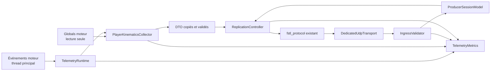
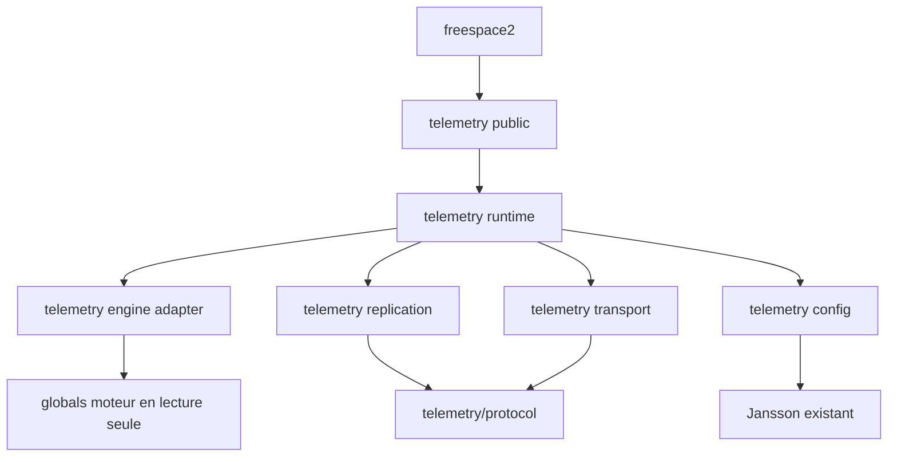

# 02 — Architecture, contrats et interfaces

## 1. Objet et statut

Ce document fixe l'architecture d'implémentation de la **Phase 1 — Squelette et premier flux**. Il complète le [cadre normatif](01-cadre-normatif-et-perimetre.md), le [modèle de données](04-modele-de-donnees-et-regles-metier.md) et le contrat FSTL hérité de la [Phase 0](../0-Contrat-de-protocole/README.md). Les chemins, types et signatures sous `code/telemetry/` sont **proposés** : ils deviennent normatifs quant à leurs responsabilités et à leurs dépendances, mais leur découpage physique PEUT être ajusté si les mêmes frontières restent démontrables.

La décision structurante est `D1-010` : collecte, protocole et I/O UDP non bloquante s'exécutent sur le thread principal. La Phase 1 n'introduit ni worker, ni SPSC, ni accès concurrent aux globals moteur.

## 2. Seams upstream autorisés

L'intégration du socle DOIT limiter les modifications de fichiers moteur existants aux deux seams de `P1-REQ-005` :

| Fichier existant | Modification autorisée | Modification interdite |
|---|---|---|
| `code/source_groups.cmake` | ajouter un groupe `Telemetry` et ses fichiers à `source_files` | modifier les groupes, options ou dépendances sans rapport |
| `freespace2/freespace.cpp` | inclure l'en-tête public et appeler une fois `telemetry::initialize()` immédiatement après le retour réussi de `psnet_init()` | insérer la logique métier, réseau ou de sérialisation dans la boucle moteur |

Le placement après `psnet_init()` garantit que le runtime socket de la plateforme est disponible. Les callbacks enregistrés assurent le tick et la destruction avant `psnet_close()`. Aucune modification de `object`, `ship`, `physics_info`, `ai_info`, `cfile.cpp`, PSNET, Jansson ou du gestionnaire d'événements n'est autorisée en Phase 1.

Les ajouts sous `code/telemetry/` et `tools/` restent dans le périmètre décrit par [07](07-livraison-et-tracabilite.md#1-contenu-livré).

## 3. Vue d'ensemble



`TelemetryRuntime` est l'unique racine de possession. Il appelle ses composants dans l'ordre borné défini par [03](03-flux-cycle-de-vie-et-concurrence.md#6-ordonnancement-dun-tick). Aucun composant ne conserve une référence vers une structure moteur. Le transport ne connaît que des octets et endpoints ; le protocole ne lit aucun global ; le collecteur ne connaît ni socket ni layout filaire.

## 4. Composants, responsabilités et possession

| Composant proposé | Responsabilité | Possède | Ne possède jamais |
|---|---|---|---|
| `TelemetryRuntime` | idempotence, callbacks, état global, ordre du tick et teardown | configuration effective, transport, sessions, réplication, métriques | entité moteur ou thread |
| `TelemetryConfigLoader` | lecture Jansson, schéma fermé, bornes et calcul de budgets | objets JSON seulement pendant le chargement | socket, callback ou secret en log |
| `ProducerIdentityStore` | charger/créer le `producer_id` et fournir l'entropie des `session_id` | profil persistant et générateur injecté | index moteur |
| `DedicatedUdpTransport` | bind IPv4/IPv6, mode non bloquant, receive/send bornés | zéro, un ou deux sockets privés | socket PSNET/multijoueur |
| `IngressValidator` | ordre de validation Phase 0, allowlist, endpoint/session, quotas | compteurs et petits états de rate limit bornés | allocation proportionnelle avant validation |
| `SessionTable` | au plus `maxClients`, machines Phase 0, heartbeat et fenêtres fiables | slots client préalloués | client sans endpoint validé |
| `PlayerKinematicsCollector` | lire et valider les globals sur le thread principal | DTO valeur du tick | pointeur, handle ou index survivant au tick |
| `EntityIdRegistry` | ID `u64` non nuls, monotones dans la session | mapping minimal de la session courante | `objnum` comme ID filaire |
| `ReplicationController` | état courant, baseline active/candidate, delta cumulatif, keyframe et resync | états bornés par client | historique de frames ou d'événements |
| `TickScheduler` | échéances vol, heartbeat, retransmission et budget datagrammes | timestamps monotones et curseurs | boucle d'attente |
| `TelemetryMetrics` | compteurs, gauges et histogrammes de [05](05-integration-configuration-et-observabilite.md#8-catalogue-normatif-des-métriques) | stockage à cardinalité fixe | payload ou label libre |

Les structures Phase 0 déjà présentes dans `code/telemetry/protocol` — notamment `ProducerSessionModel`, `TelemetryFragmenter`, `ReliableSendWindow`, `ProducerBaselineTracker`, codecs de contrôle et d'état — DOIVENT être réutilisées ou étendues additivement pour FSTL 1.1. Une seconde implémentation parallèle de leur wire, de leurs ACK/NACK ou de leur logique de baseline est interdite.

## 5. Contrats d'interface proposés

### 5.1 Surface publique moteur

La surface publique du module est volontairement minimale :

```cpp
namespace telemetry {
void initialize() noexcept;
}
```

`initialize()` DOIT :

1. être sûre si elle est appelée plusieurs fois ;
2. enregistrer exactement une fois `EngineUpdate`, `EngineShutdown`, `GameMissionLoad`, `GameEnterState` et `GameLeaveState` ;
3. ne pas ouvrir de socket ni charger de mission directement ;
4. retourner sans propager d'exception dans le moteur.

Le premier `EngineUpdate` réalise le démarrage différé. Ce choix garde le seam constant et place toutes les opérations après l'initialisation réseau moteur.

### 5.2 Runtime et callbacks

Les signatures internes suivantes expriment le contrat attendu ; les noms peuvent varier sans changer la sémantique :

```cpp
class TelemetryRuntime final {
 public:
  void on_engine_update() noexcept;
  void on_engine_shutdown() noexcept;
  void on_mission_load(const char* filename) noexcept;
  void on_game_enter_state(int old_state, int new_state) noexcept;
  void on_game_leave_state(int old_state, int new_state) noexcept;
};
```

Ces signatures correspondent exactement à `events.h`. Le callback mission NE DOIT PAS conserver le pointeur `filename` ni copier le chemin ; il pose seulement un marqueur de discontinuité. Chaque callback DOIT être constant ou borné par la configuration. Il capture une transition ou exécute le tick ; il ne bloque jamais, ne dort jamais et n'appelle jamais une API de simulation mutatrice. Une erreur interne est convertie en état fail-closed, métrique et diagnostic agrégé.

Le gestionnaire `util::event` ne fournit pas de désabonnement individuel. Le runtime DOIT donc enregistrer des callbacks de durée processus exactement une fois et rendre tout callback post-shutdown inerte via un état `Stopped`. `EngineShutdown` libère les ressources possédées ; il ne tente pas de retirer les callbacks.

### 5.3 Configuration et identité

```cpp
enum class ConfigStatus { Absent, ValidDisabled, ValidEnabled, Invalid };

struct ConfigLoadResult {
  ConfigStatus status;
  TelemetryConfig effective;
  ConfigError error;
};

ConfigLoadResult load_telemetry_config() noexcept;
IdentityResult load_or_create_producer_identity(RandomSource&) noexcept;
```

`ConfigError` est une enum fermée et sans texte contrôlé par l'entrée. Le détail de schéma est fixé par [05](05-integration-configuration-et-observabilite.md#4-schémas-json-fermés). `ValidDisabled`, `Absent` et `Invalid` n'autorisent aucune ouverture de socket. L'identité n'est chargée qu'après validation d'une configuration activée ; tout défaut d'entropie ou de persistance la fait échouer fermée.

### 5.4 Transport

```cpp
enum class IoStatus { Complete, WouldBlock, Closed, Error };

struct ReceivedDatagram {
  Endpoint endpoint;
  std::span<const std::byte> bytes;
};

class DedicatedUdpTransport final {
 public:
  TransportOpenResult open(const TelemetryConfig&) noexcept;
  ReceiveResult try_receive() noexcept;
  IoStatus try_send(const Endpoint&, std::span<const std::byte>) noexcept;
  void close() noexcept;
};
```

Les buffers de réception et d'émission sont préalloués à la borne FSTL de 1200 octets. `try_receive()` et `try_send()` effectuent au plus un syscall et retournent immédiatement. `WouldBlock` n'est pas une erreur fatale. `close()` est idempotente, invalide d'abord les handles logiques puis ferme chaque socket une seule fois.

### 5.5 Collecte moteur

```cpp
enum class CaptureStatus { NoPlayer, Valid, InvalidSource };

struct PlayerKinematicsSample {
  std::uint64_t entity_id;
  std::uint64_t sample_time_us;
  Vec3d position_world;
  Quaterniond orientation_local_to_world;
  Vec3d velocity_world;
  Vec3d angular_velocity_local;
  double radius;
  std::uint32_t physics_flags;
};

CaptureStatus collect_player_kinematics(
    const EngineReadView&, PlayerKinematicsSample&) noexcept;
```

`EngineReadView` est un accès local au callback, jamais un objet conservé. La fonction valide `Player`, `Player_obj`, `Player_ship`, types, indices, valeurs finies et bornes avant copie. La conversion matrice vers quaternion est implémentée dans le module et canonisée selon [04](04-modele-de-donnees-et-regles-metier.md#43-quaternion-canonique). `InvalidSource` force le comportement de discontinuité, jamais un échantillon partiel.

### 5.6 Réplication et protocole

```cpp
class ReplicationController final {
 public:
  void set_current_state(const CanonicalMissionState&) noexcept;
  void clear_mission() noexcept;
  void on_session_ready(ClientSlot&) noexcept;
  void on_applied(ClientSlot&, MessageIdentity) noexcept;
  void on_resync_request(ClientSlot&) noexcept;
  std::optional<OutboundDatagram> next_datagram(ClientSlot&, TimePoint) noexcept;
};
```

Le contrôleur délègue l'encodage, la fragmentation et la fiabilité aux composants Phase 0. `set_current_state()` remplace une valeur canonique ; il n'empile pas les captures. `next_datagram()` respecte la priorité de [03](03-flux-cycle-de-vie-et-concurrence.md#63-priorités-dégressives), produit au plus un datagramme par appel et ne conserve jamais plus d'un dernier delta remplaçable par baseline.

### 5.7 Erreurs

Toutes les interfaces internes DOIVENT retourner un résultat fermé ou une enum stable. Les erreurs d'entrée ne traversent pas la frontière sous forme d'exception. Les allocations de démarrage peuvent échouer et désactiver le module ; aucune allocation de taille contrôlée par le réseau n'est autorisée avant les validations et quotas Phase 0. Une erreur socket permanente ferme toutes les sessions et le transport, puis place le runtime en `Faulted` jusqu'au prochain démarrage du processus.

## 6. Dépendances autorisées



Contraintes :

- `telemetry/protocol` NE DOIT PAS dépendre des globals moteur, de `freespace2` ni du transport concret ;
- l'adaptateur moteur NE DOIT PAS dépendre de Jansson, socket ou codecs ;
- le transport NE DOIT PAS dépendre de `object`, `ship`, `physics_info`, `ai_info`, `psnet_send()` ou `multi_io_send()` ;
- les outils indépendants NE DOIVENT PAS lier le parser, les DTO ou le `fstl_protocol` C++ du producteur ;
- aucune dépendance externe nouvelle n'est admise ; Jansson et les abstractions plateforme déjà présentes sont réutilisés.

## 7. Invariants d'état et de propriété

1. Un `TelemetryRuntime` possède zéro ou un transport ouvert.
2. Un transport possède au plus deux sockets, jamais partagés avec le moteur.
3. Une `SessionTable` contient au plus quatre slots et au plus `maxClients` slots actifs.
4. Un slot client est lié à un endpoint et à un `session_id` après validation Phase 0.
5. Par slot, il existe une baseline active, au plus une candidate et au plus un delta remplaçable par baseline.
6. Un message fiable réside uniquement dans une fenêtre bornée Phase 0 ; un delta n'y entre pas.
7. Une capture survivant au tick ne contient que des scalaires, enums et tableaux de taille fixe.
8. Les identifiants de session et d'entité ne sont jamais dérivés d'une adresse, d'un pointeur ou d'un index moteur.
9. Tout handle logique est invalidé avant fermeture physique ; tout teardown est idempotent.
10. Les métriques ne prolongent jamais la durée de vie d'un endpoint, payload ou DTO.

Les produits de budgets (`maxClients × réassemblages × octets`, fenêtres fiables, baselines et buffers) sont calculés avec arithmétique vérifiée au démarrage. Tout overflow ou dépassement du plafond statique désactive le module avant bind.

## 8. Flux de données nominal

1. `GameMissionLoad`, `GameEnterState` et `GameLeaveState` mettent à jour des marqueurs de lifecycle bornés.
2. `EngineUpdate` lit une fois l'horloge monotone et applique ces marqueurs.
3. Le scheduler donne un budget fini à l'ingress et à l'egress.
4. L'ingress valide entièrement les datagrammes avant toute mutation de session.
5. Si une capture est due et la mission active, le collecteur produit un DTO valeur ou un statut d'absence/invalidité.
6. La couche métier canonicalise la vue, maintient l'ID observé et remplace l'état courant.
7. Le contrôleur de réplication prépare snapshot fiable, delta cumulatif ou resync selon la machine Phase 0.
8. Le fragmenter produit des datagrammes de 1200 octets maximum.
9. Le transport tente un seul envoi ; `WouldBlock` conserve le fiable dans sa fenêtre mais remplace ou abandonne le delta ancien.
10. Les métriques enregistrent résultat et durée sans payload.

Le détail des courses, priorités et transitions est normatif dans [03](03-flux-cycle-de-vie-et-concurrence.md).

## 9. Démarrage et arrêt

### 9.1 Démarrage différé

Au premier `EngineUpdate`, le runtime DOIT exécuter dans cet ordre :

1. vérifier le thread principal et passer de `Cold` à `Starting` ;
2. charger et valider `telemetry.json` ;
3. retourner en fast path si absent, invalide ou désactivé ;
4. charger/créer le `producer_id`, générer un `session_id` de processus non réutilisé et vérifier les budgets ;
5. préallouer slots, buffers, fenêtres et métriques ;
6. ouvrir/configurer tous les sockets demandés ;
7. publier l'état `Ready` uniquement si l'ensemble est réussi.

Une ouverture partielle est annulée en ordre inverse. Aucun client ne peut voir un transport à moitié initialisé.

### 9.2 Arrêt

`EngineShutdown` passe d'abord à `ShuttingDown`, interdit toute nouvelle capture/session, puis :

1. invalide les sessions et purge fiable, réassemblage, candidates et deltas ;
2. purge mission et registre d'entités ;
3. ferme les sockets ;
4. émet au plus un résumé agrégé ;
5. remet les allocations possédées à zéro et passe à `Stopped`.

Il n'existe aucun `join`, drain d'attente ou délai réseau, puisqu'aucun worker n'existe. Les datagrammes encore en attente sont abandonnés.

## 10. Arborescence de code proposée

```text
code/telemetry/
├── telemetry.h                 surface publique initialize()
├── telemetry.cpp               runtime et callbacks
├── config.{h,cpp}              schéma fermé et identité producteur
├── engine_adapter.{h,cpp}      collecte main-thread et quaternion
├── transport.{h,cpp}           sockets UDP privés v4/v6
├── ingress.{h,cpp}             validation, allowlist et quotas
├── replication.{h,cpp}         état courant, baselines et scheduler
├── metrics.{h,cpp}             catalogue à cardinalité fixe
└── protocol/                    bibliothèque FSTL existante étendue en 1.1
```

Cette arborescence est une proposition de packaging. Une fusion de fichiers est acceptable ; fusionner les responsabilités ou inverser les dépendances ne l'est pas. Le détail CMake est fixé par [05](05-integration-configuration-et-observabilite.md#3-intégration-cmake-et-build).

## 11. Évolutivité sans anticipation

Les frontières prévoient les phases suivantes sans les implémenter : un futur worker pourra consommer des DTO sans relire les globals ; de nouveaux collecteurs pourront fournir d'autres domaines ; le transport pourra évoluer derrière son interface. En Phase 1, ces points d'extension restent inactifs : aucune SPSC, aucun `CORE_SHIP`, aucune `ALL_ENTITIES`, aucun Talking Head, aucune vidéo ni QoS avancée n'est ajouté.

## 12. Traçabilité

| Exigence | Couverture architecturale |
|---|---|
| `P1-REQ-003`–`005` | sections 2, 3, 6 et 10 ; périmètre, lecture seule et deux seams |
| `P1-REQ-006`–`009` | composants config/identité, contrats 5.3 et démarrage 9.1 |
| `P1-REQ-010`–`014` | transport privé, ingress, invariants et budgets |
| `P1-REQ-015`–`019` | surface publique, callbacks, runtime et renvoi vers 03 |
| `P1-REQ-020`–`030` | collecteur, contrôleur de réplication et réutilisation Phase 0 |
| `P1-REQ-031`–`033` | métriques, erreurs, fast path et renvoi vers 05 |
| `P1-REQ-034`–`035` | indépendance stricte des outils |
| `P1-REQ-036` | dépendances existantes et intégration CMake |
| `P1-REQ-037`–`038` | teardown idempotent, ressources bornées et interfaces injectables |

Les critères de qualité associés sont regroupés dans [06](06-validation-securite-et-conformite.md).
