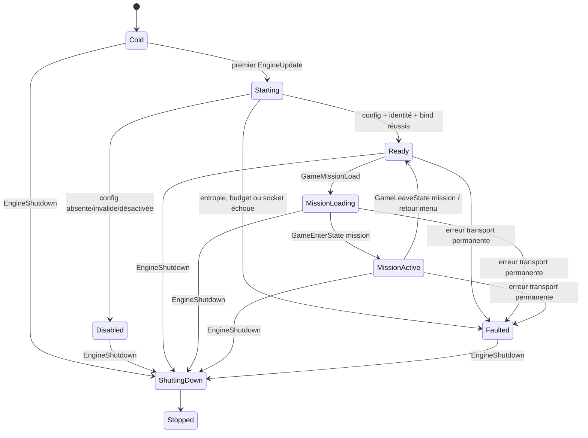
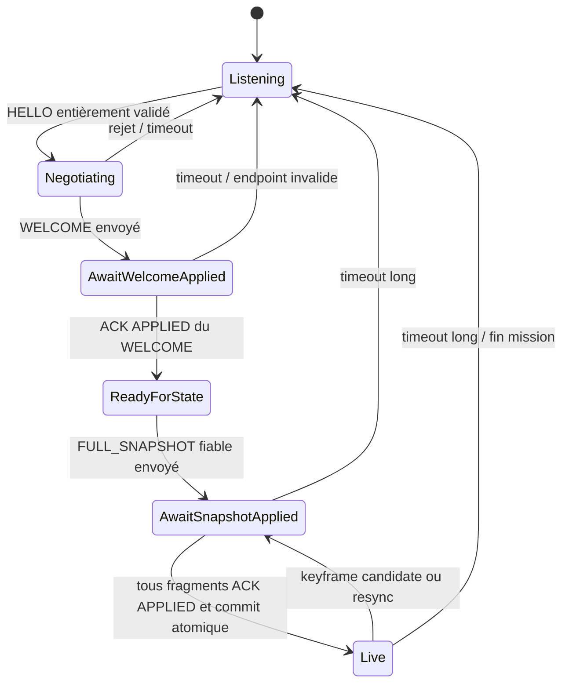
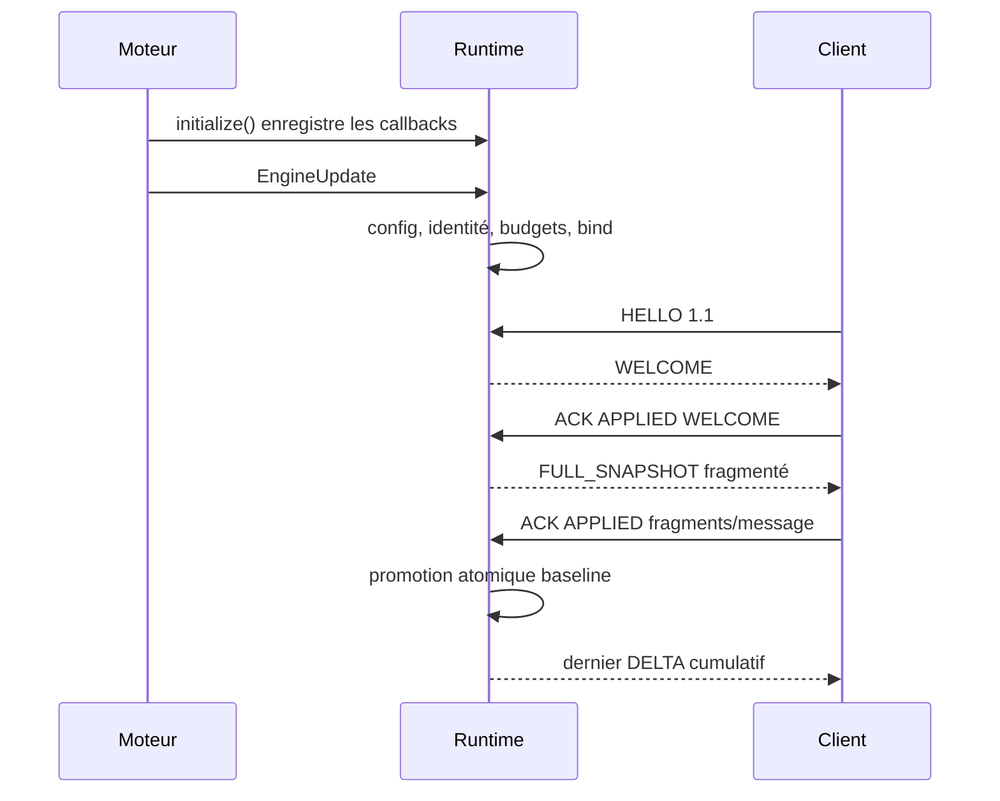
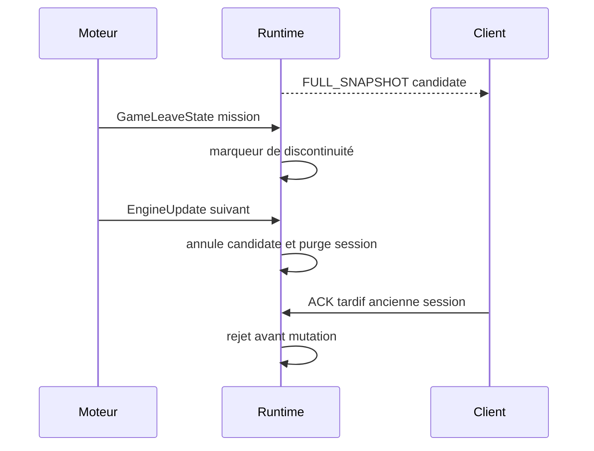

# 03 — Flux, cycle de vie et concurrence

## 1. Objet

Ce document fixe l'ordre d'exécution, les machines d'état, les limites de files et le nettoyage de la **Phase 1 — Squelette et premier flux**. Il spécialise les machines producteur/client et les timeouts de la [Phase 0](../0-Contrat-de-protocole/03-session-horloges-fiabilite.md) sans les remplacer.

La décision `D1-010` est normative : tout le runtime producteur s'exécute sur le thread principal. Aucun worker, thread socket, mutex, condition variable ou SPSC n'est introduit. « Concurrence » désigne donc les courses logiques entre callbacks moteur, datagrammes, temporisateurs, ACK et captures, toutes sérialisées par `EngineUpdate`.

## 2. Contexte d'exécution

### 2.1 Callbacks existants

`telemetry::initialize()` enregistre exactement une fois :

| Événement | Rôle Phase 1 | Travail maximal |
|---|---|---|
| `GameMissionLoad` | annoncer une discontinuité et purger l'état mission précédent | O(`maxClients`) |
| `GameEnterState` | détecter l'entrée effective en mission ou menu | mise à jour d'un marqueur |
| `GameLeaveState` | détecter la sortie de mission/menu | mise à jour d'un marqueur |
| `EngineUpdate` | exécuter l'unique tick runtime | borné par configuration et quotas |
| `EngineShutdown` | fermer sessions, transport et allocations | O(`maxClients`) sans attente |

Dans la boucle existante, `EngineUpdate` intervient avant le traitement des événements de séquence de jeu. Une transition `GameEnterState` ou `GameLeaveState` observée plus tard dans la même frame est donc appliquée au tick de télémétrie suivant. Ce délai d'une frame est attendu ; aucune lecture anticipée de l'état de séquence n'est ajoutée.

Tous les callbacks DOIVENT vérifier l'identité du thread principal en build de validation. En build de livraison, une violation place le runtime en `Faulted` sans toucher aux globals depuis le mauvais thread.

### 2.2 Absence de partage concurrent

- les sockets sont pollés et écrits uniquement dans `EngineUpdate` ;
- les globals moteur sont lus uniquement pendant la collecte de ce callback ;
- les callbacks lifecycle ne capturent que des enums/flags de transition ;
- les DTO, baselines, fenêtres fiables et métriques sont possédés par le runtime ;
- aucune API publique n'expose un pointeur vers l'état interne.

Il n'existe donc ni ordre mémoire interthread, ni verrou, ni `join`. Toute extension future avec worker constitue un changement de phase et doit introduire son propre contrat SPSC.

## 3. Machine d'état globale du runtime

| État | Sockets | Sessions | Collecte | Sorties autorisées |
|---|---:|---:|---:|---|
| `Cold` | 0 | 0 | non | aucune avant premier tick |
| `Starting` | 0 puis ouverture transactionnelle | 0 | non | diagnostic de démarrage unique |
| `Disabled` | 0 | 0 | non | métriques locales seulement |
| `Ready` | 1 ou 2 | 0 à `maxClients` | non | contrôle et heartbeat hors mission |
| `MissionLoading` | ouverts | sessions renouvelées selon règle ci-dessous | non | contrôle/heartbeat ; aucun état joueur |
| `MissionActive` | ouverts | 0 à `maxClients` | selon cadence | contrôle, snapshot, delta, heartbeat |
| `Faulted` | 0 après rollback | 0 | non | résumé agrégé unique |
| `ShuttingDown` | fermeture en cours | purge | non | aucune nouvelle émission métier |
| `Stopped` | 0 | 0 | non | callbacks inertes |

`Disabled`, `Faulted` et `Stopped` sont terminaux jusqu'au redémarrage du processus. La configuration n'est jamais relue à chaud. Une erreur de datagramme isolée n'est pas une erreur runtime ; seule une erreur transport permanente ou un invariant interne rompu conduit à `Faulted`.

## 4. Portée des identités et purges

| Ressource | Portée | Renouvellement | Purge obligatoire |
|---|---|---|---|
| `producer_id` | installation/profil | uniquement si profil explicitement régénéré | jamais à la sortie mission |
| identité de processus utilisée contre la réutilisation | processus | au démarrage | shutdown |
| `session_id` filaire | session client | chaque nouvelle négociation et toute discontinuité imposant une nouvelle session | timeout, leave, fault, shutdown |
| compteur `entity_id` | session filaire | part de 1 avec contrôle overflow ; jamais réutilisé dans la session | fin de session |
| identité joueur observé | continuité logique dans la session et mission | nouvel ID si la source validée disparaît puis réapparaît ou change | mission load/leave/session end |
| baseline active/candidate et delta | client + session | selon ACK/keyframe | session end, mission discontinuity, fault, shutdown |
| état courant mission | mission | nouvelle capture valide | load, leave, menu, shutdown |
| sondes/échantillons heartbeat | client + session | fenêtre glissante bornée à huit | session end |
| sockets | runtime activé | démarrage processus seulement en Phase 1 | fault ou shutdown |

`GameMissionLoad` invalide immédiatement toute vue mission et toute baseline de données. Pour éviter qu'un ancien snapshot soit accepté sous une nouvelle mission, le producteur ferme les sessions établies, génère de nouveaux `session_id` lors des prochaines négociations et conserve seulement le transport/listener. `GameLeaveState` hors mission applique la même purge. Une sortie et réentrée entre deux ticks est condensée en une discontinuité ; elle ne peut pas conserver une baseline.

## 5. Machine de session et handshake

La machine Phase 0 est réutilisée. Les noms ci-dessous sont des regroupements de lecture, pas de nouveaux états wire :

Le shutdown n'est pas une transition vers `Listening` : l'état global `ShuttingDown` détruit directement tous les slots, puis passe à `Stopped`.

Règles impératives :

1. `HELLO` passe l'ordre de validation, l'allowlist, l'anti-amplification et les rate limits Phase 0 avant création d'un slot.
2. Le producteur Phase 1 négocie exactement FSTL 1.1 ; un client 1.0 reçoit `WelcomeStatus::UnsupportedVersion` sans état durable.
3. Aucun manifeste, snapshot, fragment d'état ou delta n'est émis avant `ACK APPLIED` du `WELCOME`.
4. `SESSION_BEGIN.required_manifest_id` vaut zéro ; aucun échange de manifeste n'est attendu.
5. Un ACK d'un endpoint, producteur, session, message ou fragment différent est rejeté avant mutation.
6. Un ACK perdu peut provoquer une retransmission ; un doublon déjà appliqué est réacquitté sans republier l'état.
7. Les timeouts courts/longs, retries et transitions exacts restent ceux de la Phase 0.

## 6. Ordonnancement d'un tick

### 6.1 Préconditions et ordre

Chaque `EngineUpdate` lit une seule fois l'horloge monotone `timer_get_microseconds()` et exécute :

1. fast path immédiat pour `Disabled`, `Faulted`, `ShuttingDown` ou `Stopped` ;
2. démarrage différé si `Cold` ;
3. application des marqueurs lifecycle dans leur ordre d'observation ;
4. calcul des échéances et expiration des sessions, réassemblages, sondes et retransmissions ;
5. traitement alterné ingress/egress sous le budget commun de datagrammes ;
6. collecte si mission active et échéance `flightHz` atteinte ;
7. mise à jour de l'état canonique et des deltas remplaçables ;
8. second passage d'egress avec le budget restant ;
9. enregistrement des durées et high-water marks.

L'ordre 5 avant 6 permet à un ACK de snapshot de promouvoir la baseline avant de calculer le delta de la capture courante. Si une capture candidate a eu lieu avant cet ACK, les dirty fields accumulés depuis la capture candidate sont conservés et apparaissent dans le premier delta de la nouvelle baseline.

### 6.2 Budget commun de datagrammes

`maxDatagramsPerTick = N` borne la somme des tentatives de réception et d'émission réussies ou `WouldBlock` du tick. Chaque appel socket consomme une unité ; aucune boucle interne ne peut dépasser `N`.

Le runtime maintient un curseur `IngressFirst`/`EgressFirst` :

- si ingress et egress sont tous deux prêts, il alterne les directions et inverse le premier choix au tick suivant ;
- si une seule direction est prête, elle consomme le budget restant ;
- une tentative `WouldBlock` termine la direction concernée pour ce tick ;
- avec `N=1`, l'alternance persistante empêche la famine d'une direction ;
- un datagramme fragmenté est émis fragment par fragment sur plusieurs ticks si nécessaire.

Cette règle rend `P1-REQ-011` mesurable et évite une interprétation double du plafond. Les opérations sans syscall — validation, diff et choix du prochain fragment — restent bornées par les fenêtres et slots préalloués.

### 6.3 Priorités dégressives

Dans l'egress, le prochain datagramme est choisi par priorité stable :

1. rejet/contrôle nécessaire pour la sûreté, sous anti-amplification ;
2. ACK/NACK/heartbeat de session et retransmission fiable arrivée à échéance ;
3. fragments du `WELCOME` ou d'un `FULL_SNAPSHOT` fiable déjà engagé ;
4. nouvelle keyframe/resync autorisée par les fenêtres ;
5. heartbeat périodique ;
6. dernier `DELTA` cumulatif remplaçable.

Le contrôle fiable ne peut être évincé par un delta. Entre éléments d'une même priorité, un round-robin par slot client empêche la famine. Un slot ne peut consommer plus d'une émission consécutive si un autre slot de même priorité est prêt.

### 6.4 Cadences

| Travail | Échéance | Rattrapage |
|---|---|---|
| collecte vol | `1 / flightHz`, défaut 30 Hz | une seule capture ; sauter les périodes manquées |
| keyframe candidate | `keyframeSeconds`, défaut 2 s | une seule candidate ; ne pas empiler si une candidate existe |
| heartbeat mission | `missionHeartbeatMs`, défaut 500 ms | un seul heartbeat récent |
| heartbeat hors mission | `idleHeartbeatMs`, défaut 1000 ms | un seul heartbeat récent |
| retransmission/timeouts | Phase 0 | fenêtre bornée ; aucun rattrapage en rafale non borné |

Les prochaines échéances sont avancées depuis `now`, pas par une boucle répétant toutes les périodes manquées. Une pause, un breakpoint ou un hitch ne provoque donc pas de burst proportionnel au retard.

## 7. Collecte, pause et discontinuités

### 7.1 Source valide

Une capture est publiée seulement si `Player`, `Player_obj` et `Player_ship` sont cohérents et si toutes les valeurs requises respectent [04](04-modele-de-donnees-et-regles-metier.md#4-sources-moteur-et-capture-atomique). Les copies sont achevées dans le tick. L'état courant peut survivre sous forme canonique, jamais sous forme de pointeur moteur.

### 7.2 Absence ou source invalide

- `NoPlayer` avant la première source valide : snapshot complet pour la couverture annoncée, joueur observé absent, session cliente `Live` avec sous-vue joueur indisponible ;
- disparition après une source valide : discontinuité ; invalider l'identité observée et forcer une nouvelle keyframe sans joueur ;
- `SourceTemporarilyUnavailable` après une capture valide : conserver le dernier état canonique cohérent, le marquer stale et ne publier aucun fragment partiel ; ce statut ne ferme pas la session ;
- `InvalidSource` : incrémenter la raison fermée, ne pas publier les champs invalides et appliquer la même discontinuité ;
- réapparition : attribuer un nouvel `entity_id`, puis envoyer une keyframe récente.

La Phase 1 ne synthétise aucun `EVENT_BATCH` de mort, observer ou respawn. Elle converge par état et renouvellement de snapshot, conformément à `D1-012`.

### 7.3 Pause

L'horloge producteur et les timeouts réseau restent monotones pendant la pause. Le temps mission peut rester constant. La collecte à 30 Hz PEUT observer un état inchangé ; aucun delta n'est émis s'il n'existe aucune différence canonique. Heartbeat, ACK, retransmission et timeout continuent. Reprendre la mission ne crée une nouvelle session que si le lifecycle moteur signale une discontinuité.

## 8. Baseline, ACK et courses logiques

### 8.1 Snapshot initial atomique

1. À `ReadyForState`, capturer l'état canonique courant.
2. Créer une baseline candidate et un `FULL_SNAPSHOT` fiable.
3. Fragmenter et envoyer sous fenêtre Phase 0.
4. Continuer à capturer ; enregistrer les différences contre la candidate sans la promouvoir.
5. À réception de tous les `ACK APPLIED`, promouvoir atomiquement la candidate.
6. Émettre le delta cumulatif actuel contre la nouvelle baseline si des champs ont changé.

Le client ne passe `Live` qu'après application atomique du snapshot complet. Aucun fragment isolé ne devient visible.

### 8.2 Keyframe périodique

La baseline active continue à produire des deltas pendant le transit d'une candidate. Une seule candidate est autorisée. Si l'échéance suivante survient avant `APPLIED`, elle est coalescée en un marqueur « keyframe due » ; aucun troisième snapshot n'est conservé. Après promotion, une nouvelle candidate peut être capturée à la prochaine échéance si le marqueur subsiste.

### 8.3 ACK perdu, doublon et ancien état

- ACK perdu : retransmettre le fiable ; l'application du doublon ne republie pas l'état et renvoie l'ACK idempotent ;
- ancien delta d'une baseline connue mais non active : drop silencieux compté ;
- baseline inconnue : drop, passage client `Synchronizing`/`Stale` selon Phase 0 et `RESYNC_REQUEST` rate-limité ;
- ACK d'une ancienne session : drop avant mutation ;
- changement mission pendant snapshot : annuler fenêtre et candidate, fermer la session, ne jamais promouvoir.

### 8.4 Resynchronisation

Les requêtes identiques sont dédupliquées par identité de message et acquittées `VALIDATED` selon Phase 0. Au plus une intention de resync est pendante par client. Elle produit une keyframe basée sur l'état courant le plus récent dès que la fenêtre permet une candidate. Aucun historique de requêtes ou de snapshots n'est créé.

## 9. Heartbeat et horloges

Par client, le runtime conserve au plus huit sondes en vol et huit échantillons `(RTT, offset)`. Il :

1. utilise l'horloge monotone du producteur pour émission, timeout et RTT ;
2. calcule le RTT/offset avec les quatre timestamps NTP-style Phase 0 et arithmétique vérifiée ;
3. rejette valeurs négatives impossibles, overflow et réponses sans sonde ;
4. sélectionne l'échantillon au RTT minimal ;
5. lisse l'offset sur au plus huit valeurs valides ;
6. ne confond jamais cet offset avec le temps mission de `MISSION_STATE`.

Une neuvième sonde ou mesure évince la plus ancienne. Aucun pair ne peut augmenter ces fenêtres.

## 10. Ressources bornées et files

La Phase 1 ne possède aucune file interthread. Les seuls ensembles en attente sont :

| Ensemble | Borne |
|---|---:|
| slots clients | `maxClients`, 1–4 |
| `session_id` déjà utilisés | 65 536 par processus, sans éviction |
| sockets | 1 dual-stack sûr ou 2 dédiés |
| datagrammes traités par tick | `maxDatagramsPerTick`, 1–256 au total |
| buffer datagramme | 1200 octets par buffer préalloué |
| réassemblages | 4 par client |
| mémoire de réassemblage | 4 Mio par client |
| fragments par message | 1024 |
| message d'état | 1 Mio |
| baseline | 1 active + 1 candidate par client |
| deltas | 1 dernier remplaçable par baseline et client |
| intention resync | 1 par client |
| sondes/échantillons heartbeat | 8 + 8 par client |
| fenêtres fiables | bornes Phase 0, jamais extensibles par le pair |

La « profondeur de file » observable correspond au nombre d'éléments dans ces ensembles, jamais à un conteneur non borné. Les high-water marks exacts sont définis par [05](05-integration-configuration-et-observabilite.md#8-catalogue-normatif-des-métriques).

Sous `WouldBlock`, un fiable reste dans sa fenêtre jusqu'à son échéance ou timeout ; un delta est remplacé par le cumulatif plus récent ; un heartbeat non fiable ancien est abandonné. Aucun retry immédiat en boucle n'est permis.

## 11. Nettoyage et convergence des erreurs

### 11.1 Fin de session

Timeout, rejet final, fin mission ou erreur endpoint : libérer dans l'ordre réassemblages, fenêtre fiable, delta, candidate, active, sondes, endpoint, puis slot. Les compteurs de scope session sont figés dans le résumé puis remis à zéro pour la prochaine session.

### 11.2 Fin de mission

Interdire d'abord la collecte, invalider l'état courant et le registre d'entités, annuler les snapshots, fermer les sessions, puis passer `Ready`. Les sockets restent ouverts afin d'accepter un client hors mission et d'émettre uniquement contrôle/heartbeat jusqu'à la prochaine mission.

### 11.3 Erreur transport permanente

Fermer tous les slots, invalider tous les handles, fermer tous les sockets, libérer buffers et passer `Faulted`. Il n'existe pas de boucle de reopen en Phase 1. Un seul diagnostic agrégé est permis.

### 11.4 Shutdown

`EngineShutdown` est idempotent. Il ne tente aucun drain réseau, ACK final, sleep ou join. Il marque `ShuttingDown`, purge en ordre inverse de possession, ferme les sockets avant `psnet_close()`, publie le résumé final puis passe `Stopped`. Un second appel et tout `EngineUpdate` tardif sont des no-op mesurables.

## 12. Séquences de référence

### 12.1 Démarrage et premier flux

### 12.2 Sortie mission pendant une candidate

## 13. Traçabilité

| Exigence | Sections |
|---|---|
| `P1-REQ-011` | 6.2, 6.3 et 10 |
| `P1-REQ-013`–`014` | 5, 6.3, 8 et 10 |
| `P1-REQ-015`–`017` | 2, 3, 4 et 11 |
| `P1-REQ-018`–`019` | 5 et 9 |
| `P1-REQ-024`–`025` | 4 et 7 |
| `P1-REQ-026`–`030` | 8 et 12 |
| `P1-REQ-031`–`033` | 6, 10 et renvoi vers 05 |
| `P1-REQ-037`–`038` | 4, 8, 10 et 11 |

Les comportements attendus en situation nominale ou dégradée sont résumés dans [06](06-validation-securite-et-conformite.md).
