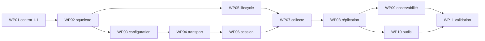

# 07 — Livraison et traçabilité

## 1. Objet

Ce document ordonne la future implémentation de la Phase 1, enregistre les décisions, définit les critères d'acceptation et trace chaque source. Il ne constate aucun succès d'implémentation.

## 2. Arborescence attendue

Les artefacts suivants sont **proposés** et restent à créer ou confirmer :

```text
code/telemetry/                  producteur, configuration, transport, session et collecte
test/src/telemetry/producer/     tests unitaires et intégration C++ du producteur
test/telemetry/protocol/         schéma, vectors FSTL 1.0/1.1 et fixtures wire
test/telemetry/protocol/tools/
├── fstl_reference_decoder.py   décodeur indépendant existant à étendre
└── fstl_console_client.py      client console de preuve proposé
documentation/analysis/specs/
└── 1-Squelette-et-premier-flux/ présente spécification
```

L'implémentation DOIT confirmer les chemins réels dans sa revue de lot ; cette arborescence n'affirme pas leur existence.

## 3. Lots de travail

| Lot | Contenu | Dépend de | Gate locale |
|---|---|---|---|
| `P1-WP-01` | amendement FSTL 1.1, schéma, bit `PLAYER_KINEMATICS`, compatibilité et vectors | gate Phase 0 | `G1-A` |
| `P1-WP-02` | groupe CMake, seam `initialize()`, squelette et fast path disabled | `P1-WP-01` | `G1-B` |
| `P1-WP-03` | JSON strict, profil producteur, défauts sûrs, allowlist et budgets | `P1-WP-02` | `G1-C` |
| `P1-WP-04` | transport UDP v4/v6 non bloquant, buffers fixes et poll borné | `P1-WP-03` | `G1-C` |
| `P1-WP-05` | callbacks moteur, mission, menu et shutdown idempotents | `P1-WP-02` | `G1-D` |
| `P1-WP-06` | négociation 1.1, session, heartbeat, ACK/NACK, rate limits | `P1-WP-04` | `G1-D` |
| `P1-WP-07` | registre d'IDs, DTO et collecte cinématique main-thread | `P1-WP-05`, `P1-WP-06` | `G1-E` |
| `P1-WP-08` | snapshot, baseline active/candidate, delta cumulatif, keyframe et resync | `P1-WP-07` | `G1-E` |
| `P1-WP-09` | métriques, logs, budgets et benchmarks | `P1-WP-06`, `P1-WP-08` | `G1-F` |
| `P1-WP-10` | décodeur indépendant et client console | `P1-WP-01`, `P1-WP-06`, `P1-WP-08` | `G1-F` |
| `P1-WP-11` | fuzz, profils UDP, soak 30 min, relances et matrice build | `P1-WP-09`, `P1-WP-10` | `G1-G` |



## 4. Gates intermédiaires

| Gate | Condition mesurable |
|---|---|
| `G1-A Contrat` | vectors 1.0 inchangés ; extension 1.1, invalides et deux décodeurs revus |
| `G1-B Intégration` | builds passent ; seam limité ; disabled fast path mesuré |
| `G1-C Transport sûr` | config fail-closed, v4/v6, allowlist, anti-amplification et quotas passent |
| `G1-D Cycle de vie` | session, heartbeat, mission/menu/shutdown convergent et libèrent les ressources |
| `G1-E Premier flux` | snapshot minimal, baseline, delta cumulatif, keyframe et resync passent |
| `G1-F Outils` | métriques complètes, budgets respectés, décodeur indépendant et console interopèrent |
| `G1-G Sortie` | fuzz sans défaut bloquant, profils réseau, soak et relances acceptés |

Une gate échouée bloque ses lots descendants. Aucune dérogation ne peut redéfinir le wire ou élargir silencieusement le périmètre.

## 5. Critères d'acceptation finaux

| ID | Critère |
|---|---|
| `P1-AC-001` | les hashes et octets de tous les vectors FSTL 1.0 sont inchangés et décodés par deux chemins indépendants |
| `P1-AC-002` | le schéma 1.1 définit exactement le bit `0x0400`, le record-set minimal et le rejet de ce bit en 1.0 |
| `P1-AC-003` | toutes les variantes supportées compilent ; le seam du socle ne modifie que les deux fichiers upstream autorisés |
| `P1-AC-004` | config absente ou invalide : zéro socket/session et au plus un diagnostic |
| `P1-AC-005` | loopback IPv4 et IPv6 négocient 1.1 ; source non allowlistée reçoit zéro réponse ; client 1.0 est rejeté sans état durable |
| `P1-AC-006` | l'oracle moteur et le JSON canonique concordent pour ID, temps, position, quaternion, vitesses, rayon et flags ; norme quaternion dans `[0,9999;1,0001]` |
| `P1-AC-007` | le snapshot n'est publié qu'après `APPLIED`, ne requiert aucun manifeste et ne contient aucun record Phase 2 |
| `P1-AC-008` | après perte de deltas intermédiaires, le dernier delta cumulatif converge exactement ; ancien delta et baseline inconnue ne corrompent pas l'état |
| `P1-AC-009` | toute mutation entre capture candidate et ACK apparaît dans le premier delta de la nouvelle baseline |
| `P1-AC-010` | heartbeat, filtre d'offset, overflow, `Stale` et timeout long passent leurs bornes exactes |
| `P1-AC-011` | corpus invalide et fuzz produisent zéro crash, OOB, allocation hors budget ou publication partielle |
| `P1-AC-012` | sous `WOULD_BLOCK` et limite de 64 datagrammes/tick, aucune attente ; ressources sous maxima ; fiable non évincé par delta |
| `P1-AC-013` | toutes les métriques obligatoires sont exercées et leur scope de reset vérifié ; logs exempts de contenu interdit |
| `P1-AC-014` | les benchmarks respectent les seuils de `P1-REQ-033` avec environnement reproductible |
| `P1-AC-015` | chaque profil 1/5/20 %, indépendant et rafales, dure dix minutes ; budgets tenus et retour `Live` en dix secondes après impairment |
| `P1-AC-016` | soak solo trente minutes, relance mission et processus : zéro fuite détectée, sockets/handles libérés, nouvelle session à chaque discontinuité, `mission_generation` incrémentée dans le même processus, nouveau `session_id` après redémarrage et reconvergence |
| `P1-AC-017` | revue statique et tests entrants démontrent zéro chemin vers une commande de simulation |
| `P1-AC-018` | le client console affiche les champs/états requis, envoie ACK/resync et gère arrêt normal ou brutal |
| `P1-AC-019` | l'arborescence et le binaire ne contiennent aucun artefact fonctionnel appartenant aux Phases 2–7 |
| `P1-AC-020` | chaque `P1-REQ-001` à `038` est reliée à une preuve réelle et la checklist finale est approuvée sans réserve bloquante |

## 6. Décisions de clarification

| ID | Question | Décision figée |
|---|---|---|
| `D1-001` | contradiction premier snapshot / `CORE_SHIP` | extension mineure FSTL 1.1 ; ni anticipation Phase 2 ni snapshot partiel |
| `D1-002` | identité du nouveau domaine | `PLAYER_KINEMATICS=0x0400`, interdit en session 1.0 |
| `D1-003` | contenu minimal | `SESSION_STATE`, `MISSION_STATE`, puis lifecycle+flight conditionnels sur le joueur observé ; manifeste nul |
| `D1-004` | nouveau record ou réemploi | réutiliser `FLIGHT_STATE` v1 avec `presence=0`; aucun record 29 ni version 2 |
| `D1-005` | sens d'« identité joueur » | ID observé + lifecycle `SHIP`; nom, classe, callsign et rôle détaillé restent Phase 2 |
| `D1-006` | compatibilité producteur Phase 1 | profil producteur 1.1 uniquement ; client 1.0 rejeté explicitement ; décodeur garde 1.0 |
| `D1-007` | erreurs et reload JSON | schéma strict, fail-closed, clés inconnues invalides, relecture au redémarrage uniquement |
| `D1-008` | exposition par défaut | loopback, `Cockpit`, un client, découverte et `TrustedFullState` désactivés |
| `D1-009` | dual-stack | un socket dual-stack sûr ou deux sockets dédiés ; jamais de wildcard implicite |
| `D1-010` | threading initial | collecte, protocole et I/O non bloquante sur thread principal ; aucun worker/SPSC Phase 1 |
| `D1-011` | cadences | vol 30 Hz, keyframe 2 s, heartbeat 500 ms mission/1000 ms hors mission ; tous configurables dans les bornes |
| `D1-012` | événements et respawn | aucun `EVENT_BATCH` métier ; discontinuité corrigée par keyframe/session ; réplication complète Phase 2 |
| `D1-013` | outil indépendant | le client console utilise le décodeur indépendant, jamais le parser/DTO C++ producteur |
| `D1-014` | seuils de performance | seuils de `P1-REQ-033`; environnement et percentiles archivés, aucun résultat supposé |
| `D1-015` | relation documentation/implémentation | la spec peut exister avant les preuves ; tout code reste bloqué par `G1-A` et la gate Phase 0 |

## 7. Traçabilité de la roadmap Phase 1

| Bullet roadmap | Exigences / décision | Lot / acceptation |
|---|---|---|
| groupe `Telemetry` | `P1-REQ-005`, `036` | `WP02`, `AC-003` |
| include et `initialize()` | `P1-REQ-005`, `015` | `WP02`, `AC-003` |
| configuration JSON | `P1-REQ-006`–`009` | `WP03`, `AC-004`–`005` |
| socket dédié non bloquant dual-stack | `P1-REQ-010`–`014` | `WP04`, `AC-005`, `012` |
| événements moteur | `P1-REQ-015`–`017` | `WP05`, `AC-016` |
| session et heartbeat | `P1-REQ-018`–`019` | `WP06`, `AC-010` |
| premier snapshot | `P1-REQ-020`–`026`, `D1-001`–`006` | `WP01`, `WP07`, `WP08`, `AC-001`–`009` |
| deltas cumulatifs et baseline | `P1-REQ-026`–`030` | `WP08`, `AC-007`–`009` |
| métriques et intégration | `P1-REQ-031`–`033`, `036`–`038` | `WP09`, `WP11`, `AC-011`–`016` |
| décodeur puis console | `P1-REQ-034`–`035` | `WP10`, `AC-018` |
| trente minutes, arrêt, relance | `P1-REQ-037` | `WP11`, `AC-016` |

### 7.1 Matrice détaillée exigence-preuve

Dans les deux tableaux de cette section, les formes compactes `WPnn` et `AC-nnn` renvoient respectivement aux identifiants canoniques `P1-WP-nn` et `P1-AC-nnn`; elles ne créent aucun identifiant supplémentaire.

| Exigence | Source normative principale | Preuve / lot / acceptation |
|---|---|---|
| `P1-REQ-001` | Phase 0 README §Gate | hashes 1.0, `WP01`, `AC-001` |
| `P1-REQ-002` | Phase 0 format/compatibilité | vectors 1.0/1.1, `WP01`, `AC-002` |
| `P1-REQ-003` | roadmap §3 | revue de périmètre, `WP11`, `AC-019` |
| `P1-REQ-004` | analyse README décisions 3, 4 et 8 | revue read-only, `WP11`, `AC-017` |
| `P1-REQ-005` | roadmap §3 ; architecture §2 | diff/build, `WP02`, `AC-003` |
| `P1-REQ-006` | architecture §10 ; Phase 0 sécurité | table JSON, `WP03`, `AC-004` |
| `P1-REQ-007` | Phase 0 sécurité §9.1 | tests de bind/allowlist, `WP03`, `AC-004`–`005` |
| `P1-REQ-008` | protocole §11 ; roadmap §3 | tests min/défaut/max, `WP03`, `AC-004` |
| `P1-REQ-009` | Phase 0 session §2 | injection RNG/profile, `WP03`, `AC-005` |
| `P1-REQ-010` | architecture §9 ; réseau/API §8 | loopback v4/v6, `WP04`, `AC-005` |
| `P1-REQ-011` | architecture §8 | harness `WOULD_BLOCK`, `WP04`, `AC-012` |
| `P1-REQ-012` | protocole §2–4 et §7 ; Phase 0 format | vectors/limites/fuzz, `WP01`, `WP04`, `AC-011`–`012` |
| `P1-REQ-013` | Phase 0 validation §5 et sécurité §9 | anti-amplification/rates, `WP03`, `WP06`, `AC-005`, `AC-011` |
| `P1-REQ-014` | Phase 0 fiabilité §10–16 | saturation/high-water, `WP04`, `WP08`, `AC-012` |
| `P1-REQ-015` | architecture §3 | double initialize, `WP02`, `WP05`, `AC-003` |
| `P1-REQ-016` | architecture §5 et §8 | assertion thread/revue DTO, `WP05`, `WP07`, `AC-006` |
| `P1-REQ-017` | roadmap tests §10.3 ; Phase 0 cleanup | lifecycle/leak, `WP05`, `WP11`, `AC-016` |
| `P1-REQ-018` | Phase 0 session §4 et §6.5 | transitions/timeouts, `WP06`, `AC-010` |
| `P1-REQ-019` | protocole §5.1 ; Phase 0 session §6 | tests horloge, `WP06`, `AC-010` |
| `P1-REQ-020` | décision `D1-001`–`D1-002` | schéma/vector 1.1, `WP01`, `AC-002` |
| `P1-REQ-021` | décision `D1-003` | golden snapshot, `WP01`, `WP08`, `AC-007` |
| `P1-REQ-022` | inventaire §4.1 ; Phase 0 modèle §6.3 | oracle moteur, `WP07`, `AC-006` |
| `P1-REQ-023` | roadmap premier snapshot ; `D1-005` | absence records Phase 2, `WP07`, `AC-007`, `AC-019` |
| `P1-REQ-024` | inventaire §1 et §4 ; Phase 0 modèle | source/invalides, `WP07`, `AC-006`, `AC-011` |
| `P1-REQ-025` | inventaire §3 ; Phase 0 IDs | test ID/session, `WP07`, `AC-006`, `AC-016` |
| `P1-REQ-026` | Phase 0 fiabilité §7 et §10 | commit/ACK perdu, `WP08`, `AC-007` |
| `P1-REQ-027` | architecture §6 ; Phase 0 fiabilité §11 | perte/désordre, `WP08`, `AC-008` |
| `P1-REQ-028` | roadmap §3 ; Phase 0 fiabilité §11 | course ACK/baseline, `WP08`, `AC-009` |
| `P1-REQ-029` | roadmap frontières Phase 2/6 | lifecycle + exclusion, `WP05`, `WP11`, `AC-019` |
| `P1-REQ-030` | Phase 0 fiabilité §13 | resync répété, `WP08`, `AC-008`, `AC-012` |
| `P1-REQ-031` | roadmap §11 ; Phase 0 validation §16 | compteur par chemin, `WP09`, `AC-013` |
| `P1-REQ-032` | roadmap §11 ; Phase 0 validation §16 | scan des logs, `WP09`, `AC-013` |
| `P1-REQ-033` | roadmap §10.6 ; architecture §8 | benchmarks, `WP09`, `AC-014` |
| `P1-REQ-034` | roadmap §3 ; Phase 0 interop §15 | rapport croisé, `WP01`, `WP10`, `AC-001`–`002` |
| `P1-REQ-035` | roadmap §3 | transcript console, `WP10`, `AC-018` |
| `P1-REQ-036` | architecture §2.2 et §10 ; roadmap §10.5 | build matrix, `WP02`, `WP11`, `AC-003` |
| `P1-REQ-037` | roadmap critère Phase 1 | soak/leak/restart, `WP11`, `AC-016` |
| `P1-REQ-038` | roadmap §10 ; Phase 0 harness | seeds/profils réseau, `WP11`, `AC-011`, `AC-015` |

## 8. Couverture du plan de tests, observabilité et risques

| Source | Couverture Phase 1 |
|---|---|
| roadmap §10.1 Sérialisation | vectors 1.0/1.1, round-trip, limites, troncatures, versions, endian, fragmentation et fuzz ; [06 §3.2](06-validation-securite-et-conformite.md#32-compatibilité-et-sérialisation) |
| roadmap §10.2 UDP | pertes, duplication, désordre, jitter, coupure, ACK/delta/fragments, client lent et resync ; [06 §3.4](06-validation-securite-et-conformite.md#34-transport-udp-et-dégradation) |
| roadmap §10.3 Cycle de vie | connexion, mission, pause, menu, shutdown, client crash et nouvelle session ; mort/respawn explicitement Phase 2 |
| roadmap §10.4 Données | mission solo et comparaison cinématique ; autres domaines explicitement différés |
| roadmap §10.5 Build | variantes supportées, Jansson existant, aucune dépendance nouvelle |
| roadmap §10.6 Performance | collecte, diff, sérialisation, datagrammes, allocations, files et disabled ; seuils `P1-REQ-033` |
| roadmap §11 Observabilité | `P1-REQ-031`–`032` et [06 §6](06-validation-securite-et-conformite.md#6-observabilité-et-performance) |
| roadmap §12 Risques | registre section 10 ci-dessous |
| roadmap §13 Ordre | `WP01` à `WP11`, producteur et contrat avant console |

## 9. Matrice de traçabilité globale des sources

| Source | Apport | Couverture Phase 1 |
|---|---|---|
| [README analyse](../../README.md) | UDP, lecture seule, socket dédié, delta cumulatif, vues séparées | cadre, `P1-REQ-003`–`004`, `010`, exclusions |
| [01 Inventaire](../../01-telemetry-data-inventory.md) | sources, IDs, pose, quaternion, unités, dérivés/interdits | `P1-REQ-021`–`025` |
| [02 Architecture](../../02-telemetry-architecture.md) | seams, événements, pipeline, threading, config et socket | `P1-REQ-005`–`019`, `031`–`033`, `036` |
| [03 Protocole UDP](../../03-udp-protocol.md) | datagramme, session, fiabilité, snapshots, deltas et sécurité | `P1-REQ-010`–`014`, `018`–`030` |
| [04 Roadmap](../../04-implementation-roadmap.md) | bullets Phase 1, tests, observabilité, risques et gate 30 min | toutes les exigences et acceptations |
| [05 Réseau/API](../../05-existing-network-and-api.md) | limites PSNET, socket séparé, références de pose et C++ plutôt que Lua | `P1-REQ-004`, `010`, `012`, `024`, `036` |
| [06 Communication](../../06-communication-view.md) | frontière de la vue Talking Head | exclusion Phase 5 ; aucun record `COMM_*` |
| [07 Cible haute résolution](../../07-high-resolution-target-view.md) | frontière vidéo, priorité et absence de blocage | exclusion Phase 7 ; état prioritaire |
| [Phase 0](../0-Contrat-de-protocole/README.md) | wire FSTL 1.0, session, modèle, sécurité, tests et gates | `P1-REQ-001`–`002`, `009`–`030`, `034`, `038` |

## 10. Registre des risques

| Risque | Détection | Réponse | Gate bloquée |
|---|---|---|---|
| dérive des octets FSTL 1.0 | hash/vector diff | refuser l'amendement et corriger 1.1 | `G1-A` |
| domaine 1.1 ambigu ou pris pour `CORE_SHIP` | test record-set/couverture | rejeter snapshot et corriger schéma | `G1-A`, `G1-E` |
| dette upstream | revue diff | réduire aux deux seams autorisés | `G1-B` |
| écoute réseau involontaire | test config/interface | fail-closed loopback | `G1-C` |
| blocage frame | p99, `WOULD_BLOCK`, trace syscalls | borner poll, remplacer delta, corriger avant merge | `G1-C`, `G1-F` |
| data race/pointeur conservé | assertions thread, sanitizers, revue DTO | copie main-thread uniquement | `G1-D`, `G1-E` |
| perte de delta | harness cumulatif | dernier delta + keyframe/resync | `G1-E` |
| mutation perdue au changement baseline | scénario ACK race | dirty-set candidate depuis capture | `G1-E` |
| mémoire non bornée/client hostile | high-water/quota/fuzz | refuser réservation, rate limiter | `G1-C`, `G1-G` |
| fuite d'information ou commande | revue payload/mutation | `Cockpit`, allowlist, lecture seule | `G1-C`, `G1-G` |
| outil non indépendant | graphe dépendances/build | séparer parser et fixtures | `G1-F` |
| faux succès documentaire | absence de rapport/hash/trace | laisser gate et checklist ouvertes | `G1-G` |

## 11. Preuves à produire

- hashes et rapport de compatibilité FSTL 1.0/1.1 ;
- schéma machine-readable et catalogue de vectors valides/invalides ;
- diff de portée et matrice de builds ;
- rapports de tests configuration, transport, session, lifecycle et données ;
- seeds, commandes et traces des profils réseau ;
- corpus et rapports de fuzz/sanitizers ;
- rapport benchmark avec percentiles ;
- rapport soak/leak trente minutes et relances ;
- sortie JSON croisée du décodeur indépendant ;
- transcripts du client console ;
- revue sécurité/read-only et revue d'exclusion Phases 2–7.

### Commandes de preuve proposées

Les noms de cibles sont à confirmer lors de l'implémentation ; ces commandes ne sont pas déclarées réussies :

```powershell
cmake --build $BuildDir --target $TelemetryTestsTarget
ctest --test-dir $BuildDir -R telemetry --output-on-failure
& $DecoderCommand --vectors test/telemetry/protocol
& $NetworkHarnessCommand --profile $Profile --seed $Seed
& $SoakCommand --duration 30m --restart-mission --restart-process
```

Chaque rapport DOIT enregistrer la commande réellement exécutée, le code de sortie, la révision, les versions d'outils et les artefacts produits.

## 12. Checklist de sortie

- [ ] Gate Phase 0 fermée et amendement FSTL 1.1 approuvé.
- [ ] `P1-WP-01` à `P1-WP-11` livrés avec leurs preuves.
- [ ] `P1-AC-001` à `P1-AC-020` acceptés.
- [ ] Chaque `P1-REQ-001` à `P1-REQ-038` reliée à une preuve réelle.
- [ ] Aucun vector FSTL 1.0 modifié.
- [ ] Aucun défaut bloquant de build, test, fuzz, sécurité, fuite ou performance.
- [ ] Client console et décodeur indépendant interopérables.
- [ ] Soak trente minutes et relances concluants.
- [ ] Revue d'absence des fonctionnalités Phases 2–7 approuvée.
- [ ] Documentation et commandes de reproduction archivées.

Tant qu'une case reste ouverte, la Phase 1 n'est pas terminée.
