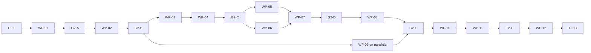

# 07 — Livraison et traçabilité

## 1. Objet

Ce document transforme le contrat Phase 2 en lots de travail, gates, critères d’acceptation, décisions, preuves et matrice de traçabilité. Il ne déclare aucune preuve déjà acquise.

## 2. Arborescence attendue

L’implémentation DOIT aboutir au minimum à cette surface ; un renommage privé n’est permis que si la même responsabilité et la même cible de test restent explicites dans CMake :

```text
code/telemetry/
  engine_adapter.h/.cpp
  phase2_closure.h/.cpp
  phase2_manifest_builder.h/.cpp
  phase2_profile_gate.h/.cpp
  phase2_state_image.h/.cpp
  session_controller.h/.cpp
  native_session_runtime.cpp
  runtime.cpp

code/ship/ship.cpp
code/ai/aicode.cpp
code/playerman/playercontrol.cpp
code/hud/hudtargetbox.cpp
code/source_groups.cmake

test/src/telemetry/producer/
  phase2_engine_adapter_tests.cpp
  phase2_closure_tests.cpp
  phase2_manifest_tests.cpp
  phase2_state_image_tests.cpp
  phase2_lifecycle_tests.cpp
  phase2_oracle_tests.cpp
  phase2_security_corpus_tests.cpp

test/src/telemetry/protocol/
  phase2_profile_tests.cpp
  phase2_manifest_codec_tests.cpp
  phase2_state_codec_tests.cpp

test/src/CMakeLists.txt

test/telemetry/protocol/vectors-v1.1/
  phase2-core-gate.bin
  phase2-complete-ship.bin
test/telemetry/protocol/expected-v1.1/
  phase2-core-gate.json
  phase2-complete-ship.json
test/telemetry/protocol/
  tools/fstl_console_client.py

test/telemetry/producer/phase2/
  run_phase2_reliability_evidence.py
  run_phase2_oracle_evidence.py
  run_phase2_performance_evidence.py
  fuzz/corpus/packet_reader/
  fuzz/corpus/state_validator/
  reports/wp01-contract/
  reports/wp02-capture/
  reports/wp03-manifest/
  reports/wp04-core-gate/
  reports/wp05-systems/
  reports/wp06-weapons/
  reports/wp07-lifecycle-support/
  reports/wp08-runtime/
  reports/wp09-security/fuzz-artifacts/
  reports/wp10-oracle/
  reports/wp11-loss-gate/
  reports/wp11-performance/
  reports/wp11-soak/
  reports/wp12-final/
```

Les tests natifs de producteur restent sous `test/src/telemetry/producer/` et les tests de protocole sous `test/src/telemetry/protocol/`, conformément à l’arborescence existante. Tous les `.cpp`/`.h` sont déclarés explicitement dans `code/source_groups.cmake` et `test/src/CMakeLists.txt`; aucun glob n’est accepté.

## 3. Lots de travail

### `P2-WP-01` — Préconditions, freeze et profils

**Dépend de :** fermeture prouvée de `G1-G`.

**Livrables :** inventaire courant des preuves Phase 1 ; exécution du freeze FSTL 1.0 ; tests du golden `phase2-promotion` `0x0401` ; fixtures positives/négatives du profil `0x0583` ; enum privée des profils.

**Sortie :** `P2-AC-001` et `P2-AC-002` passent ; les validateurs/fixtures de profil nécessaires à `P2-AC-003` sont prêts, sans prétendre que le producteur final existe déjà.

### `P2-WP-02` — DTO, gardes et capture main-thread

**Dépend de :** `P2-WP-01`.

**Livrables :** extension de `EngineReadView`, DTO pré-ID possédé, gardes source, canonisation, capacités préallouées, capture par blocs, tests de thread/absence/limites et les quatre seams `code/ship/ship.cpp::OnShipCleanup`, `code/ai/aicode.cpp::OnSupportTransition`, `code/playerman/playercontrol.cpp::OnControlTarget/OnCargoAuthority` et `code/hud/hudtargetbox.cpp::OnCargoAuthority`.

**Sortie :** toutes les autorités requises sont copiées sans pointeur, allocation live ni lecture concurrente ; `P2-AC-004` passe.

### `P2-WP-03` — Closure, identités et manifestes

**Dépend de :** `P2-WP-02`.

**Livrables :** calcul du point fixe Cockpit, descripteurs pré-ID, registres auxiliaires, IDs canoniques, fingerprints, mapping statique exhaustif des classes, sous-systèmes, banques, contre-mesures et armes, builders `CLASS_MANIFEST`/`WEAPON_MANIFEST`, transaction exhaustive, pagination, maximum de deux générations active/staged et tests de changement/coalescence de génération.

**Sortie :** manifeste déterministe installé avant snapshot, bornes et confidentialité prouvées ; `P2-AC-005` passe.

### `P2-WP-04` — Gate `CORE_SHIP`

**Dépend de :** `P2-WP-03`.

**Livrables :** `SHIP_IDENTITY`, `DAMAGE_STATE`, `SHIELD_STATE`, `SUBSYSTEM_STATE`, `ENERGY_STATE`, `PROPULSION_STATE`, image `0x0401`, cardinalité `9+N`, goldens minimal/complexe.

**Sortie :** chaque omission obligatoire est rejetée et le golden existant reste valide ; gate `G2-C` fermée.

### `P2-WP-05` — Commandes, cohérences croisées et tourelles

**Dépend de :** `P2-WP-04`.

**Livrables :** `CONTROL_STATE`, cohérences flight/control/propulsion/afterburner/ETS avec les records cœur déjà complets de WP-04, groupes sous-systèmes/animations et sous-ensemble tourelle sans cible. WP-05 n’est pas propriétaire d’un second mapper propulsion ou énergie.

**Sortie :** cas limites et oracles unitaires passent ; aucune donnée Phase 3 n’est publiée.

### `P2-WP-06` — Armes, banques et contre-mesures

**Dépend de :** `P2-WP-03` et `P2-WP-04`.

**Livrables :** `WEAPON_STATE` dynamique, banques primaires/secondaires/tertiaires/tourelles hétérogènes, munitions, sélecteurs, contre-mesures et changements de loadout ; le catalogue statique complet, y compris les définitions tertiaires sans classe d’arme, est déjà livré par `P2-WP-03`.

**Sortie :** domaine `WEAPONS` complet, génération armes vide valide pour un joueur non armé, événements de tir exacts toujours exclus.

### `P2-WP-07` — Cargo/docking minimal, support et lifecycle

**Dépend de :** `P2-WP-05` et `P2-WP-06`.

**Livrables :** `CARGO_SCAN_STATE`, `DOCKING_STATE`, `SUPPORT_STATE`, extension transitive du point fixe à tout ship référencé, rings cleanup/support globaux, latches d’épisodes par slot, keyframes terminales, événements lifecycle reconstructibles, mort/disparition/respawn et seams métier des fichiers `ship.cpp`, `aicode.cpp`, `playercontrol.cpp`, `hudtargetbox.cpp`.

**Sortie :** domaine `CARGO_DOCK_SUPPORT` complet dans le point fixe Cockpit, nouvel ID au respawn et scénarios déterministes prérequis de `P2-AC-007`/`P2-AC-008` verts ; leurs preuves client/perte restent dues en WP-10/WP-11.

### `P2-WP-08` — Image, baseline, delta et runtime final

**Dépend de :** `P2-WP-04` à `P2-WP-07`.

**Livrables :** image `4+10K+N` (`14+N` seulement pour K=1), profile gate `0x0583`, slots variables bornés, image/baseline par client, manifeste avant snapshot, delta cumulatif par atome, resync, changement de fermeture, limite delta 1 Mio avec fallback keyframe et scheduling.

**Sortie :** runtime complet en faux moteur puis intégration native ; `P2-AC-003` passe et les scénarios fonctionnels prérequis de `P2-AC-009` sont verts, sans remplacer la campagne longue WP-11.

### `P2-WP-09` — Configuration, build, observabilité et sécurité

**Dépend de :** `P2-WP-02`, peut progresser en parallèle des lots métier.

**Livrables :** `systemsHz`, CMake explicite, métriques/logs Phase 2, préallocation aux maxima, plafonds 64 Mio partagé/80 Mio par client/384 Mio process, quotas, cibles fuzz Clang, rejeu corpus MSVC, tests fail-closed et confidentialité.

**Sortie :** `P2-AC-010`, `P2-AC-011` et `P2-AC-012` passent.

### `P2-WP-10` — Client indépendant et oracle tableau de bord

**Dépend de :** `P2-WP-08`.

**Livrables :** extension du client Python, projection de dashboard, inventaire de provenance, `ProofOracleSink`, rapport zéro mismatch et fixtures goldens.

**Sortie :** 100 % des champs affichés ont une preuve ; `P2-AC-006` et `P2-AC-014` passent.

### `P2-WP-11` — Perte, performance et endurance

**Dépend de :** `P2-WP-08`, `P2-WP-09` et `P2-WP-10`.

**Livrables :** campagne `P2-LOSS-GATE` de 12 runs (deux profils × 1/5/20 % × iid/burst, 600 s mesurées après warm-up), rapports Release, protocole de mesure du document 05, allocations, quatre clients, cinq soaks 1800 s et relances.

**Sortie :** convergence, budgets et endurance prouvés ; `P2-AC-009`, `P2-AC-013` et `P2-AC-015` passent.

### `P2-WP-12` — Certification et revue indépendante

**Dépend de :** tous les lots précédents.

**Livrables :** exécution propre de toutes les preuves sur le même commit, manifeste de rapports avec hashes/commandes, revue indépendante exigences-diff-tests, résolution des écarts et checklist finale.

**Sortie :** `G2-G` fermée, aucune case sans preuve et aucun changement hors scope inexpliqué.

## 4. Gates intermédiaires



| Gate | Lots autorisés / lots qui ferment | Tests et acceptations bloquants | Rapport normatif |
|---|---|---|---|
| `G2-0` | autorise WP-01 ; fermée par l’audit du prédécesseur | manifeste et suites Phase 1 courantes sur la révision de base, `P2-AC-001` | `test/telemetry/producer/phase2/reports/wp01-contract/g2-0-predecessor.json` |
| `G2-A` | WP-01 ferme ; autorise WP-02 | `P2-TST-010..019`, `P2-AC-002` et fixtures/validateurs prérequis de `P2-AC-003` | `test/telemetry/producer/phase2/reports/wp01-contract/g2-a-wire-profiles.json` |
| `G2-B` | WP-02 ferme ; autorise WP-03 et le travail parallèle WP-09 | `P2-TST-007..009`, tests unitaires de capture cleanup/support sans fence runtime, `P2-AC-004` | `test/telemetry/producer/phase2/reports/wp02-capture/g2-b-capture.json` |
| `G2-C` | WP-03 puis WP-04 ferment ; autorise WP-05/WP-06 | `P2-TST-020..034`, `P2-TST-039`, `P2-TST-047`, `P2-AC-005`, golden `0x0401` et oracle unitaire cœur prérequis de `P2-AC-006` | `test/telemetry/producer/phase2/reports/wp04-core-gate/g2-c-core-gate.json` |
| `G2-D` | WP-05/WP-06/WP-07 ferment ; autorise WP-08 | `P2-TST-035..038`, `P2-TST-040..044`, `P2-TST-046`, matrice métier déterministe `0x0583` et prérequis unitaires de `P2-AC-006/007/008` | `test/telemetry/producer/phase2/reports/wp07-lifecycle-support/g2-d-complete-domain.json` |
| `G2-E` | WP-08 et WP-09 ferment ; autorise WP-10 | `P2-TST-001..009`, `P2-TST-049..070`, corpus hostile/fuzz, `P2-AC-003/010/011/012` et prérequis runtime de `P2-AC-007/008/009` | `test/telemetry/producer/phase2/reports/wp09-security/g2-e-runtime-security.json` |
| `G2-F` | WP-10 puis WP-11 ferment ; autorise WP-12 | `P2-TST-045`, `P2-TST-048`, client/goldens/oracle, 12 runs loss, protocole performance, cinq soaks, `P2-AC-006/007/008/009/013/014/015` | `test/telemetry/producer/phase2/reports/wp11-loss-gate/g2-f-proof-manifest.json` |
| `G2-G` | WP-12 ferme la Phase 2 | build matrix propre, toutes suites et preuves au même commit, revue indépendante, `P2-REQ-001..050`, `P2-AC-001..015` | `test/telemetry/producer/phase2/reports/wp12-final/g2-g-certification.json` |

Un lot ne commence qu’après sa gate d’entrée et ses dépendances WP explicites. WP-09 peut progresser après `G2-B`, mais ne ferme rien avant l’intégration WP-08. Une gate ne se ferme pas par déclaration : le JSON nommé contient commande exacte, révision, hash des artefacts, résultats par ID et code retour ; une preuve manquante laisse la gate ouverte.

## 5. Critères d’acceptation finaux

| ID | Critère mesurable | Preuve attendue |
|---|---|---|
| `P2-AC-001` | `G1-G` est prouvée sur la base et aucune régression Phase 1 | manifeste prédécesseur + suites Phase 1 vertes |
| `P2-AC-002` | FSTL 1.0 byte-identical et golden `0x0401` inchangé/valide | vérificateurs freeze/amendement et hashes |
| `P2-AC-003` | profil final exactement `0x0583`, image exactement `4+10K+N` records (`14+N` seulement pour K=1), omissions rejetées | matrice K=1/2/64 et négative K=65 + goldens |
| `P2-AC-004` | capture main-thread possédée, bornée et sans allocation après `Ready` | tests thread/gardes + compteurs allocation |
| `P2-AC-005` | manifeste classe+arme exhaustif, déterministe, installé avant snapshot | round-trip, pagination, ACK et changement génération |
| `P2-AC-006` | 100 % des champs dashboard ont une source/formule et zéro mismatch | rapport oracle machine-readable |
| `P2-AC-007` | apparition/mort/disparition/respawn convergent, nouvel ID au respawn | scénario lifecycle natif + client indépendant |
| `P2-AC-008` | support et fermeture cargo/docking sont complets, filtrés et terminaux fiables | fixtures toutes phases + keyframe terminale sous perte |
| `P2-AC-009` | après perturbation, chrono démarré à `APPLIED` du dernier manifeste requis, état source/closure stabilisé converge dans `2×keyframeSeconds+1s` | 12 rapports : profils `0x0401`/`0x0583` × 1/5/20 % × iid/burst, 600 s chacun, seed 1345474380 |
| `P2-AC-010` | config/build rétrocompatibles, `systemsHz` fermé et fichiers CMake explicites | suites config + build matrix |
| `P2-AC-011` | aucune commande, fuite Cockpit, allocation hostile ou dépassement quota | corpus sécurité, fuzz et scan logs |
| `P2-AC-012` | métriques/logs complets, cohérents, bornés et remis à zéro | tests observabilité + snapshot final |
| `P2-AC-013` | tous les seuils Release du document 05 sont respectés après warm-up 60 s, mesure ≥1800 s et minima d’échantillons, p99 nearest-rank sans retrait | rapport séries brutes, percentiles, hôte et flags |
| `P2-AC-014` | client indépendant valide manifestes, snapshots, deltas et goldens | tests Python + transcript/dashboard |
| `P2-AC-015` | cinq soaks de 1800 s passent sans fuite/croissance/deadlock | campagne seed 4242 + manifest de rapports |

## 6. Décisions de clarification

### `D2-001` — Aucun nouveau wire

La Phase 2 utilise FSTL 1.1 tel quel. Aucun bit, record, champ, enum ou layout n’est ajouté. FSTL 1.0 reste gelé.

### `D2-002` — Deux gates de couverture

`0x0401` est la promotion cœur explicitement demandée par la roadmap. `0x0583` est le profil final nécessaire aux autres livrables Phase 2. Une promotion en cours de session est interdite.

### `D2-003` — Profil final `0x0583`

Le validateur Phase 0 interdit `CONTROL_STATE`, `WEAPON_STATE` et `SUPPORT_STATE` sans `CONTROL_INPUTS`, `WEAPONS` et `CARGO_DOCK_SUPPORT`. Le profil final inclut donc ces bits au lieu d’émettre des records hors domaine.

### `D2-004` — Point fixe complet des vaisseaux référencés

`CARGO_DOCK_SUPPORT` exige aussi `CARGO_SCAN_STATE` et `DOCKING_STATE`. La fermeture est le plus petit point fixe contenant le joueur, le support de chaque membre, tous les leaders et toute composante de docking directe/transitive. Une cible cargo n’est publiée que si elle appartient déjà à ce point fixe. Chaque ship référencé reçoit lifecycle, `CORE_SHIP`, armes, docking et support complets ; aucune référence opaque n’est permise. Cela n’autorise ni UI cargo ni inventaire docking global.

### `D2-005` — Autorité livrée

La conformité Phase 2 est `SOLO + COCKPIT`. Les autres modes sont architecturés et testés fail-closed ; ils ne sont pas annoncés comme livrés.

### `D2-006` — Transaction atomique et deux générations résidentes

Les ensembles de records `CLASS_MANIFEST` et `WEAPON_MANIFEST` partagent le même `manifest_id`, la même transaction exhaustive et le même commit. Une fermeture armes vide reste une génération installée si aucun weapon record n’est référencé. Un slot conserve au plus les générations sémantiques `active` et `staged`; toute mutation supplémentaire est coalescée en rebuild-intent, jamais matérialisée en troisième génération.

### `D2-007` — Catalogue least-privilege

Seules les définitions transitivement référencées par le joueur et ses systèmes autorisés sont incluses. L’ensemble complet des tables `Ship_info`/`Weapon_info` n’est jamais exporté par commodité.

### `D2-008` — IDs publics canoniques

Les IDs sont séquentiels dans l’ordre canonique de la génération. Indices, signatures et pointeurs ne sont pas des IDs publics. Un respawn reçoit toujours un nouvel `entity_id`.

### `D2-009` — Thread principal uniquement

La Phase 2 conserve la capture, le diff et l’egress non bloquant sur le thread principal. Worker/SPSC reste Phase 6.

### `D2-010` — Cadences

Flight/control utilisent `flightHz=30` par défaut ; les systèmes utilisent le nouveau `systemsHz=10`; keyframe 2 s. Une keyframe force une capture complète au même tick.

### `D2-011` — Couverture événementielle prudente

`event_coverage_state_derived=ENTITY | DAMAGE (0x0005)`, `event_coverage_exact=0`. Les événements lifecycle et damage-state observés sont fiables/reconstructibles ; tirs, impacts et transitions entièrement entre captures ne sont pas garantis.

### `D2-012` — Support terminal par latch d’épisode et keyframe

Le schéma n’a ni événement support ni phase `COMPLETED`. Chaque transition seam reçoit un `episode_sequence` monotone par `assisted_signature`/entité assistée ; `support_signature` est un attribut mutable de l’épisode, ce qui conserve la séquence de `QUEUE(0)→ONWAY(support)`. Chaque slot conserve un latch immuable du dernier terminal non acquitté. `COMPLETE→END` du même épisode se coalesce en `NONE` avec raison privée `Completed`; un épisode plus récent remplace l’ancien selon la règle du document 03. `ABORTED`, `OBSTRUCTED` et ce terminal coalescé forcent une keyframe fiable.

### `D2-013` — Groupes prédictifs absents

La Phase 2 n’annonce pas `PREDICTION`; les groupes prédictifs optionnels de `FLIGHT_STATE` restent absents. Les modes physiques obligatoires restent présents.

### `D2-014` — Tourelles sans ciblage

La Phase 2 publie mécanique, cooldown, animation, banques et ammo. Cible, aim point, range liée à la cible, priorité, AWACS et locks restent Phase 3.

Pour `NEXT_FIRE_POINT`, `turret_num_firing_points=0` rend le groupe absent, `1..64` le rend présent avec `turret_next_fire_pos % count`, et toute valeur `>64` refuse transactionnellement l’échantillon sans troncature. Cette clarification résout l’arbitrage utilisateur de `P2-WP-05` sans nouvel identifiant de décision.

### `D2-015` — Provenance dégâts absente

Faute d’autorité durable complète, `CUMULATIVE_DAMAGE`, `LAST_DAMAGE` et `CONTRIBUTORS` sont absents. Aucun hook de tir/dégât global n’est anticipé.

### `D2-016` — Valeurs support dérivées

Les ratios proviennent des HP/max, ammo/initial, quantités et durées publiées. Un cap mission inconnu ou dénominateur nul donne « indisponible », jamais un pourcentage inventé.

### `D2-017` — Matrice de perte quantifiée

Le critère vague « perte artificielle » devient `P2-LOSS-GATE` : deux profils (`0x0401`, `0x0583`) × trois taux (1, 5, 20 %) × deux modes (iid, burst), soit 12 runs de 600 s mesurées après 60 s de warm-up avec seed `1345474380`. Le chrono de convergence commence après `APPLIED` du dernier manifeste requis et exige une source/closure stabilisée ; la borne est `2×keyframeSeconds+1s`, soit 5 s par défaut.

### `D2-018` — Client de preuve, pas client Phase 5

Le script Python indépendant et son dashboard textuel ferment l’oracle. `ReplicaStore`, UI et packaging restent Phase 5.

### `D2-019` — Protocole de mesure et budgets fermés

Les seuils Release sont ceux du document 05 : 0,75 ms p99 systems nominal, 2 ms p99/5 ms max keyframe, 1,50 ms p99 quatre clients, régression frame médiane <2 %. Chaque mesure suit 60 s de warm-up, au moins 1800 s et les minima d’échantillons ; p99 est nearest-rank, aucun outlier n’est retiré. Le budget mémoire inclusif est 64 Mio partagé, 80 Mio par client et 384 Mio process pour quatre clients, accepté à la borne et rejeté à `+1`.

### `D2-020` — Fail-closed

Toute source, cardinalité, fermeture, référence ou transaction non représentable refuse le profil/session. La troncature et la réduction silencieuse de couverture sont interdites.

### 6.1 Matrice décisions → exigences → lots → preuves

| Décision | Exigences normatives | Lots | Tests/campagnes | Acceptation |
|---|---|---|---|---|
| `D2-001` | `P2-REQ-001`, `P2-REQ-002`, `P2-REQ-003` | `P2-WP-01`, `P2-WP-12` | `P2-TST-010`, `P2-TST-011`, `P2-TST-012`, `P2-TST-013` | `P2-AC-002` |
| `D2-002` | `P2-REQ-004`, `P2-REQ-005` | `P2-WP-01`, `P2-WP-08` | `P2-TST-013`, `P2-TST-014`, `P2-TST-015`, `P2-TST-016`, `P2-TST-017`, `P2-TST-018` | `P2-AC-003` |
| `D2-003` | `P2-REQ-004`, `P2-REQ-005` | `P2-WP-01`, `P2-WP-08` | `P2-TST-015`, `P2-TST-016`, `P2-TST-017` | `P2-AC-003` |
| `D2-004` | `P2-REQ-019`, `P2-REQ-020`, `P2-REQ-031` | `P2-WP-03`, `P2-WP-07` | `P2-TST-029`, `P2-TST-041`, `P2-TST-042`, `P2-TST-043`, `P2-TST-070` | `P2-AC-005`, `P2-AC-008` |
| `D2-005` | `P2-REQ-006` | `P2-WP-01`, `P2-WP-09` | `P2-TST-008`, `P2-TST-060`, `P2-TST-066` | `P2-AC-003`, `P2-AC-011` |
| `D2-006` | `P2-REQ-015`, `P2-REQ-016`, `P2-REQ-017`, `P2-REQ-018` | `P2-WP-03`, `P2-WP-08` | `P2-TST-024`, `P2-TST-025`, `P2-TST-026`, `P2-TST-059` | `P2-AC-005` |
| `D2-007` | `P2-REQ-019`, `P2-REQ-020` | `P2-WP-03` | `P2-TST-020`, `P2-TST-029`, tests confidentialité | `P2-AC-005`, `P2-AC-011` |
| `D2-008` | `P2-REQ-017`, `P2-REQ-020`, `P2-REQ-034` | `P2-WP-03`, `P2-WP-07` | `P2-TST-021`, `P2-TST-022`, `P2-TST-027`, `P2-TST-064`, `P2-TST-069` | `P2-AC-005`, `P2-AC-007` |
| `D2-009` | `P2-REQ-009`, `P2-REQ-010`, `P2-REQ-011`, `P2-REQ-012` | `P2-WP-02` | `P2-TST-007`, `P2-TST-009`, `P2-TST-046` | `P2-AC-004` |
| `D2-010` | `P2-REQ-014`, `P2-REQ-041` | `P2-WP-02`, `P2-WP-09` | `P2-TST-001`, `P2-TST-002`, `P2-TST-034`, `P2-TST-050` | `P2-AC-010`, `P2-AC-013` |
| `D2-011` | `P2-REQ-035` | `P2-WP-07` | `P2-TST-062`, `P2-TST-063`, `P2-TST-064` | `P2-AC-007` |
| `D2-012` | `P2-REQ-030`, `P2-REQ-039` | `P2-WP-07`, `P2-WP-08` | `P2-TST-043`, `P2-TST-050`, `P2-TST-059`, `P2-TST-068` | `P2-AC-008` |
| `D2-013` | `P2-REQ-027` | `P2-WP-04`, `P2-WP-05` | `P2-TST-034` | `P2-AC-006` |
| `D2-014` | `P2-REQ-025` | `P2-WP-05` | `P2-TST-040` | `P2-AC-006`, `P2-AC-011` |
| `D2-015` | `P2-REQ-022` | `P2-WP-04` | `P2-TST-030` | `P2-AC-006` |
| `D2-016` | `P2-REQ-030`, `P2-REQ-032` | `P2-WP-07`, `P2-WP-10` | `P2-TST-043`, `P2-TST-045`, `P2-TST-048` | `P2-AC-006`, `P2-AC-008` |
| `D2-017` | `P2-REQ-037`, `P2-REQ-040` | `P2-WP-08`, `P2-WP-11` | `P2-TST-052`, `P2-TST-053`, campagne `P2-LOSS-GATE` | `P2-AC-009` |
| `D2-018` | `P2-REQ-047`, `P2-REQ-048` | `P2-WP-10` | `P2-TST-048`, suite client indépendante | `P2-AC-014` |
| `D2-019` | `P2-REQ-042`, `P2-REQ-045`, `P2-REQ-046` | `P2-WP-02`, `P2-WP-08`, `P2-WP-09`, `P2-WP-11` | `P2-TST-004`, `P2-TST-049`, campagnes performance/soak | `P2-AC-013`, `P2-AC-015` |
| `D2-020` | `P2-REQ-050` | `P2-WP-01..12` | cas négatifs `P2-TST-001..070`, corpus hostile et fuzz | `P2-AC-011` |

## 7. Traçabilité de la roadmap Phase 2

| Livrable roadmap | Exigences | Lots | Acceptation |
|---|---|---|---|
| coque et boucliers dynamiques | 022–023, 033 | WP-04 | AC-006 |
| énergie, ETS, propulsion, afterburner | 026–027 | WP-04 (mapping complet), WP-05 (cohérences croisées) | AC-006 |
| `CONTROL_STATE` et modes | 028 | WP-05 | AC-003/006 |
| armement, banques, munitions, contre-mesures | 029 | WP-06 | AC-003/006 |
| sous-systèmes et tourelles | 024–025 | WP-04/05 | AC-006 |
| `SUPPORT_STATE` brut et transitions | 030–031 | WP-07 | AC-008 |
| catalogues classes/armes | 015–020 | WP-03 | AC-005 |
| promotion `PLAYER_KINEMATICS|CORE_SHIP` | 004, 015–016, 021–027 | WP-01/03/04 | AC-002 |
| snapshots/deltas cumulatifs par bloc | 036–040 | WP-08/11 | AC-009 |
| apparition, mort, respawn | 034–035 | WP-07/08 | AC-007 |
| comparaison dashboard/source | 047–048 | WP-10/11 | AC-006/014 |
| retour correct après perte | 037, 040 | WP-08/11 | AC-009 |

### 7.1 Matrice détaillée exigence-preuve

Abréviations source : `R` README analyse, `I` inventaire, `A` architecture, `P` protocole UDP, `M` roadmap, `N` réseau/API existant, `C` communication, `V` vidéo cible, `P0` contrat Phase 0, `P1` contrat Phase 1.

| Exigence | Sources | Lot(s) | Tests principaux | Acceptation |
|---|---|---|---|---|
| 001 | M,P1 | 01,12 | 001,005 | AC-001 |
| 002 | R,P,P0,P1 | 01,12 | 010,012 | AC-002 |
| 003 | P,P1 | 01 | 011–013 | AC-002 |
| 004 | M,P0 | 01,04,08 | 013–017 | AC-002/003 |
| 005 | P0,P1 | 01,08 | 018,026 | AC-003 |
| 006 | R,A,M,P1 | 01,09 | 060,066 | AC-003/011 |
| 007 | R,P,P0 | 09 | corpus commande | AC-011 |
| 008 | M,C,V | 01,05,07 | confidentialité | AC-011 |
| 009 | A,I,P1 | 02 | thread/callback | AC-004 |
| 010 | I,A,N | 02 | gardes sources | AC-004 |
| 011 | A,P0 | 02 | ownership/poison | AC-004 |
| 012 | A,M,P1 | 02 | race/absence worker | AC-004 |
| 013 | A,P,M | 02,09 | allocation/syscall | AC-004/013 |
| 014 | A,P | 02,08 | sample-time keyframe | AC-006 |
| 015 | I,M,P0 | 03 | 020–025 | AC-005 |
| 016 | P,P0 | 03,08 | 024–026,050 | AC-005 |
| 017 | I,P0 | 03 | 021–023,027 | AC-005 |
| 018 | A,P0 | 03,08 | 026 | AC-005/009 |
| 019 | R,I,C,V | 03 | confidentialité closure | AC-005/011 |
| 020 | P0 | 03,07 | références invalides | AC-005/008 |
| 021 | I,M,P0 | 04 | identity oracle | AC-006 |
| 022 | I,M,P0 | 04 | 030 | AC-006 |
| 023 | I,M,P0 | 04 | 031–032 | AC-006 |
| 024 | I,M,P0 | 04,05 | 039–040 | AC-006 |
| 025 | I,M | 05 | 040 + fuite target | AC-006/011 |
| 026 | I,M,P0 | 04,05 | 033 | AC-006 |
| 027 | I,M,P0 | 04,05 | 034 | AC-006 |
| 028 | I,M,P0 | 05 | 035 | AC-003/006 |
| 029 | I,M,P0 | 06 | 036–038 | AC-003/006 |
| 030 | I,M,P0 | 07 | 043 | AC-008 |
| 031 | M,P0 | 07 | 041–043 | AC-008 |
| 032 | R,I,A | 10 | 045 + oracle | AC-006 |
| 033 | I,P0 | 02,04 | 044 | AC-006/011 |
| 034 | I,M,P0,P1 | 07 | 061,064–065 | AC-007 |
| 035 | I,M,P0 | 07,08 | 061–065 | AC-007 |
| 036 | A,P,M,P0 | 08 | 050–051 | AC-003/009 |
| 037 | A,P,M,P0 | 08,11 | 052–053 + loss | AC-009 |
| 038 | P0 | 08 | 054 | AC-009 |
| 039 | P0 | 07,08 | 039,054 | AC-007/009 |
| 040 | M,P | 11 | P2-LOSS-GATE | AC-009 |
| 041 | A,P,M,P1 | 09 | 001–003 | AC-010 |
| 042 | P,P0 | 03,08,09 | 023–025,028 | AC-005/011 |
| 043 | A,M,P1 | 09 | observabilité | AC-012 |
| 044 | P,P0,P1,C,V | 09 | scan logs | AC-011/012 |
| 045 | A,M,P1 | 09,11 | performance | AC-013 |
| 046 | A,P,P0 | 02,08,09,11 | allocation/soak | AC-004/015 |
| 047 | R,I,M,N | 10 | oracle exhaustif | AC-006/014 |
| 048 | M,P | 10,11,12 | matrice complète | AC-014/015 |
| 049 | M | 09 | 005–006 | AC-010 |
| 050 | R,A,P,P0 | tous | cas négatifs/fuzz | AC-011 |

Les numéros de tests renvoient aux IDs `P2-TST-*` du document 06 ; les preuves nommées sans numéro sont des campagnes également définies dans ce document.

## 8. Couverture du plan de tests, observabilité et risques

| Domaine | Couverture obligatoire |
|---|---|
| sérialisation | round-trip, goldens contrôle/support, FSTL 1.0 gelé, profils incomplets rejetés |
| UDP | perte iid/burst, duplication, réordre, jitter, coupure, fragments manquants |
| lifecycle | connexion, mission, pause, mort, observer, respawn, menu, client/process restart |
| données | sans shields/ETS, segments non standard, armes mixtes, banques dynamiques, tourelles/animations, support |
| sécurité | allowlist, anti-amplification, fuzz, info leakage, aucune commande |
| performance | collecte/diff/sérialisation/réseau, allocations, keyframe, quatre clients, off path |
| observabilité | compteurs, gauges, high-water, resets, labels fermés, logs scannés |
| build | Windows Debug/Release, non-Windows CI, CMake explicite |

## 9. Matrice de traçabilité globale des sources

| Source | Décisions/livrables Phase 2 |
|---|---|
| [README.md](../../README.md) | Cockpit, read-only, wire public, deltas cumulatifs, définition de « tout » |
| [01-telemetry-data-inventory.md](../../01-telemetry-data-inventory.md) | autorités de chaque bloc, A/C/D/E, catalogues, exclusions HUD/pointeurs |
| [02-telemetry-architecture.md](../../02-telemetry-architecture.md) | main-thread, DTO, authority, pipeline, cadence `systemsHz=10`, files |
| [03-udp-protocol.md](../../03-udp-protocol.md) | wire, ACK, manifestes/snapshots, fragmentation, sécurité et convergence |
| [04-implementation-roadmap.md](../../04-implementation-roadmap.md) | tous les livrables Phase 2, tests transversaux et critère de sortie |
| [05-existing-network-and-api.md](../../05-existing-network-and-api.md) | oracles moteur/réseau/Lua et interdiction de copier le format existant |
| [06-communication-view.md](../../06-communication-view.md) | `COMM_*` et bundles explicitement hors Phase 2 |
| [07-high-resolution-target-view.md](../../07-high-resolution-target-view.md) | `TARGET_*`, rendu et vidéo explicitement hors Phase 2 |
| [Phase 0](../0-Contrat-de-protocole/README.md) | registres, layouts, matrices, bornes, machines et sécurité normatives |
| [Phase 1](../1-Squelette-et-premier-flux/README.md) | FSTL 1.1, runtime, config, seam, cinématique, preuve client et prédécesseur |

## 10. Registre des risques

| ID | Risque | Signal | Mitigation | Preuve |
|---|---|---|---|---|
| `P2-RISK-01` | dérive upstream des structs | build/mapping casse | adaptateur central et tests oracle | WP-02/AC-004 |
| `P2-RISK-02` | contradiction couverture roadmap/protocole | record rejeté | profils 0x0401 puis 0x0583, D2-002/003 | WP-01/AC-003 |
| `P2-RISK-03` | scope cargo/docking excessif | fuite/phase creep | point fixe borné sur les seules relations support/docking/leader, D2-004 | WP-03/07/AC-008/011 |
| `P2-RISK-04` | manifeste volumineux | >16 Mio/64 parts | closure least-privilege, refus fermé | WP-03/AC-005 |
| `P2-RISK-05` | index/pointeur exposé | IDs instables/fuite | IDs canoniques et scans binaires | WP-03/AC-005/011 |
| `P2-RISK-06` | nombre de segments/sous-systèmes dynamique | overflow/troncature | listes bornées complètes, rejet +1 | WP-04/AC-006 |
| `P2-RISK-07` | allocation paresseuse subsystem | hitch/live allocation | parcours possédé/provisioning avant Ready | WP-02/AC-004/013 |
| `P2-RISK-08` | événement bref manqué | fausse exactitude | exact=0, événements reconstructibles seulement | WP-07/AC-007 |
| `P2-RISK-09` | support terminal écrasé par delta | transition invisible | keyframe fiable terminale | WP-07/AC-008 |
| `P2-RISK-10` | delta intermédiaire perdu | état stale | delta cumulatif + keyframe/resync | WP-08/11/AC-009 |
| `P2-RISK-11` | course manifeste/snapshot | IDs inconnus client | APPLIED manifeste avant snapshot | WP-03/08/AC-005 |
| `P2-RISK-12` | blocage frame | hitch | socket non bloquant, budgets, seuils | WP-09/11/AC-013 |
| `P2-RISK-13` | client lent/flood | mémoire/file croît | quotas, remplacement, timeout | WP-09/11/AC-011/015 |
| `P2-RISK-14` | seconde vérité dashboard | valeurs divergentes | champs bruts + formules oracle | WP-10/AC-006 |
| `P2-RISK-15` | fuite classes/cargo/target | info cachée | filtre avant closure/diff, scan logs | WP-03/07/09/AC-011 |
| `P2-RISK-16` | Phase 1 non réellement fermée | dette masquée | G2-0 bloquante et preuves courantes | WP-01/AC-001 |
| `P2-RISK-17` | seuils hardware non reproductibles | p99 contestable | machine/flags/samples documentés | WP-11/AC-013 |
| `P2-RISK-18` | preuve exécutée sur mauvais commit | faux PASS | manifest de campagne avec révision/hashes | WP-12 |

## 11. Preuves à produire

Chaque rapport contient : commit, état du worktree, date UTC, plateforme, build, commande exacte, code retour, durée, seeds, configuration, hashes d’entrées/sorties et résultat par critère.

Répertoires normatifs :

- `test/telemetry/producer/phase2/reports/wp01-contract/` ;
- `test/telemetry/producer/phase2/reports/wp02-capture/` ;
- `test/telemetry/producer/phase2/reports/wp03-manifest/` ;
- `test/telemetry/producer/phase2/reports/wp04-core-gate/` ;
- `test/telemetry/producer/phase2/reports/wp05-systems/` ;
- `test/telemetry/producer/phase2/reports/wp06-weapons/` ;
- `test/telemetry/producer/phase2/reports/wp07-lifecycle-support/` ;
- `test/telemetry/producer/phase2/reports/wp08-runtime/` ;
- `test/telemetry/producer/phase2/reports/wp09-security/` ;
- `test/telemetry/producer/phase2/reports/wp10-oracle/` ;
- `test/telemetry/producer/phase2/reports/wp11-loss-gate/` ;
- `test/telemetry/producer/phase2/reports/wp11-performance/` ;
- `test/telemetry/producer/phase2/reports/wp11-soak/` ;
- `test/telemetry/producer/phase2/reports/wp12-final/`.

### Commandes de preuve proposées

Windows MSVC exécute Debug puis Release depuis un arbre multi-config propre :

```powershell
cmake -S . -B build/phase2-msvc -G "Visual Studio 17 2022" -A Win32 -T v143 -DFSO_BUILD_TESTS=ON -DFSO_BUILD_TOOLS=OFF -DFSO_BUILD_TELEMETRY_FUZZERS=ON -DFSO_TELEMETRY_FUZZ_STANDALONE=ON -DFSO_TELEMETRY_FUZZ_SANITIZERS=ON
cmake --build build/phase2-msvc --config Debug --target telemetry_phase2_unit_tests telemetry_phase2_protocol_tests telemetry_phase2_integration_tests telemetry_phase2_fuzz_tests
ctest --test-dir build/phase2-msvc -C Debug -R "telemetry_phase2|fstl_1_0|fstl_1_1" --output-on-failure
cmake --build build/phase2-msvc --config Release --target telemetry_phase2_unit_tests telemetry_phase2_protocol_tests telemetry_phase2_integration_tests telemetry_phase2_loss_harness telemetry_phase2_oracle_harness telemetry_phase2_performance_harness telemetry_phase2_fuzz_tests
ctest --test-dir build/phase2-msvc -C Release -R "telemetry_phase2|fstl_1_0|fstl_1_1" --output-on-failure
py -3 test/telemetry/protocol/tools/test_fstl_1_0_freeze.py
py -3 test/telemetry/protocol/tools/verify_fstl_1_1_amendment.py --check
py -3 test/telemetry/protocol/tools/test_fstl_console_client_contract.py
py -3 test/telemetry/producer/phase2/run_phase2_reliability_evidence.py --profiles core-gate complete-ship --loss-rates 1 5 20 --modes iid burst --seed 1345474380 --warmup-seconds 60 --duration-seconds 600 --build-dir build/phase2-msvc --config Release --report-dir test/telemetry/producer/phase2/reports/wp11-loss-gate
py -3 test/telemetry/producer/phase2/run_phase2_oracle_evidence.py --profiles core-gate complete-ship --build-dir build/phase2-msvc --config Release --report-dir test/telemetry/producer/phase2/reports/wp10-oracle
py -3 test/telemetry/producer/phase2/run_phase2_performance_evidence.py --build-dir build/phase2-msvc --config Release --warmup-seconds 60 --measure-seconds 1800 --minimum-frames 100000 --minimum-flight-ticks 54000 --minimum-system-ticks 18000 --minimum-keyframes 900 --seed 4242 --soak-seconds 1800 --soak-seed 4242 --performance-report-dir test/telemetry/producer/phase2/reports/wp11-performance --soak-report-dir test/telemetry/producer/phase2/reports/wp11-soak
```

Le job portable/fuzz obligatoire utilise Clang et Ninja sur une plateforme non-Windows :

```bash
cmake -S . -B build/phase2-clang -G Ninja -DCMAKE_BUILD_TYPE=RelWithDebInfo -DCMAKE_C_COMPILER=clang -DCMAKE_CXX_COMPILER=clang++ -DFSO_BUILD_TESTS=ON -DFSO_BUILD_TOOLS=OFF -DFSO_BUILD_TELEMETRY_FUZZERS=ON -DFSO_TELEMETRY_FUZZ_STANDALONE=OFF -DFSO_TELEMETRY_FUZZ_SANITIZERS=ON
cmake --build build/phase2-clang --target telemetry_phase2_unit_tests telemetry_phase2_protocol_tests telemetry_phase2_integration_tests telemetry_phase2_packet_reader_fuzz telemetry_phase2_state_validator_fuzz
ctest --test-dir build/phase2-clang -R "telemetry_phase2|fstl_1_0|fstl_1_1" --output-on-failure
build/phase2-clang/bin/telemetry_phase2_packet_reader_fuzz -max_total_time=60 -seed=1345474380 -timeout=5 -rss_limit_mb=384 -artifact_prefix=test/telemetry/producer/phase2/reports/wp09-security/fuzz-artifacts/ test/telemetry/producer/phase2/fuzz/corpus/packet_reader
build/phase2-clang/bin/telemetry_phase2_state_validator_fuzz -max_total_time=60 -seed=1345474380 -timeout=5 -rss_limit_mb=384 -artifact_prefix=test/telemetry/producer/phase2/reports/wp09-security/fuzz-artifacts/ test/telemetry/producer/phase2/fuzz/corpus/state_validator
```

Les trois scripts Phase 2 et les deux cibles fuzz nommées sont des livrables contractuels : ces commandes deviennent exécutables au lot qui les introduit. Les noms d’options, chemins de sortie et codes retour font partie de leurs tests CLI. Le rapport final NE DOIT remplacer aucune commande par une paraphrase.

## 12. Checklist de sortie

- [ ] `G2-0` : preuves Phase 1 courantes et base propre inventoriées.
- [ ] FSTL 1.0 reste byte-identical et FSTL 1.1 n’a aucun changement de wire.
- [ ] Le golden `0x0401` et tous les cas négatifs `CORE_SHIP` passent.
- [ ] Le profil final est exactement `0x0583` et chaque omission est rejetée.
- [ ] La transaction classe+arme est exhaustive, déterministe, bornée et installée avant snapshot.
- [ ] Le point fixe K=1/2/64 est complet pour chaque support/docking/leader et K=65 est refusé sans référence opaque.
- [ ] La capture est main-thread, possédée, filtrée et sans allocation steady-state.
- [ ] Coque, boucliers dynamiques, ETS, propulsion et afterburner passent l’oracle.
- [ ] Commandes, armes, banques, munitions et contre-mesures passent l’oracle.
- [ ] Tous les sous-systèmes/tourelles autorisés sont présents sans cible/AWACS.
- [ ] Cargo/docking minimal et support sont complets sans fuite de visibilité.
- [ ] Apparition, mort, disparition et respawn utilisent des IDs/baselines corrects.
- [ ] Les transitions support terminales sont observables sous perte.
- [ ] Les 12 runs `P2-LOSS-GATE` (deux profils × 1/5/20 % × iid/burst, seed 1345474380) convergent dans la borne après le bon `t0`.
- [ ] Chaque champ dashboard possède une source ou formule et zéro mismatch.
- [ ] Config, build matrix, métriques, logs, quotas et sécurité passent.
- [ ] Les plafonds 64 Mio partagé, 80 Mio/client et 384 Mio process acceptent la borne et refusent `+1` avant bind.
- [ ] Les seuils Release et zéro allocation après `Ready` sont respectés.
- [ ] Les cinq soaks 1800 s passent sans fuite, croissance ni deadlock.
- [ ] Fuzz et corpus hostile produisent zéro défaut et zéro fuite.
- [ ] Les rapports finaux sont liés au même commit, hashés et reproductibles.
- [ ] Une revue indépendante confirme la couverture `P2-REQ-001..050` et `P2-AC-001..015`.

Une seule case ouverte signifie que la Phase 2 n’est pas terminée.
